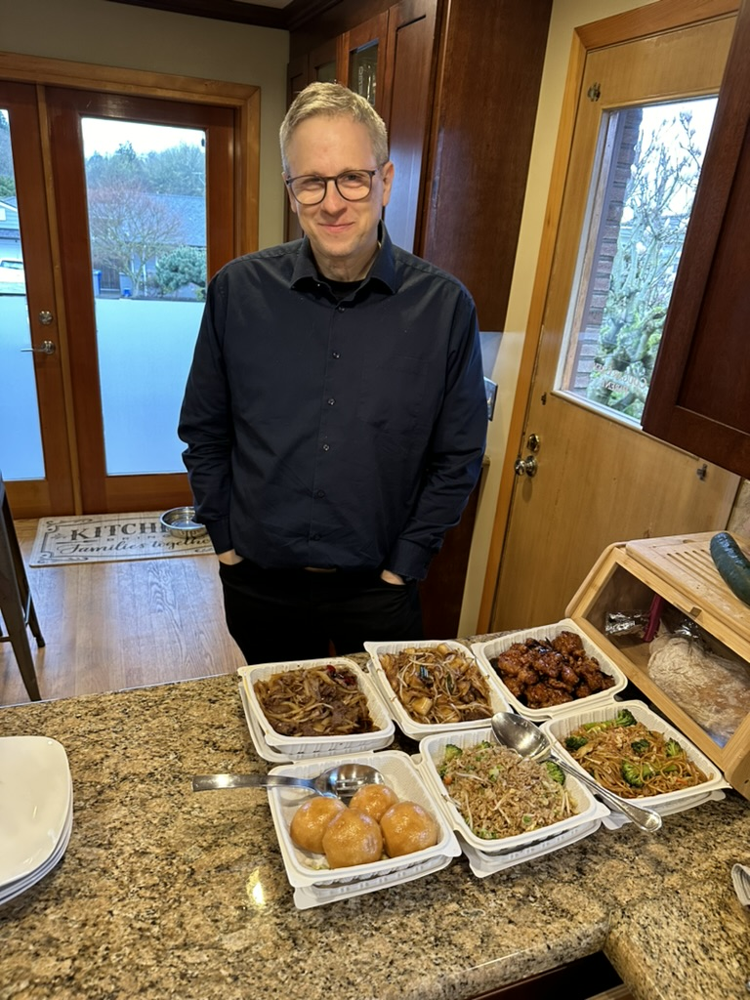

Well, things are just about ready - tomorrow is the big day!   We have spent the last couple of weeks maintaining a shared reminder list of things we wanted to ensure we packed for the trip.  We have spent this week gathering all of those things into little piles.  I went through and pulled _everything_ out of the van so that there would not be a _single thing_ we didn't know that we put in the van for the trip and why we decided to bring it.    Last night, I went through and loaded up the "Roll out bins" with everything on the list that we are OK having to dig for (snow chains, jumper cables, fishing gear, etc). And that is all sitting there, ready to place into the van and strap down.  I've got all of my clothes in packing cubes, and my backpack has the drone, the charger kit, keyboards, and laptops ready to go.  Catherine is currently loading in the Galley, and I am loading up the totes.   

Later tonight, we are heading up to Shoreline Community College to watch their performance of My Fair Lady with Kai.  

Kai arrived from China on Thursday, and we had dinner at his place to keep him up until 8:30 in the evening to help with his jet lag.   He will fly out to Texas in two weeks to meet us for the eclipse. And then flying home to Berlin after the eclipse.

At this point, I am confident that I am all buttoned up at work.  I went in every day this week for Expedia week. (which, ironically enough, is the week that we have the board of directors meeting). Tuesday was the peak population day on campus.   Four of our board members held a panel on Tuesday, and Chelsea Clinton was among those four (all women, by the way). She is a fierce advocate for women, and I was impressed with her.

Tomorrow we head towards Spokane to See Aunt Gloria, and Do and Tom.

Getting ready to eat some of our favorite Chinese food with Kai before the show.

Before the show at the Theatre at Shoreline Community College

Curtain Call of My Fair Lady. 

The van is loaded up, and we have _plenty_ of space.  I have the same feeling (which I _love_) that I used to have when we were younger as we got the boat ready to go for our trips to the San Juans.  This was a little easier, since we only had to walk to the drive way to load in ;) 