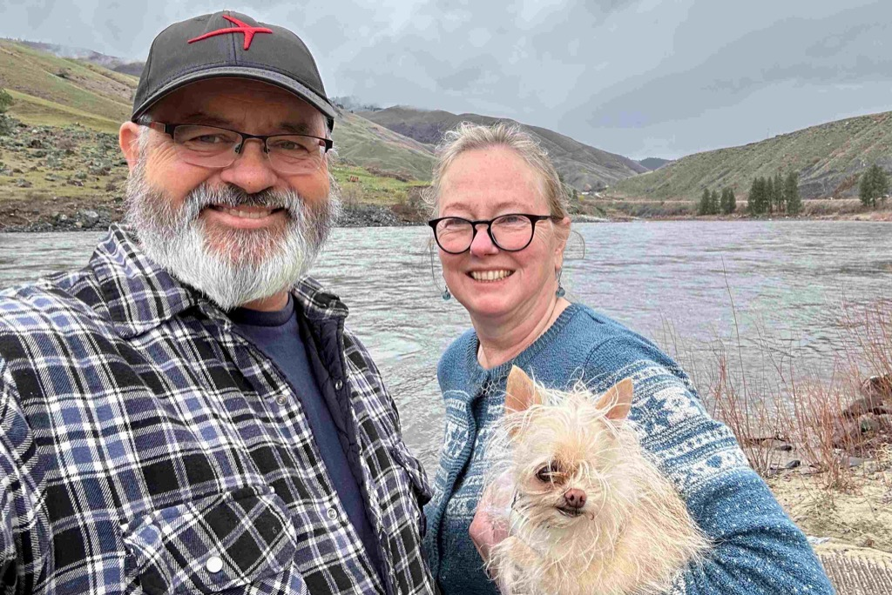
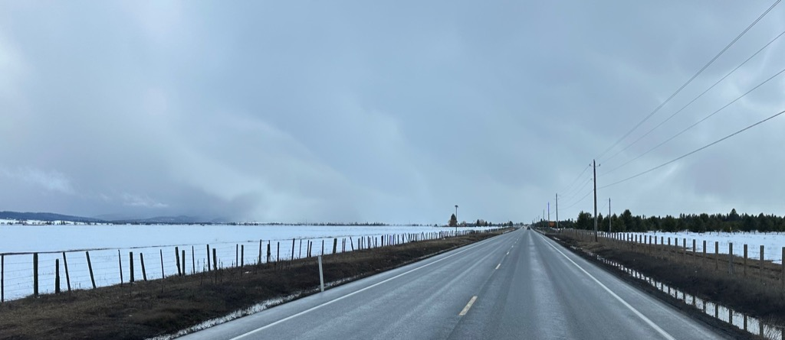

Well, Day 2 is in the books!  

We Drove from the [Horn School Safety rest area](https://maps.apple.com/?address=101%E2%80%93105%20Old%20Thornton%20Highway%20Rd,%20Rosalia,%20WA%20%2099170,%20United%20States&ll=47.182200,-117.377330&q=101%E2%80%93105%20Old%20Thornton%20Highway%20Rd) down to Lewiston, where we got Fuel, and ended the day at our friend Patrick's place in Boise.  Patrick worked at Expedia with me. "Back in the day," where we became good friends.   

The drive was nice and easy, and we saw all sorts of weather, from rain to hail to even a little snow over by McCall, Idaho.  

Driving down the Salmon River Valley was just absolutely stunning.    We made several photo stops along the way but only did a little lallygagging yesterday, as we had a long way to go.  

The van is holding well.  We have yet to discover anything we want to change about things, but we are still fresh in the journey.   Athena is settling into the trip well, and rides along comfortably in her Dog bed that we have nestled into the passenger foot well.

It was good to catchup with Patrick.  He is a wonderful cook and he made us a fabulous meal.  He was born and raised in this area, so after dinner we spent some going through options for our next leg, and I think we found some good options.  It will be fun to see where the day takes us today.

The overview of our trip on Day 2 of this adventure.

A drone shot looking down over Lewiston, Idaho, from the top of the old Grade.   You see [the old spiral highway on Lewiston Hill](https://en.wikipedia.org/wiki/Lewiston_Hill), a beautiful road to drive.  There are so many switchbacks, and the van handles them just as nicely as my sedan.

A fenceline made out of old iron wagon wheels - (this picture was taken through the window of the van as we rolled past it, and I will say that it came out much better then I expected :) )

The van on the Salmon River just before we enter the canyon.

Me, Catherine, and Athena.

Just outside of Riggins, [old highway 95 on the salmon river](https://www.fhwa.dot.gov/highwayhistory/us95.cfm),   we saw a sign saying that there was a fresh produce market up this road a mile.  We drove two miles up the road and decided that it must really be a summertime thing.  It was a pretty road.

Dramatic skies outside of the [Payette National Forest](https://www.fs.usda.gov/payette/) as we approach [McCall Idaho](https://www.mccall.id.us)

More dramatic skys!

it was even snowing!

Just outside of [horseshoe bend Id](https://en.wikipedia.org/wiki/Horseshoe_Bend,_Idaho) 
.

Patrick is an absolutely fantastic cook (dare I say Chef?) and he prepared us a wonderful meal of Dijon Chicken, Bitter Green Salad, and Cauliflower gnochi

Catherine and Patric ready for our meal (oh yea, and some wonderful Creme Brule!)

<iframe src="https://www.gaiagps.com/public/I6VK9AVwQLX6QxwMzZZ4YHjK/?embed=True" style="border:none; overflow-y: hidden; background-color:white; min-width: 320px; max-width:420px; width:100%; height: 420px;" seamless />

Overview of our Route.