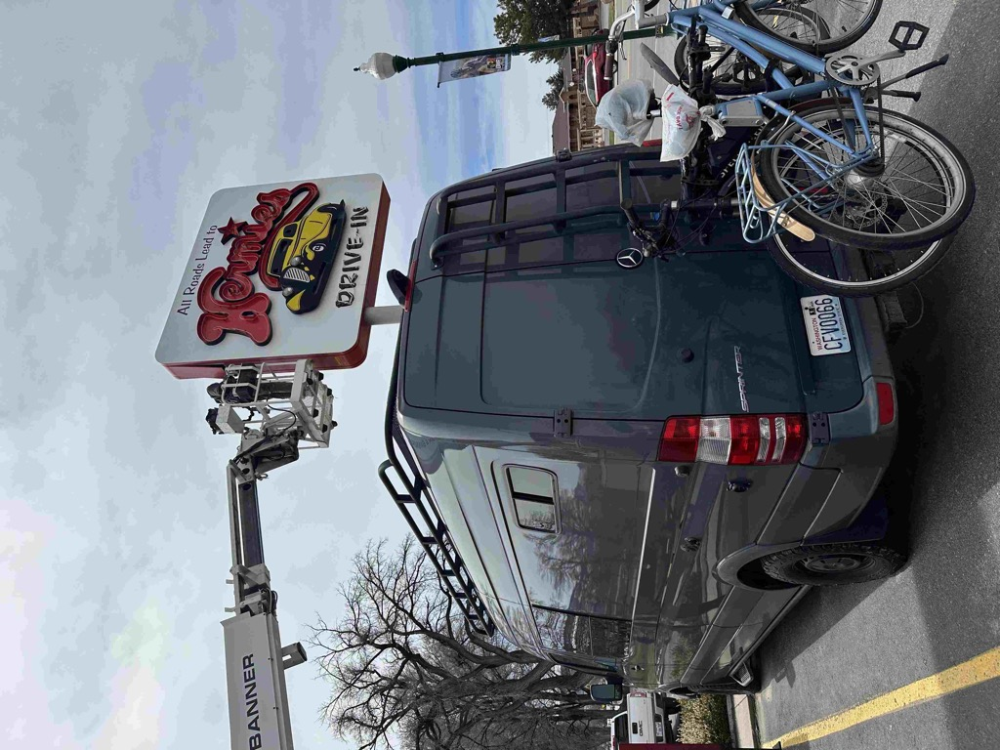
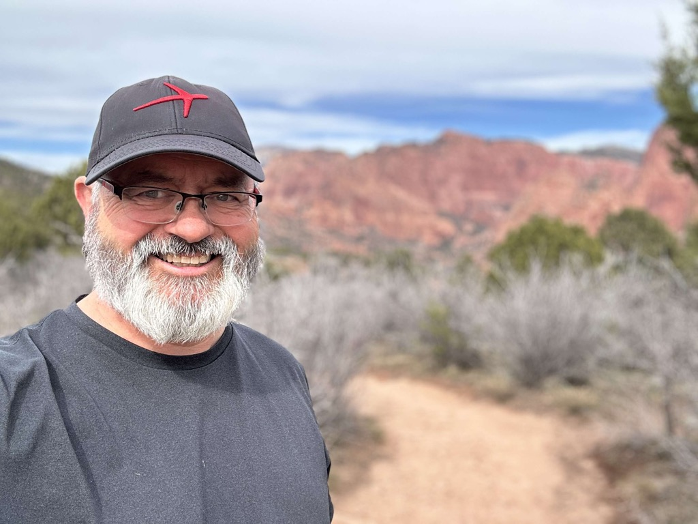
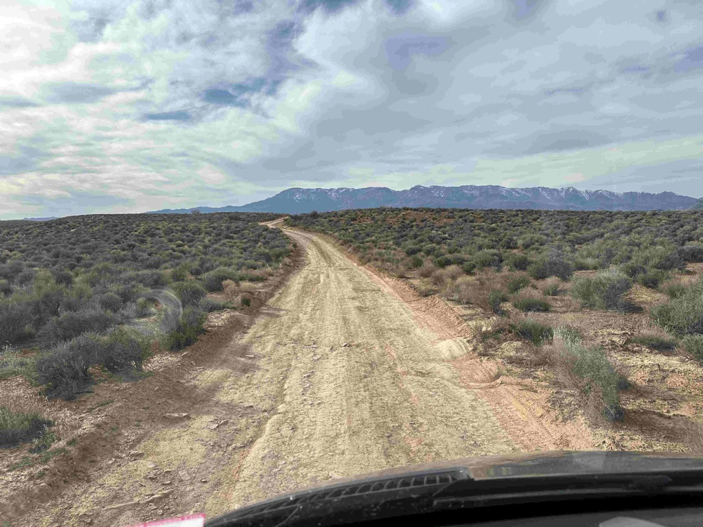

We spent Wednesday driving from the Vernon Reservoir to Kolob Canyon, which is part of [Zion National Park](!g)  

The drive was uneventful.   We stopped in Delta to fuel up and wash all of the mud off of the rig, before continuing to head south.    The drive was fantastic, with wide-open vistas across the valley and mountains on either side.   

In Cedar City, we stopped at Hermies for burgers, fries, and shakes.   That absolutely hit the spot.   we then headed down to the road to [Kolob Canyon](!g), which is part of Zion National Park.   We headed up into the Canyon and were met with some absolutely stunning views!  Once we arrived at the end of the road, we stopped, and I went for a mile hike to a lookout point.   (Catherine's ankle still bothers her, so she spared it the hike).  The views from the end of that Hike were just fantastic. 

Once we were out of the park, it was getting late, and it was time to figure out where we wanted to stay for the evening.  We had asked the ranger where we might stay in the park visitor center, and he suggested some BLM land down between [Verkin, UT](https://en.wikipedia.org/wiki/La_Verkin,_Utah) and [Virgin, UT](http://virgin.utah.gov), so we headed there.   The road was super rough, and the landscape was dotted with rigs, so we realized that this may not be the place.  We bounced over the rutted roads past every campsite, and none were available.  So...  it was time to pull out [iOverlander](https://ioverlander.com/) and look for alternatives.  We found a spot up the road away along a river and headed that way.  The drive was short, and the entrance was hard to find (it looked like a wash, but we managed to find it). There were a couple of other rigs there, but we found a nice, quiet spot.    While we were there, we met a wonderful woman and her two dogs.   One dog is a border collie and wanted nothing more than to chase balls.  so while we chatted, I threw the ball.   The woman is from Toronto and is closing in on six months of working from the road, spending most of that in Baja.   

The van was a mess after vernon reservoir, so after we fueled up, we spent $5 at the carwash and cleaned it up.

Turns out that [Hermies drive in in cedar city](https://www.yelp.com/biz/hermies-drive-in-cedar-city) had a decent burger, and it is where all of the area hot rods come to hang out (well, by looking at all of the pictures on the wall ;) 

Entering into Kolob canyon

A panoramic view of Kolob Canyon

At the upper parking lot.

Absolutely stunning views.

This is what the roads looked like in the first set of BLM land we looked for camping in.

But we finally found a spot, and it was nice and quite.

https://www.gaiagps.com/public/oo9Z3Oslpv9BBOmcPgQ7VOau/ 

<iframe src="https://www.gaiagps.com/public/oo9Z3Oslpv9BBOmcPgQ7VOau/?embed=True" style="border:none; overflow-y: hidden; background-color:white; min-width: 320px; max-width:420px; width:100%; height: 420px;" seamless />
