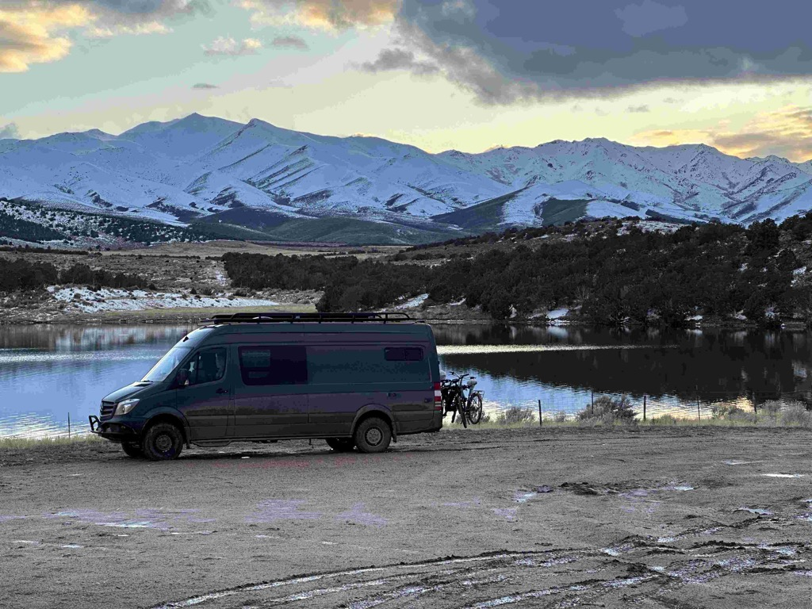
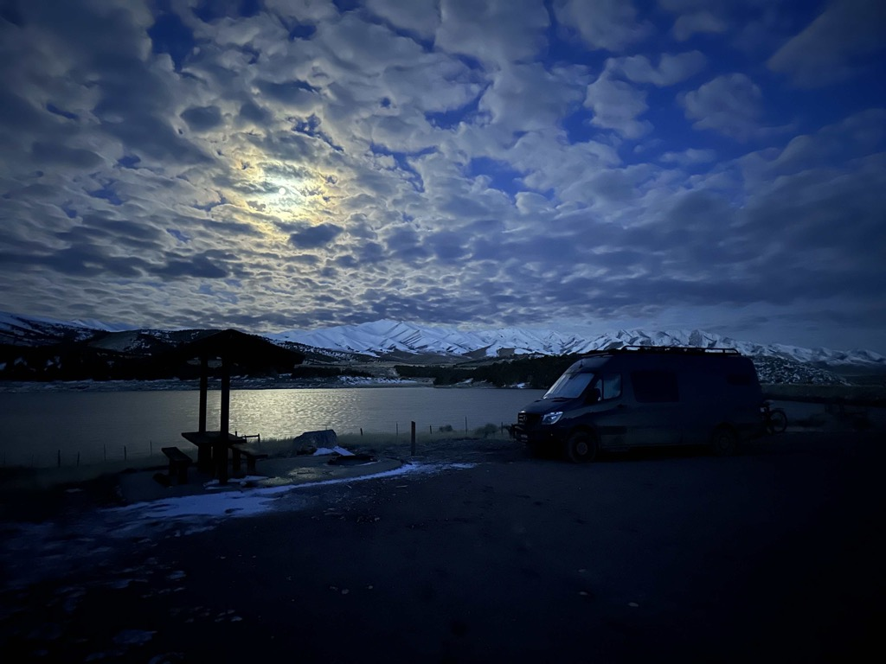

Day 4 of our road trip saw us traveling from the [City of Rocks](!g) National Reserve and then over to Garland, Utah to see my Uncle Dan and Aunt Linda weatbrook - where we had a very pleasant visit.  The weather on the way there was very gray, stormy, and rainy.  The drive was nice, though, and it was cool to be driving through the big, fluffy snowflakes!

From Uncle Dan's place, we headed down to Tooele to visit with my cousin Spencer and his family.   They have recently moved into their new home, and are enjoying it, and have quite a bit of space there.   Spencer's son Spencer is a junior in highschool, working for the family's General contracting business generating leads, and is also taking up welding.   We had a pleasant visit with them before heading out for a place to spend the night tonight.  

We did some investigations and settled on the Vernon Reservoir campground.    The road to get out here was super muddy, and now the rig is covered in mud.  Today, one of the chores will be to find a place to wash it on the way to southern Utah.

There was another absolutely fantastic moon in the evening.  It got really cold last night, and having the heater working was so worth all of the effort I put into the electrical system earlier this year.

In the morning, the ground was frozen, so we headed out earlier rather than later so the roads would more passable.

Me, Catherine, Uncle Dan, Aunt Linda

Me, Catherine, Spencer, Carmen? Spencer jr., Emmy, Hanna

Spencer jr. showing me his welding chops.

I'm no expert, but that looks pretty good to me!

Me and Spencer Jr with the green house in the background.

The muddy muddy road on the way into the Vernon reservoir campground

Big air sitting in the muddy campsite, with the mountains and reservoir behind it.

The bikes are covered in mud.

The moon getting ready to come up.

Reflection of the moon in the morning over the reservoir

Sunrise on the mountains.

More sunrise on the mountain

Our Route for the day.

<iframe src="https://www.gaiagps.com/public/kznwqmohCQdm5gltfcsu0mOk/?embed=True" style="border:none; overflow-y: hidden; background-color:white; min-width: 320px; max-width:420px; width:100%; height: 420px;" seamless />

