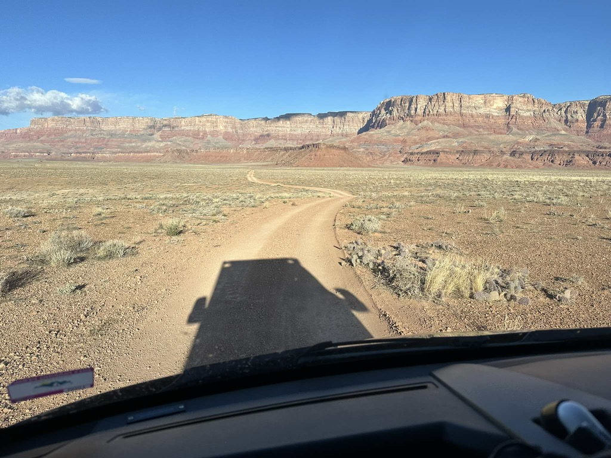
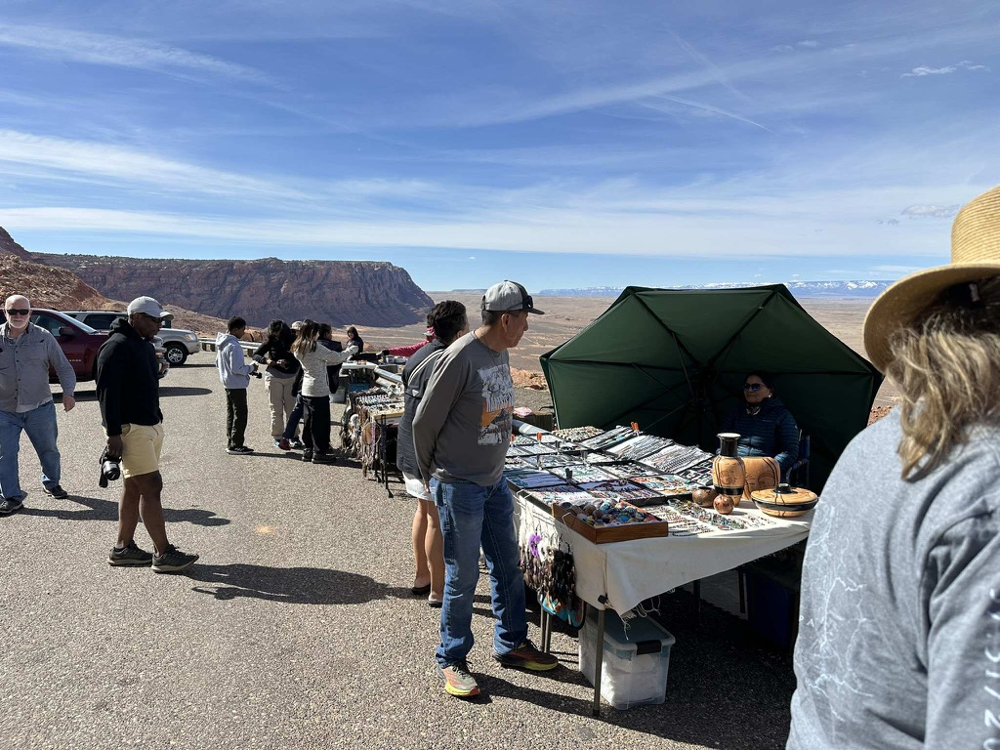
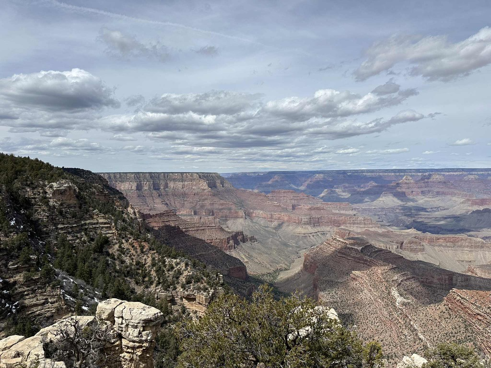
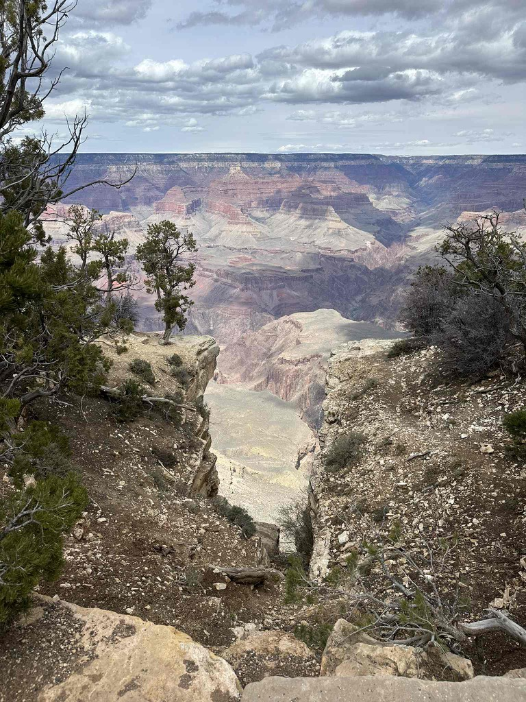

Yesterday was an absolutely brilliant day - we woke up in our campsite on the north side of the Colorado River to a glorious sunrise.   We made ourselves some coffee and then headed out. With the ultimate destination being Jack and Jays' place in Flagstaff.   

On the way out, we went past Lee's ferry and checked things out there, taking a short walk around the area.  Knowing that little river carved the entire Grand Canyon was fantastic. From there, we continued on [Highway 89a towards the junction with Highway 89](https://en.wikipedia.org/wiki/Arizona_State_Route_89A)  . When we arrived at the junction of 89, we were concerned about having enough fuel to make it all the way to the next gas station along the route, so we decided to head into Page to fuel up.  I'm glad we did, as the vistas going towards Page and returning from Page are some of the most spectacular we have seen on this trip.  I remember back in 2005, when I was switching from Disney to Expedia, my Dad and I came down this road after we had hiked the Antelope Canyon, and that brought back some memories.

On the way down, we stopped at the overlook to take in the beauty of it all, and I picked up a really cool bookmark from one of the Vendors that were there.  

From there, we headed to the Grand Canyon and gave that a cursory overview.  we drove in, stopped at some of the overlooks, took the obligatory pictures, hit the visitors center, and then headed out.   We didn't do the park justice and couldn't do any serious hiking.  

But...  This whole canyon is Jay's laboratory.  She is working on her Ph.D. on the invasive species of the canyon, specifically on the riparian vegetation (which are the plants that grow in the ecosystem that is the boundary between the river and the land, so she has been down the river four times.)

From there, we headed towards Flagstaff, taking the long way to get there.  Once there, we picked up some dinner to take to Jack and Jays.  We got to their place just as Jay's mom arrived, and we had a very pleasant visit while the Gonzaga v. Purdue game was on.   Jay and her mom are HUGE Purdue fans, so they were pleased when Purdue won.  :).  

I got a download of Jack's new job, and it sounds pretty cool.  He is working in the lab, helping ot prepare samples for all sorts of experiments that are taking place there.   Jay is working on her Ph.D. and is enjoying that. She wants to get into precision agriculture, and I suspect she will be rather good at it. She does a lot of work with remote sensing data from satellites and drones; they are so good that they can identify specific species of plants growing in areas. 

Today we are heading down to Sun City West to see Mom, Sue, Sophie and Peter.

The van in the sunrise

What a spectacular view of the clouds lit up by the sun.

A panorama of the same shot.

and now with the van ;) 

This was the road coming out of our campsite.

A rock teatering on a pillar just out side of [Lee's Ferry](https://www.nps.gov/glca/planyourvisit/lees-ferry.htm) 

heading across the Desert

This is where I picked my new bookmark.

Me and Catherine overlooking the Grand Canyon.

It's a big canyon

Jack and Jay have three Dogs, and Jay's mom brought two dogs.  and then we threw Athena into the mix :) 

[## Day7 Zion to Grand Canyon to Jack and Jay](https://www.gaiagps.com/public/O6PpQNn626qwCLtwRlKO90Oz/)

[<< Previous - 2024-03-28-day6-thur-zion-canyon-to-marble-canyon](./2024-03-28-day6-thur-zion-canyon-to-marble-canyon.md)
[Next >> - 2024-03-30-day8-Sat--jack-and-jays-to-moms-via-sedona-and-jerome](./2024-03-30-day8-Sat--jack-and-jays-to-moms-via-sedona-and-jerome.md)

<iframe src="https://www.gaiagps.com/public/O6PpQNn626qwCLtwRlKO90Oz/?embed=True" style="border:none; overflow-y: hidden; background-color:white; min-width: 320px; max-width:420px; width:100%; height: 420px;" seamless />

