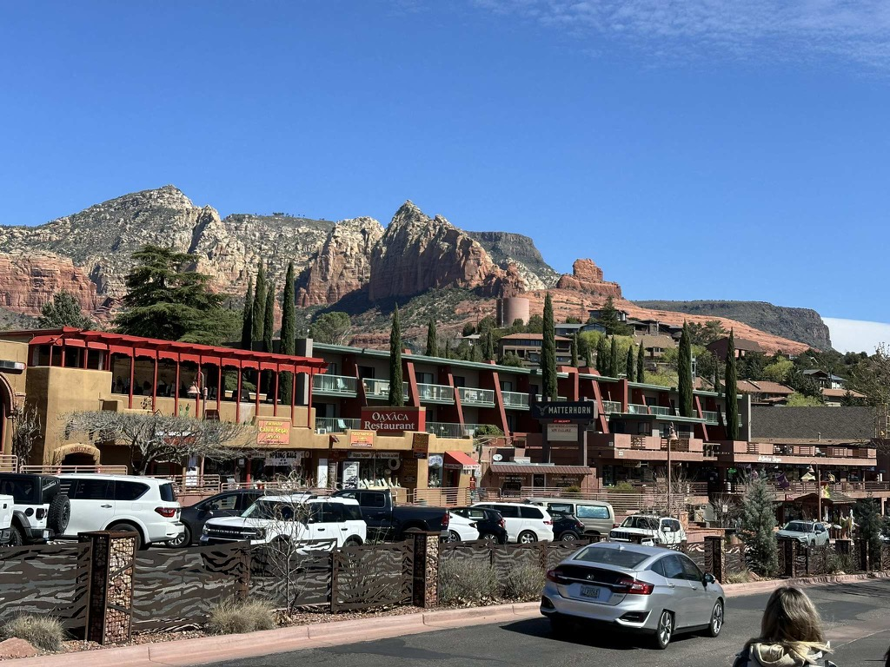
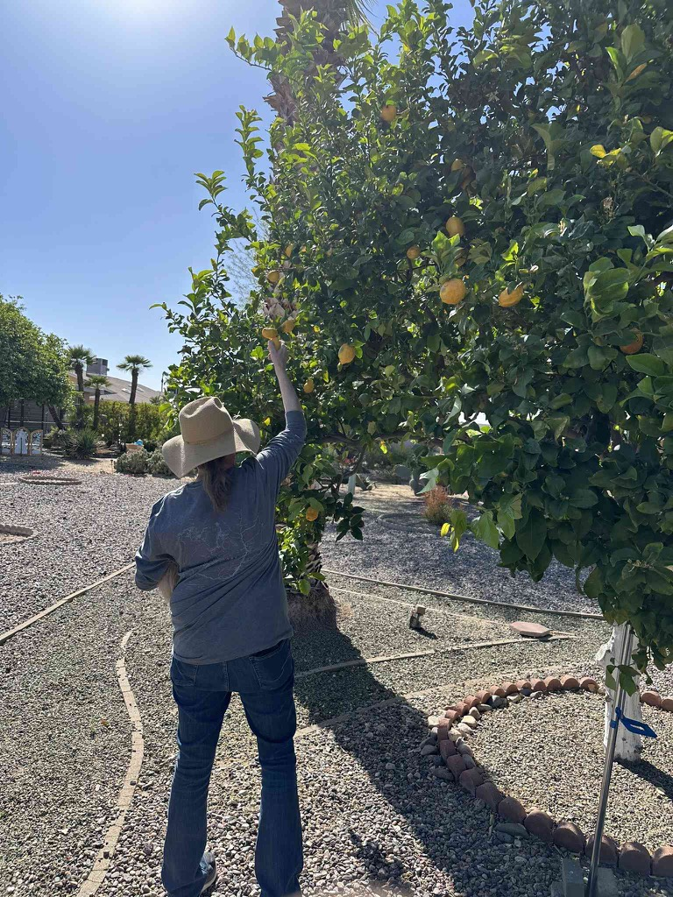
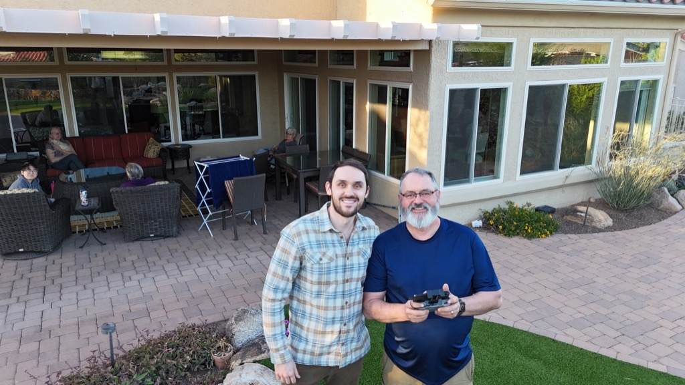

Saturday, we woke up and spent a relatively slow morning with Jack and Jay, drinking coffee, shooting the breeze, and taking pictures of the dogs briefly before getting in the van and hitting the road.    Jack and Jay spend the weekend packing their place and moving into town.  The threat of impending snow could throw a monkey wrench into the works, so we wanted to stay within our welcome there.  

We headed towards Highway 89a to head down to Phoenix via Sedona to hang out with Mom, Sue, Peter, and Sophie.  The drive was as spectacular as always.   We stopped in Sedona to grab breakfast and stretch our legs before heading towards Cottonwood and Jerome.  

After we passed through Jerome, we were going to head to Prescott, but Sue, Peter, and Sophie had already hit the road and were heading to Mom's house, so we decided to take the quick route to Sun City West and cut over to I17 before we made it as far as Prescott.

Once at Mom's, we headed over to the home of one of her friends, who had recently passed, and harvested some of the oranges, grapefruit, and lemons from the trees in the backyard.  After that, we returned to Mom's house, took some showers, and settled into a comfortable afternoon of visiting with everyone.  In the evening, we went out for Thai food for dinner before packing it in for the evening.

So far, today has been a nice, slow day of relaxing and chatting and catching up with Sue and Peter.  

treats results in completely undivided attention of the puppers

and for these three - so do toys!

Jack and Athena snuggling

Me and Jack

Walking through Sedona

Breakfast was harder to find then we expected.  The first place we went to we arrived at 10:27 and they stopped seating at 10:25.  they did recommend that we go to [shorebirds in sedona](https://shorebirdrestaurant.com/locations/sedona/) which was excellent.

The mountains outside of Sedona

We got lucky that there was plenty of parking when we showed up in Sedona.  By the time we left, the place was packed!

Climbing up Highway 89a

Some of the oranges we picked at Moms friends house.

Picking Lemons
Peter and me getting pictures with the drone.

Mom, Sue, Sophie and Catherine

[D8 from Jack and jays to moms](https://www.gaiagps.com/public/9wALsKc56ggU6FeIjn05a4xs/)

<iframe src="https://www.gaiagps.com/public/9wALsKc56ggU6FeIjn05a4xs/?embed=True" style="border:none; overflow-y: hidden; background-color:white; min-width: 320px; max-width:420px; width:100%; height: 420px;" seamless />

