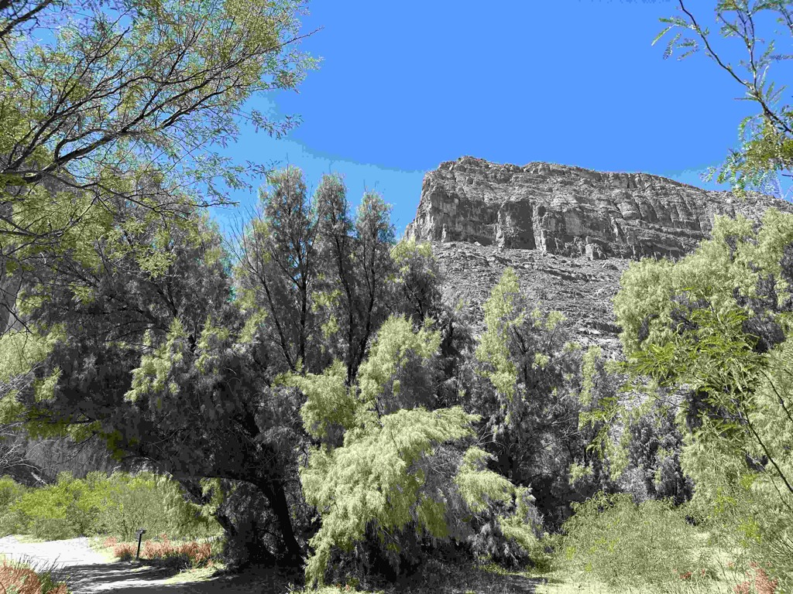
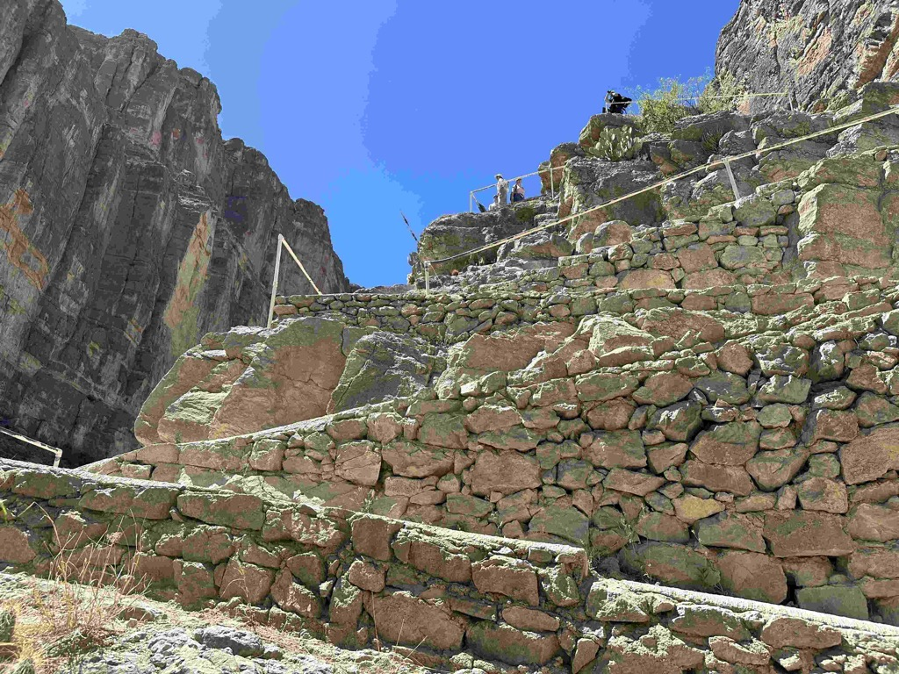
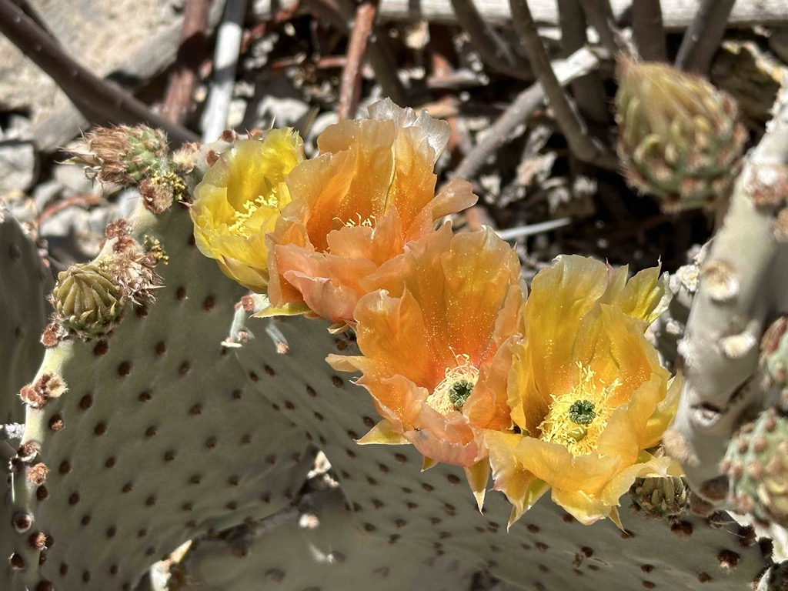
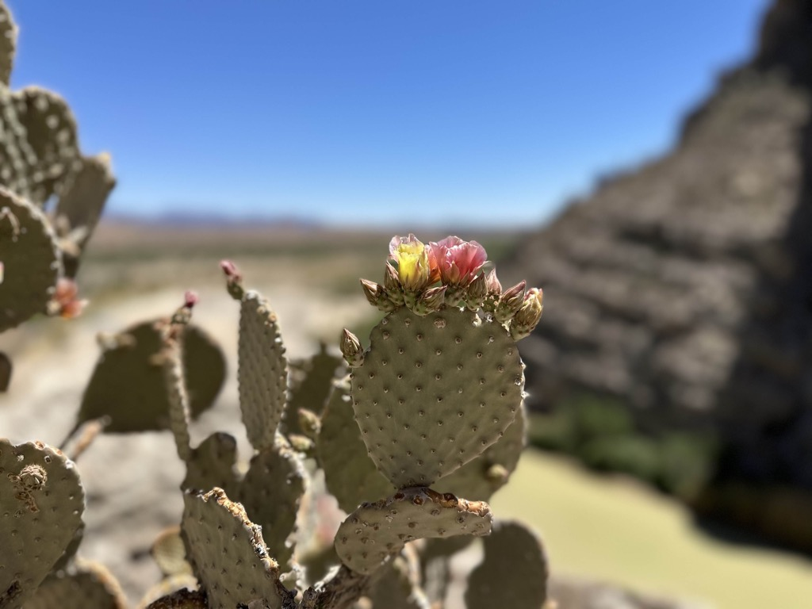
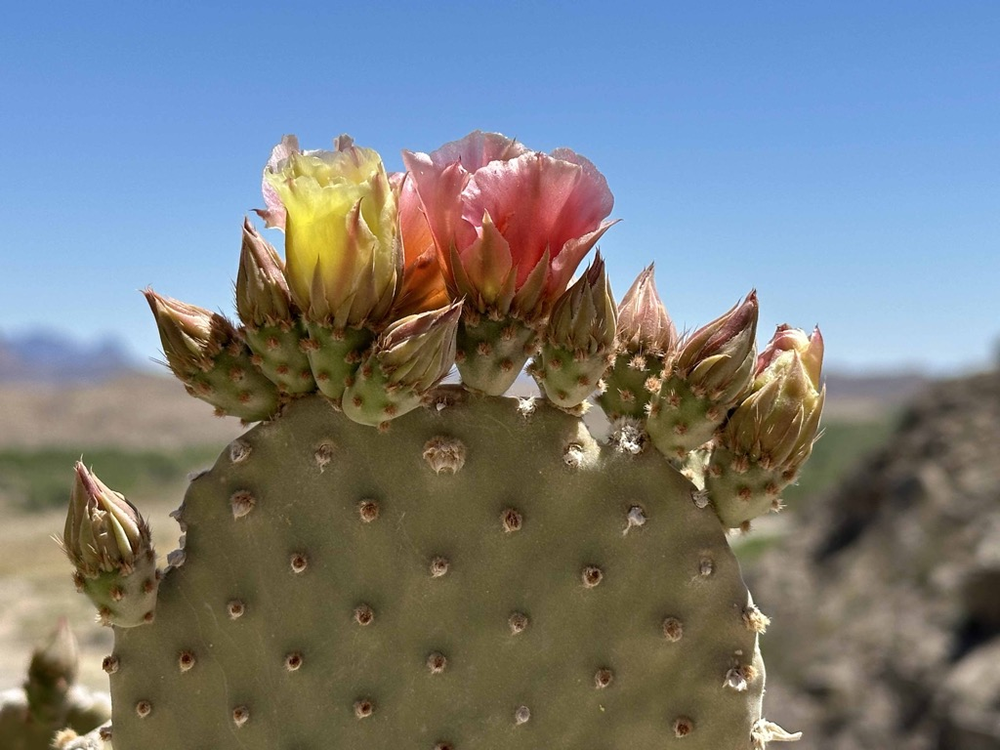
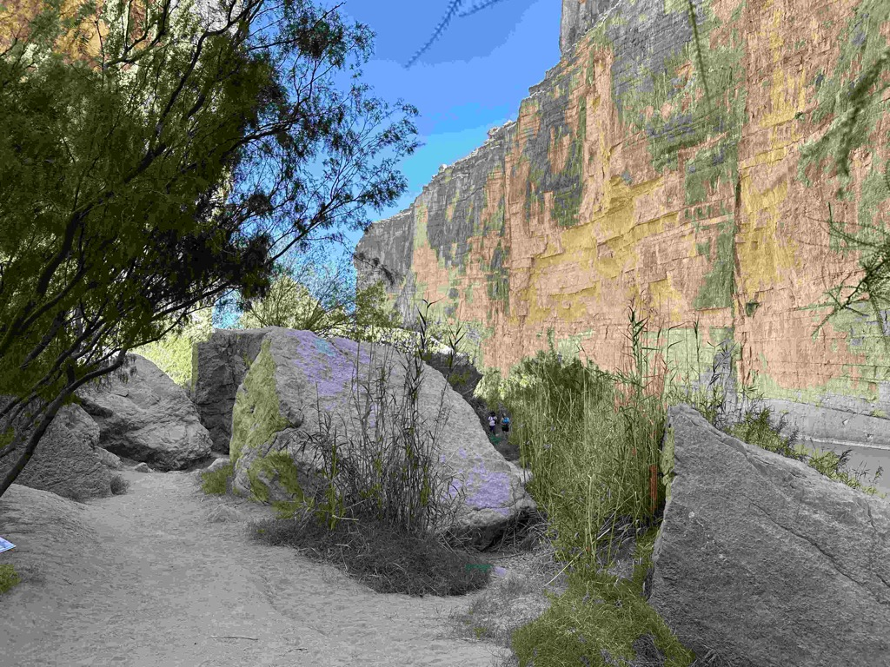
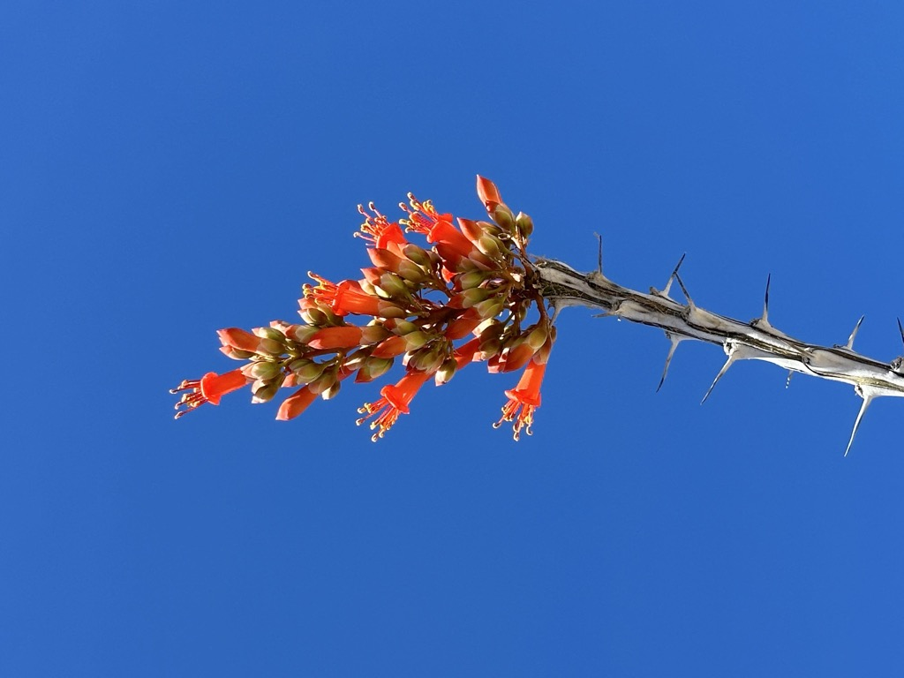
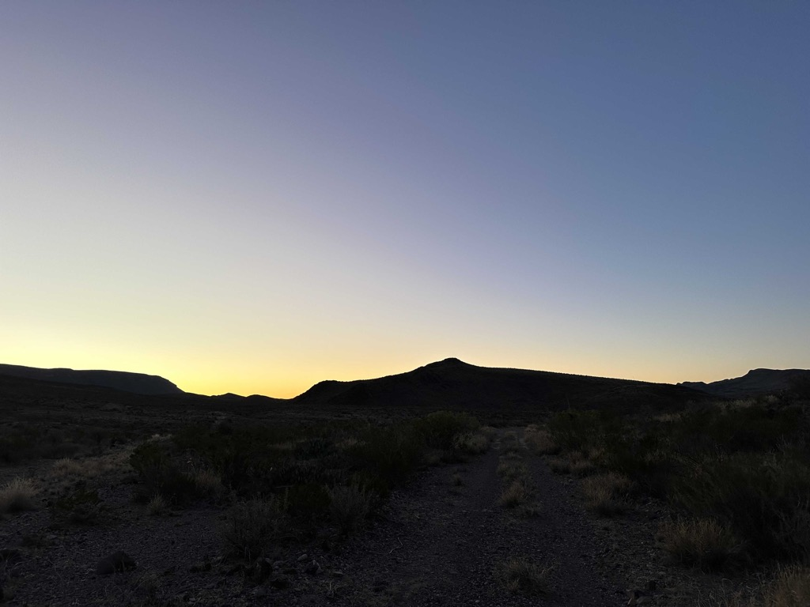

After driving through Big Bend National Park the evening before in the dark, it was wonderful to go through the park in the daylight.  This park is massive.   We decided that we would take a drive along the scenic road that is 30 miles out to the Rio Grande, and 30 miles back to the main road through the park, and hike the Santa Elena canyon.

