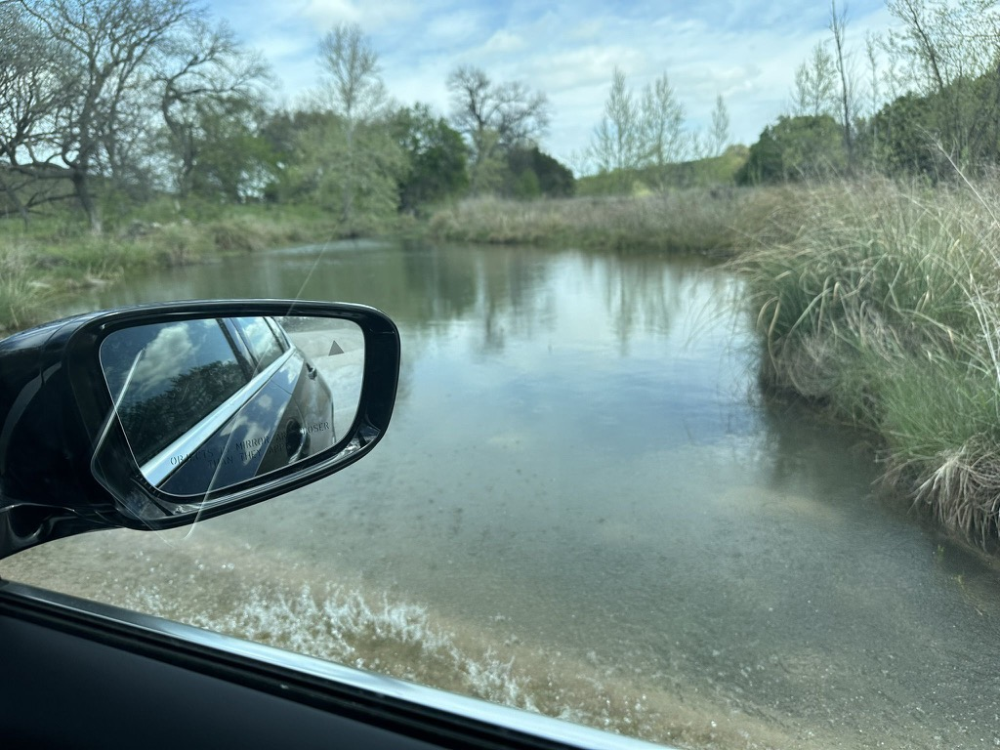

Day 13 finds us in Ingram, TX.   A coworker of mine, Joyce,  lives in the area (and in Texas, that means within a 90-minute drive), and we had been talking about having her drive out and meet us and bring us some BBQ from her favorite place near where she lives.   Well, she contacted me and said that the place doesn't open as early as she thought, and I told her that was fine because we had nowhere to be and all day to get there.   That sparked a conversation because she thought we had some activities in the area that we wanted to attend to, and if that wasn't the case, why didn't we head out her way? They were a dog-friendly place, and we could take showers out there.  So we hopped in Kai's car and went out.

Boy, I am glad that we did.

What an idyllic afternoon we had with her, her husband, Hunter, and Her mother Marki.  Her neighbors are Gary and Diamond.  Their Friends Daniel and Angel, their three daughters Haley, Lauren (that might not be quite right), and Payton.

The drive was pleasant, and once we were off the interstate and the highway, we spent about eight miles on a caliche road.  Something that we found interesting about this road was that it crossed a stream a couple of times, and where it did, they didn't use a bridge or a culvert but constructed the road so that the water would flow over the top of the road without eroding it.   That is the first time that I remember seeing crossings handled that way.  (or at least realized it, since there was water there)

The area was lovely.   And now we know why they refer to this place as hill country.  Nothing quite as pronounced as the hills of the Palouse, but still quite significant rolling hills they live amongst. 

The vegetation combines Cedar trees (invasive, which they try to remove), creosote trees, grasses, wildflowers, and Cacti.   Joyce and Hunter quite a few acres (I forget exactly how much, but it was more than 60 and less than 100). Hunter's mom, Marki, owns another land next door; Hunter's cousin is also a neighbor.  All three properties don't have any fence between them, so they have quite the run of land there.   They don't use it for ranching or anything like that.  So, to get tax breaks, they do wildlife management, which involves clearing certain plant species and providing food and water.  Hunter is quite the hunter, with many Trophies hanging in the house.   And they are also able to hunt on the land as well.

We shared the BBQ Joyce had run out to get, and Hunter was smoking a brisket on his smoker for later.  After lunch, Joyce took Catherine, Kai, and me on a property tour in their [Yamaha Rhinos](https://www.autoevolution.com/moto/yamaha/rhino/).  We saw the "boneyard," where they dispose of the carcasses of the feral pigs that they shoot (these are descendants of domestic pigs that escaped, and they are quite invasive, aggressive, destructive, and not good eating).  She showed us the feeding stations and their oak in the dry creek bed.   We also went over to Marki's place and got a tour of her place.   She was making Jalapeño and Mango Jelly, and she gave us a jar, as well as a jar of her Jalapeño and strawberry jelly that she had made before.   

After that, we headed to the place of neighbors Gary and Diamond.  They are a wonderful couple and have built quite a place in the ten years since they retired there ten years ago.   They have an extensive garden, several goats, chickens, Guinness, and a wild turkey on the property.  Gary was a mechanic and fabricator in the oil fields and has built many things there.  They also built their home, and the guest house was stunning.  We spent an hour just getting a tour of their property and visiting.

Once we returned to Joyce's place, their friends Daniel and Angel and their three daughters arrived.  They are staying through Monday as their property is just inside the path of totality.

Hunter's brisket was done, so we all had a meal together and visited.   We left with just enough daylight to reach the interstate before it got too dark.  Even then, we saw several deer on the side of the road, and one bounded across in front of us.

Today, we are thinking of heading to Frederiksberg.  And Scott and Martha arrived this afternoon.

The Caliche road off of the county road on the way to Joyce and Hunters place.

An example of how the set the roads up to let the stream flow over the road.

Hunters Smoker that he and Gary fabricated.

Catherine and me driving around in the "Rhino"

Following Joyce - No need to follow too close, it's dusty.

The cedar tree in the creek bed.

Hunters Brisket

Kai and I in a Rhino on the way to Gary and Diamonds place.

Gary's smoker.

Gary and Me

Kai, Gary, Me, Catherine, Joyce 

Hunter slicing the Brisket for dinner.

Heading back to Ingram

[Day 14 out to Joyce’s house and back to hcaf](https://www.gaiagps.com/public/42pdidY91UpX8NhqBQojhiXT/)

[<< Previous 2024-04-04-day13---big-bend-national-park](./2024-04-04-day13---big-bend-national-park.md)

[Next >> 2024-04-07-day16-day-trip-to-Fredericksburg](./2024-04-07-day16-day-trip-to-Fredericksburg.md)

<iframe src="https://www.gaiagps.com/public/42pdidY91UpX8NhqBQojhiXT/?embed=True" style="border:none; overflow-y: hidden; background-color:white; min-width: 320px; max-width:420px; width:100%; height: 420px;" seamless />

