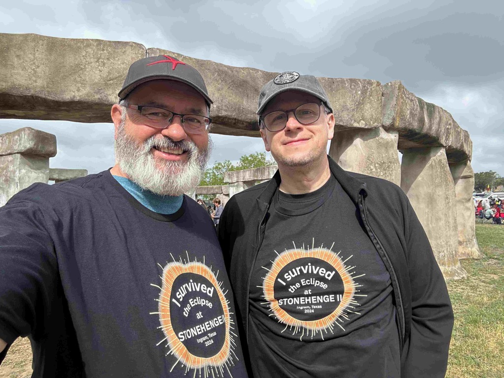

The 2024 Eclipse is in the bag, and our trip continues.    We took our chances with the weather and stayed in place here at the Hill Country Arts Foundation, and, while the opportunity to see the sun in all of its glory was heavily impacted by the clouds, the experience was still a wonderful experience.  

As the event approached, there was a building energy in the air.  The vendor booths were hopping, the lines at the food trucks were long, the grounds were crowded, and people were busting out their big telescopes.  And everyone was happy and excited despite the broken cloud cover.   One of the many cool things is that every time there was a break in the clouds that let us have a clear view of the sun, there was a roar of applause through the grounds.  

During the eclipse itself, the sun breaks became less and less prevalent.   But there were a few of them leading up to, and during totality.  

During totality, it was early dark and cool. The clouds carried the light in from outside of the umbra, so there was an eerie glow during totality, and then SNAP! Just like that, it was over as fast as it began.  And it was bright again.   And then, just like that, everyone started packing up and leaving.    After our traffic experience leaving the 2017 eclipse, we decided that the best course of action was to stay put once the event was over.  So that is what we did.  We hung out, chatted, watched the traffic, and then, after a bit, once the traffic had cleared, we all jumped in Kai's car and headed to his hotel to take showers.

After our showers, we returned to the campsite, and the sun shone.  Catherine and I won the auction for the Quilt, so we found someone to settle up with and picked that up.   And then we prepared dinner with grilled chicken and vegetables.   

We just had a wonderful, relaxing evening of hanging out with friends.   We even made some new friends, as the remnants of the crowd contained a couple of other sprinter vans, so we chatted with them for a while as the sun went down.  

Kai left around 7:30, just before sunset, as he had to be up at 3:30 in the morning to drive into Austin to catch his flight home.

Today, we will pack up camp, and then head on back west.   We don't know exactly what our route is, or where we will stop.  the only things we are trying to work in is to see George and the boys and Eric, Maggie, and Sahale all up in the bay area.

Starting the day with Mimosa's 

Our Rig, and Scott's rig setup in camp.

Kai and I got some shirts.

Chatting with the neighbors and sighting in the scope.

You can just barely see the Sun and the moon in the clouds there.

Kai got this shot with his telescope.   It turns out that it was super hard for him to get the sun into the field of view, so I think this is the only good one that he got.

It's almost total eclipse time!

It happens so fast, but there is still time to chat with folks. 

My friend Joyce sent me this picture from her Ranch.  They had great weather up in her neck of the woods.

I took this picture with my phone of the total eclipse

This is what the skyline looked like during totality.

Another shot with my phone.

Kai in his post eclipse bliss

Heading for showers!

Catherine and I picking up the quilt.

This is Jeneth. She is the events coordinator at the Hill Country Arts Foundation, and joined us for a while after the event.    They far exceeded their expectations for the event, and got some ideas of other things that they could do with the campus that they have here to expand their offerings.

Me and Kai

The Eclipse 2024 gang.

Good buy Kai!  have a safe flight home!

Perhaps we will see you on August 12, 2026 in Spain?

[<< Previous - 2024-04-07-day16-day-trip-to-Fredericksburg](./2024-04-07-day16-day-trip-to-Fredericksburg.md)
[Next >> - 2024-04-09-day18-leaving-texas---heading-towards-home](./2024-04-09-day18-leaving-texas---heading-towards-home.md)
