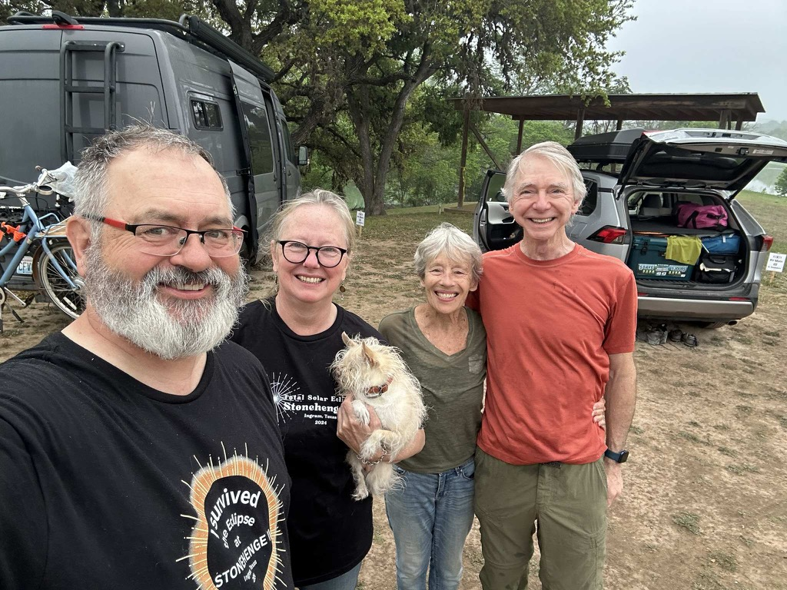
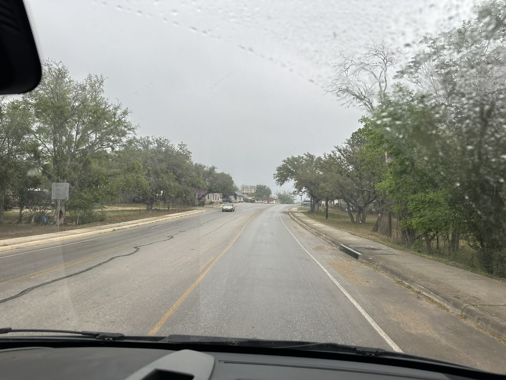
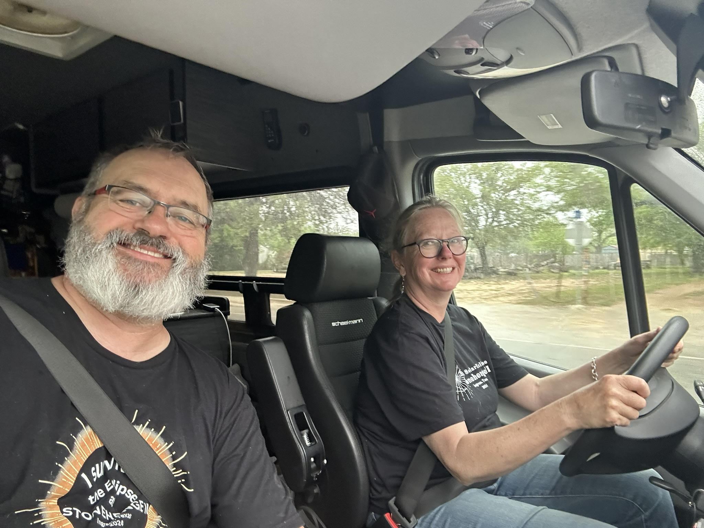
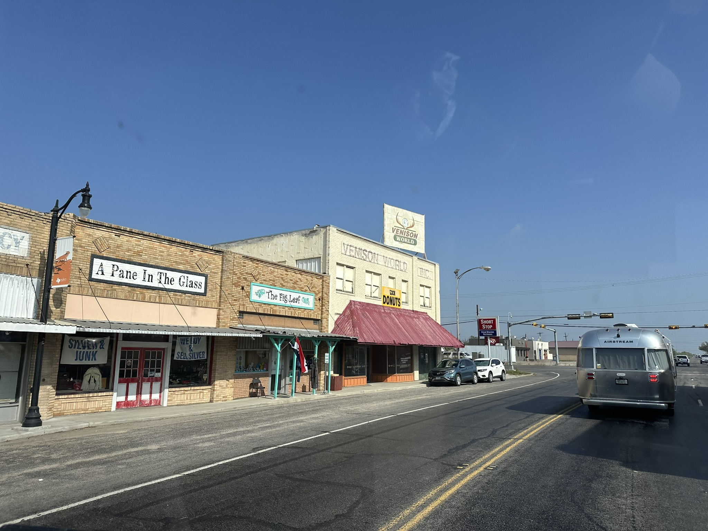
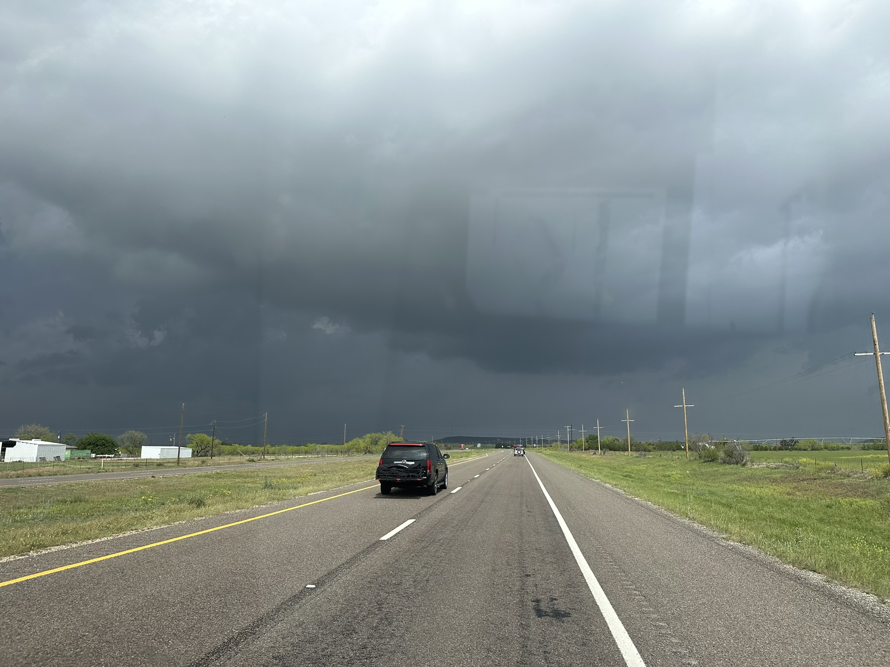
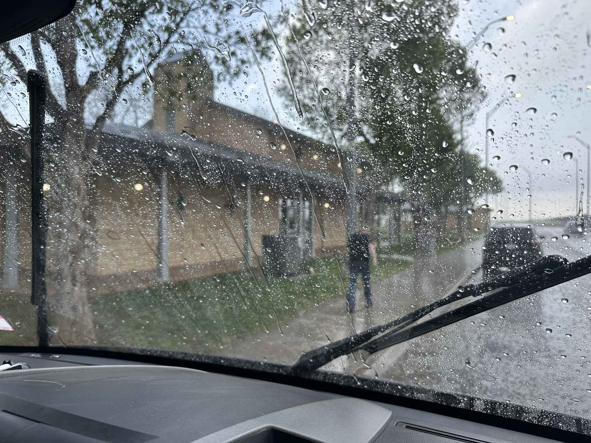
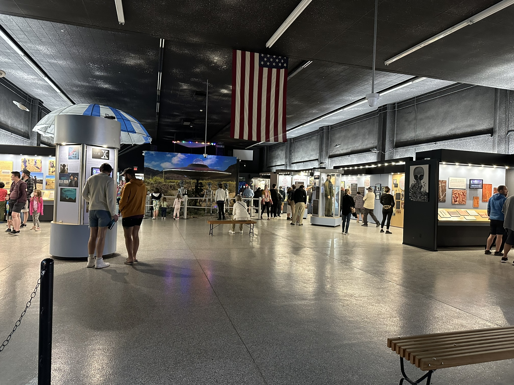
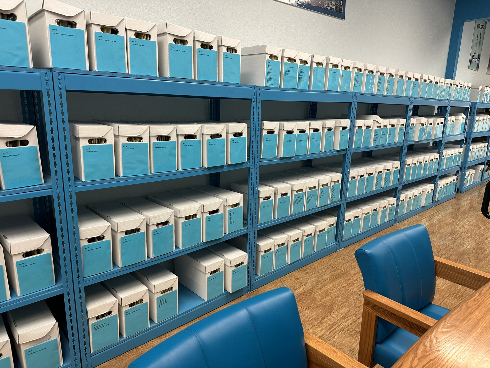
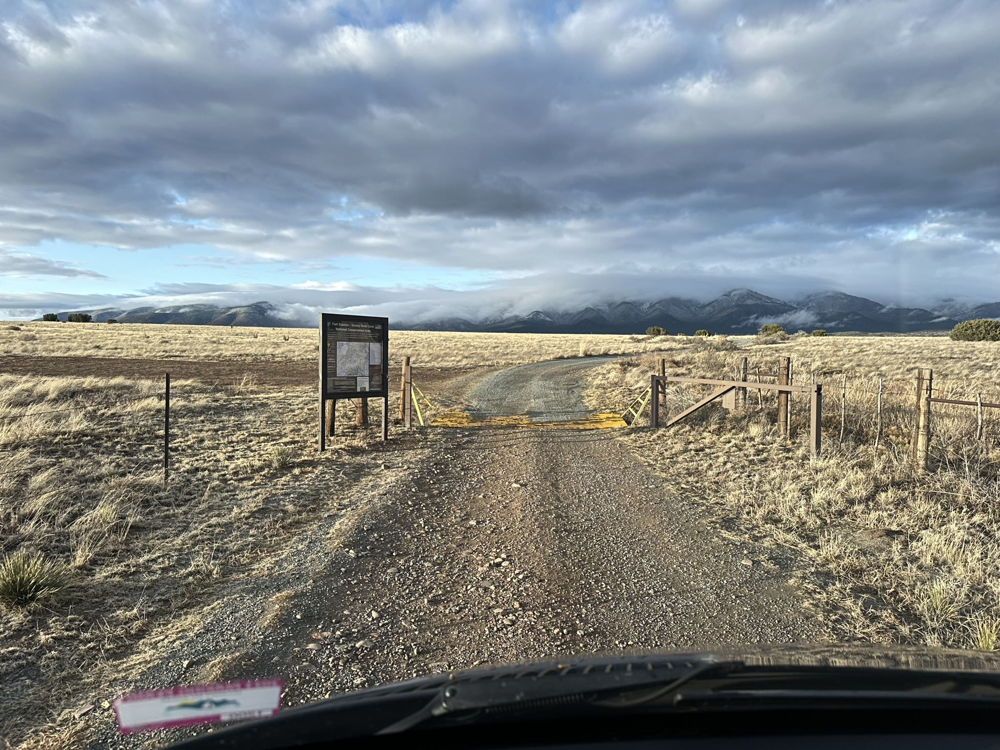
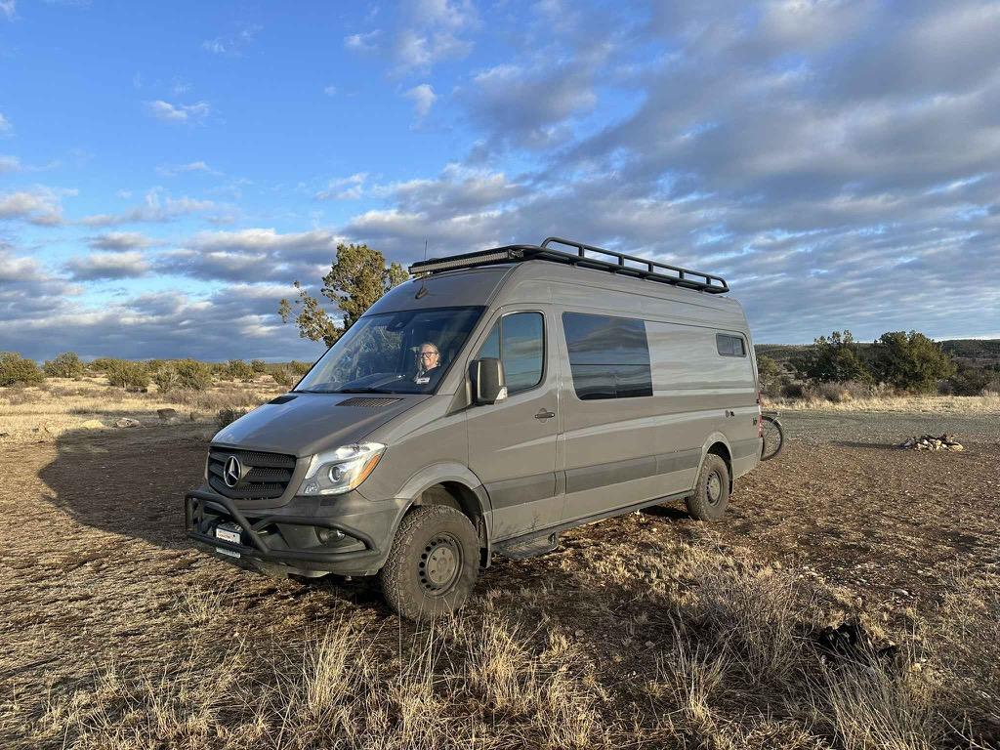

Well, it is time to start the journey home.  It is hard to believe that the trip is already half over. So far, everything, other than viewing the actual eclipse, has exceeded our expectations, and even that is ok.  The eclipse was just an excuse to see how well the van works for us and if it is something that we could reasonably expect to spend an extended period in (like on the scale of a year) as we tooled around the country.  And so far, it is.    We have plenty of space, and the facilities in the van are working great for us.   

Yesterday, we cleaned up camp, made our coffee, hung out with Scott and Martha while we drank our coffee, and headed out of Ingram, TX.  The weather was way worse than Monday - with nothing but dark and overcast skies bearing down everywhere, and the whole drive was like that.   We headed in the general direction of [White Sands National Park](https://www.nps.gov/whsa/index.htm) but with no particular route chosen as we headed out.   We ended up making good progress.  We drove through torrential rain and hail (we thought the rig would get damaged by the hail, but it was just noisy).   We stopped in Roswell, NM, and visited the [Alien Museum](https://www.msn.com/en-us/travel/tripideas/10-of-the-most-unique-museums-in-the-united-states/ss-AA1kQtZV).    I'm now convinced that there are people that believe in Aliens.   The library there was the most impressive thing there. It was chock-a-block full of books and primary materials concerning the search for aliens on this planet.  

After that, we continued, driving through [Lincoln, NM](https://en.wikipedia.org/wiki/Lincoln,_New_Mexico), and then finding a campsite on some public lands just beyond that before setting up for the evening.  Once we set up camp, got some drone shots, and had dinner, Catherine and I each participated in our board meetings.  We got Starlink for this trip, and it has been working out great!

Today, we are heading to Lincoln and then over to white sands.

All packed up and ready to say our "see ya laters" to Scott and Martha

Overcast skies for this drive.

Catherine kicks off the driving duties

The skies cleared up as we went through [Eden TX](http://www.edentexas.com/) Notice [Venison World](https://venisonworld.com/) We didn't stop there, but I'm wondering if we should have.

Oh - that's a lot of dark in those clouds up there.

By the time Catherine had returned from the bathroom, it had stopped raining.  So I didn't get nearly as wet.

Inside the Alien Museum

Just a _part_ of the library collection in the Museum

Heading into our campground

All setup for the night.

[Day18 Lions Park, Ingram, TX to Gyp Spring Canyon, Lincoln County, NM, USA](https://www.gaiagps.com/public/U8dHHtKEOvuDUFE6h5exA2Ft/)

[<< Previous - 2024-04-08-day17-eclipse-day](./2024-04-08-day17-eclipse-day.md)
[Next >> - 2024-04-09-day18-leaving-texas---heading-towards-home](2024-04-09-day18-leaving-texas---heading-towards-home.md)

<iframe src="https://www.gaiagps.com/public/U8dHHtKEOvuDUFE6h5exA2Ft/?embed=True" style="border:none; overflow-y: hidden; background-color:white; min-width: 320px; max-width:420px; width:100%; height: 420px;" seamless />

