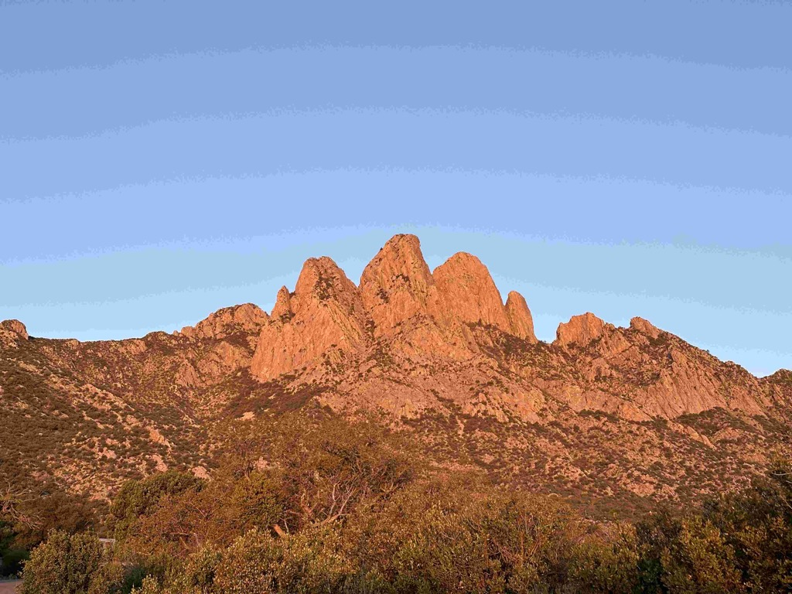

We are on the 19th day of this trip.  We woke up to a beautiful sunrise outside of [Lincoln NM](https://en.wikipedia.org/wiki/Lincoln,_New_Mexico).   I made us some coffee, and then we headed out.    We went into the historic town of Lincoln, where Billy the Kid made his escape, but alas, it was a Wednesday, and everything is open Thursday - Monday.  So we looked through the windows and wandered the streets.  From there, we headed out towards White Sands National Park.   Along the way, we stopped at the [Smokey the Bear Museum in Capitan, NM](https://www.villageofcapitan.org/community/page/museum-and-gift-shop),   And then we saw the [Three Rivers Petroglyphs](https://www.blm.gov/visit/three-rivers-petroglyph-site) before stopping in at [McGuinns Pistachioland](https://pistachioland.com/), where we picked up some shirts, Pistachios, and wine.  There are probably 100 billboards throughout New Mexico advertising this place, and it far exceeded my expectations.  

We went to the [White Sands National Park](https://www.nps.gov/whsa/index.htm), where we played in the Dunes.  This place is strange; it's like there was a big dump of white sand on the desert floor that is allowed to blow around in only this one particular spot.    The edges of it are so crisp...  There are dunes, and then there is the desert floor.  And then, as you are amongst the dunes, sometimes the valley between the dunes goes right to the desert floor.  

From there, we came up to a beautiful campground where we had a wonderful dinner and spent the night.   I took my bike out for a short ride, which was nice.

Where we woke up in the morning!   What a great view and quite campsite.

Dear in Lincoln City

Street View in [Lincoln New Mexico](https://www.legendsofamerica.com/nm-lincoln/)

THe museum was closed

This was the most rustic building in the Town

The Mercantile in Lincoln city

We stoped at the [Smokey Bear Historical park in Capitan, New Mexico](https://www.emnrd.nm.gov/sfd/smokey-bear-historical-park/)

The smokey the bear campaign actually started before (1940) they found the bear cub that they called Smokey the bear (1950)

When Smokey died, of the old age of 27, his remains were brought back to Capitan where he had been saved after being burned in a forest fire.

There are 20,000+ Petroglyphs at the [Three Rivers Petroglyph site](https://www.blm.gov/visit/three-rivers-petroglyph-site). 

[McGuinns PistachioLand](https://pistachioland.com/) was far more impressive than I expected it to be.  

The worlds largest pistachio turns out to be made of concrete!

[White Sands National Park](https://www.nps.gov/whsa/index.htm)

Athena is camaflouged!

Me and Catherine at the dunes

Our campsite last night

[White sands missile range](https://www.wsmr.army.mil)

Mountains in the evening

Mountains in the morning

[Day19 Gyp Spring Canyon, Lincoln County to  Aguirre Springs Campground](https://www.gaiagps.com/public/4zpfBcJpvptL8YlFXMrseSw4/)

[<< Previous - 2024-04-09-day18-leaving-texas---heading-towards-home](./2024-04-09-day18-leaving-texas---heading-towards-home.md)
[Next >> - 2024-04-12-day21-joshua-tree-national-park](./2024-04-12-day21-joshua-tree-national-park.md)

<iframe src="https://www.gaiagps.com/public/4zpfBcJpvptL8YlFXMrseSw4/?embed=True" style="border:none; overflow-y: hidden; background-color:white; min-width: 320px; max-width:420px; width:100%; height: 420px;" seamless />

