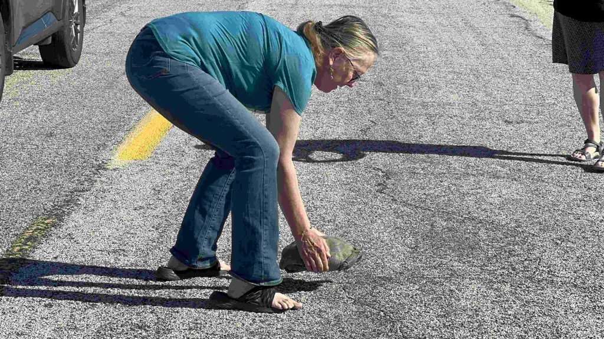
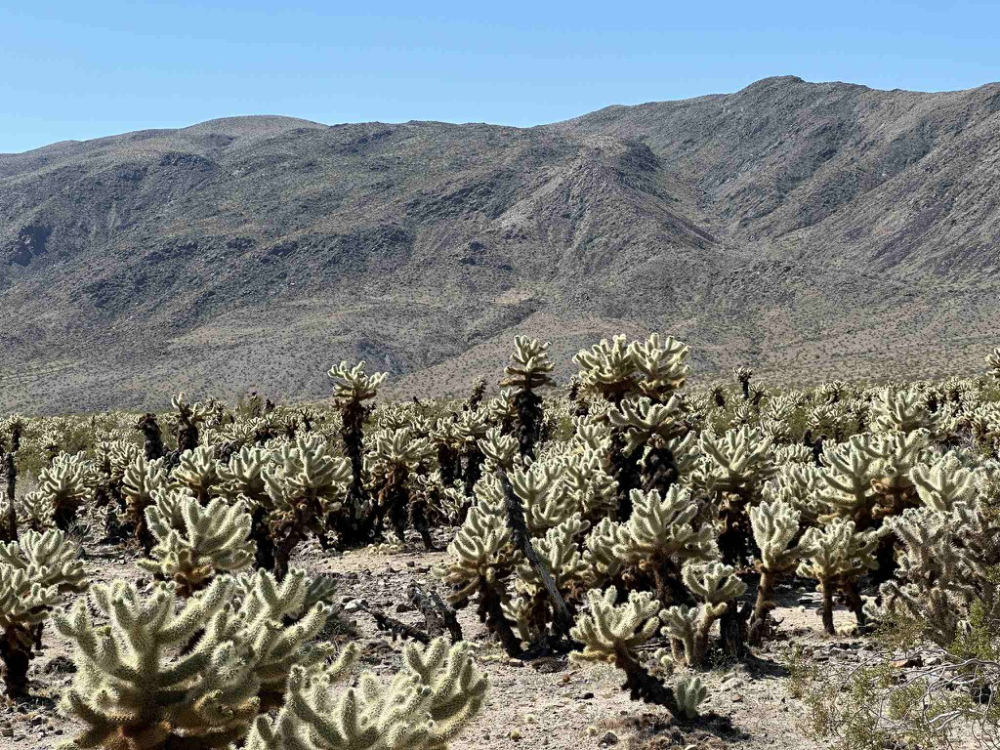
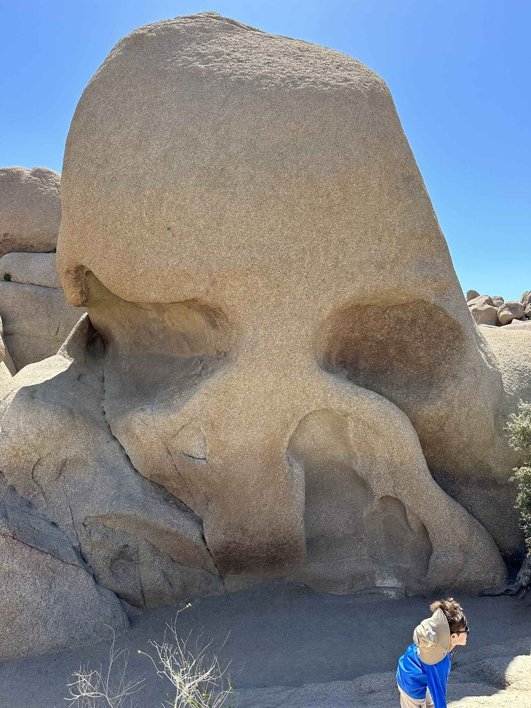
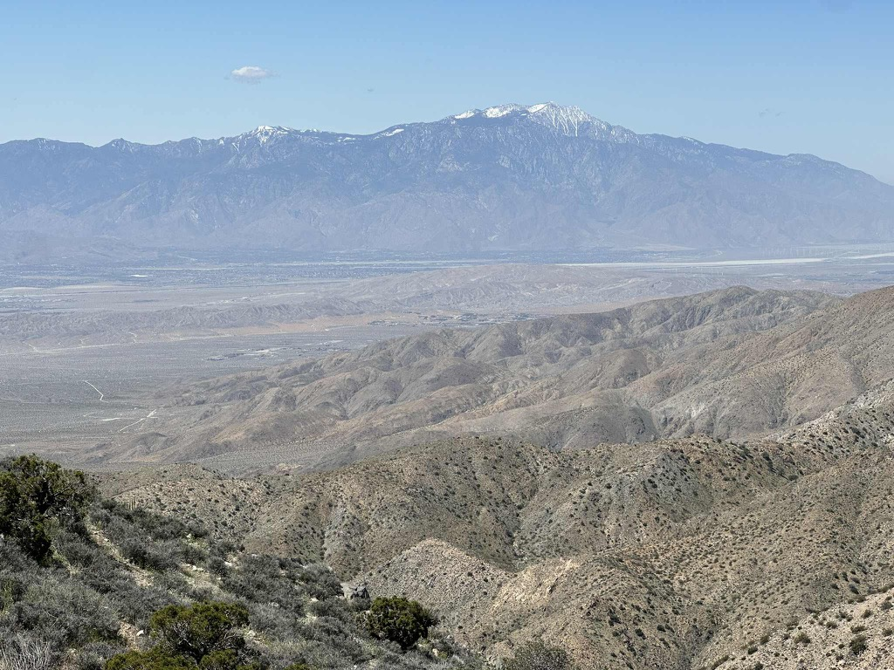

Day 21 of our road trip - boy, are we glad we pushed through the night before and made it all the way to [Joshua Tree National Park](https://www.nps.gov/jotr/) so that in the morning, we didn't have to drive any meaningful distance to get to the park.   It was nice to be able to get up and have a relatively slow morning of fixing the coffee and writing my trip reports.

We Headed into the Park just after 9:00 am.   We were coming into the park from the south, and on the entrance road, we came across a [desert tortoise](https://en.wikipedia.org/wiki/Desert_tortoise) trying to make its way across the road.  Well, if you have ever seen the cartoons about how fast Tortoises move, they are right. So we stopped, put on the hazards, and Catherine moved the tortoise off the road under the supervision of a park employee who just happened to be driving by.  (That woman was very excited about the interaction and had all sorts of advice and instructions on approaching and handling the wildlife).   Once our good deed for the day was done, we continued our drive through the park, stopping at the visitors center to stamp my National Park Passport and get some recommendations for what to see in the park.  

The drive into the park was just spectacular.  Joshua Tree is a _vast_ park, and it is where the [Mojave and the Colorado deserts meet](http://mojavedesert.net/plants/vegetation/01.html). It is the result of some fascinating and unique geological activity.    So as we drove through, we got to experience two different deserts.   The Vistas through the park were stunning and really almost otherworldly.   We stopped and took a few short hikes at various points in the park.  The sense of space was immense, especially in the early part of the route as we traversed the Colorado desert.   We went to the Vista on the north part of the park that looks out over the [Coachella Valley](https://en.wikipedia.org/wiki/Coachella_Valley).  The sense I got was that we were peaking over the edge of a big giant bowl at what lay beyond.

Once we left the park, we thought about what we wanted to do on the route up to See Eric, Maggie, and Sahale.   I had initially thought that it would be good to see Death Valley National Park, but that park is so huge that we decided to skip it to do it right in the future. We aim to hit Sequoia National Park and Yosemite National Park on the way to Eric's in Petaluma.    

So we were heading north and wanted to stop for the night somewhere with Laundry and showers and settle in there before the sunset.   So we settled in on Mountain Valley RV Park and headed that way.  Stopping for Fuel in Victorville along the [historic Route 66](https://en.wikipedia.org/wiki/U.S._Route_66) and heading across the Mojave desert.   We went by the world's [Largest Borax mine](https://en.wikipedia.org/wiki/Rio_Tinto_Borax_Mine) and E[dwards Air force Base](https://www.edwards.af.mil/).  As we left the desert and climbed into the Horned Toad Hills, we saw immense windmills covering the hillsides.  

It was nice to get the laundry done and take a shower.  

This guy was not the quickest at crossing the street, and as we approached, he just gave up the effort alltogether.

Catherine getting out to access the situation.  In the car coming at us was a woman that worked in the park.

The instructions were _very_ clear...  do not lift the tortoise more than absolutely necessary above the ground.

A forest of Cactus's

Skull Rock - aptly named I would say.

We didn't find anything up his nose but dust.

Looking over the Coachella Valley.

A wider angle shot of the Coachella Valley

Catherine and a Joshua Tree

Some cool granite boulders

This was from my hike to Baker Damn

A close up of the bark on a Joshua Tree

The Route 66 sign on Victorville

I now have a true sense of the vastness of the Mojave Desert.

<iframe width="560" height="315" src="https://www.youtube.com/embed/OcYEYJRznm8?si=iWQ0kVGPxvrzser-" title="YouTube video player" frameborder="0" allow="accelerometer; autoplay; clipboard-write; encrypted-media; gyroscope; picture-in-picture; web-share" referrerpolicy="strict-origin-when-cross-origin" allowfullscreen></iframe>

Driving through the mojave desert

<iframe width="560" height="315" src="https://www.youtube.com/embed/EuT-7U5OOE4?si=AzIJ0juTKcP4ZFSS" title="YouTube video player" frameborder="0" allow="accelerometer; autoplay; clipboard-write; encrypted-media; gyroscope; picture-in-picture; web-share" referrerpolicy="strict-origin-when-cross-origin" allowfullscreen></iframe>

Driving up to the Joshua Tree Vista that looks over the Coachella Valley

[Day21 Joshua tree](https://www.gaiagps.com/public/o7Ykau80z54Rk1xRKMquJ7q5/)

[<< Previous - 2024-04-11-day20-white-sands-area-to-joshua-tree](./2024-04-11-day20-white-sands-area-to-joshua-tree.md)

[Next >> - 2024-04-13-day22-skylark-airport-to-sequoia-national-park](./2024-04-13-day22-skylark-airport-to-sequoia-national-park.md)

<iframe src="https://www.gaiagps.com/public/o7Ykau80z54Rk1xRKMquJ7q5/?embed=True" style="border:none; overflow-y: hidden; background-color:white; min-width: 320px; max-width:420px; width:100%; height: 420px;" seamless />

