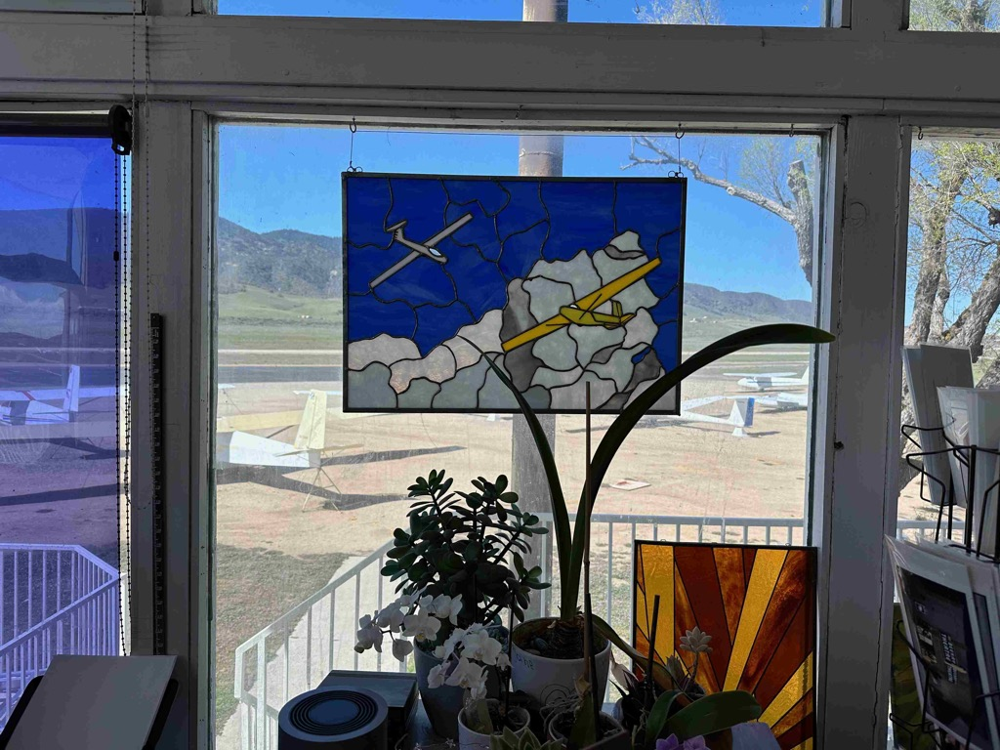
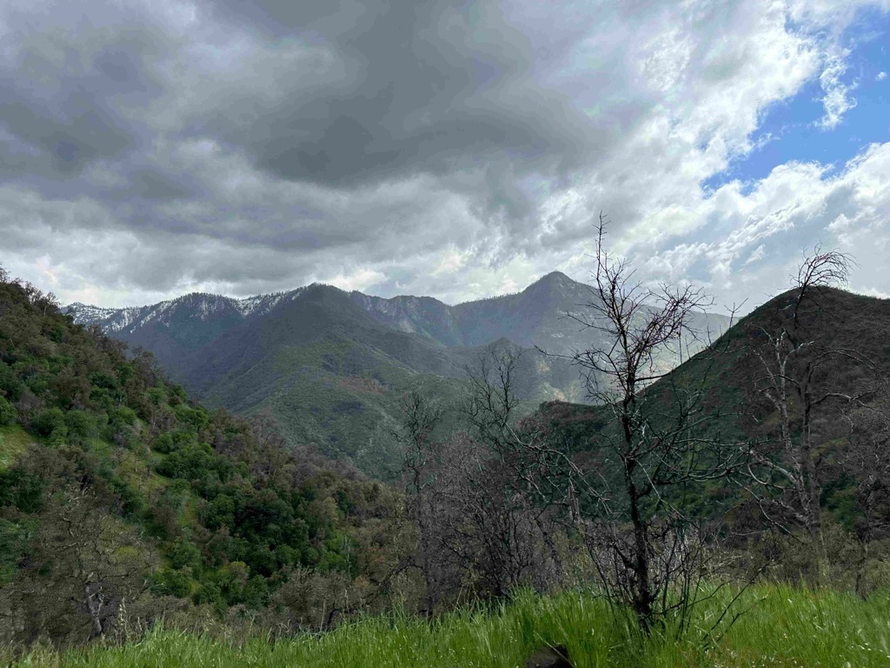
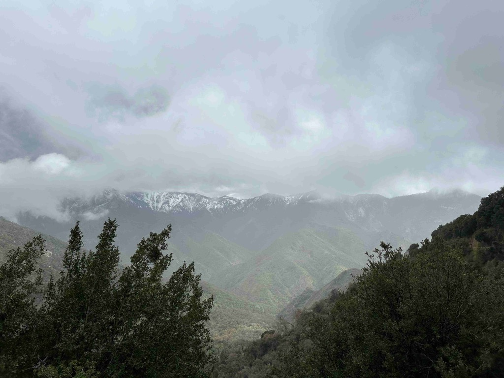
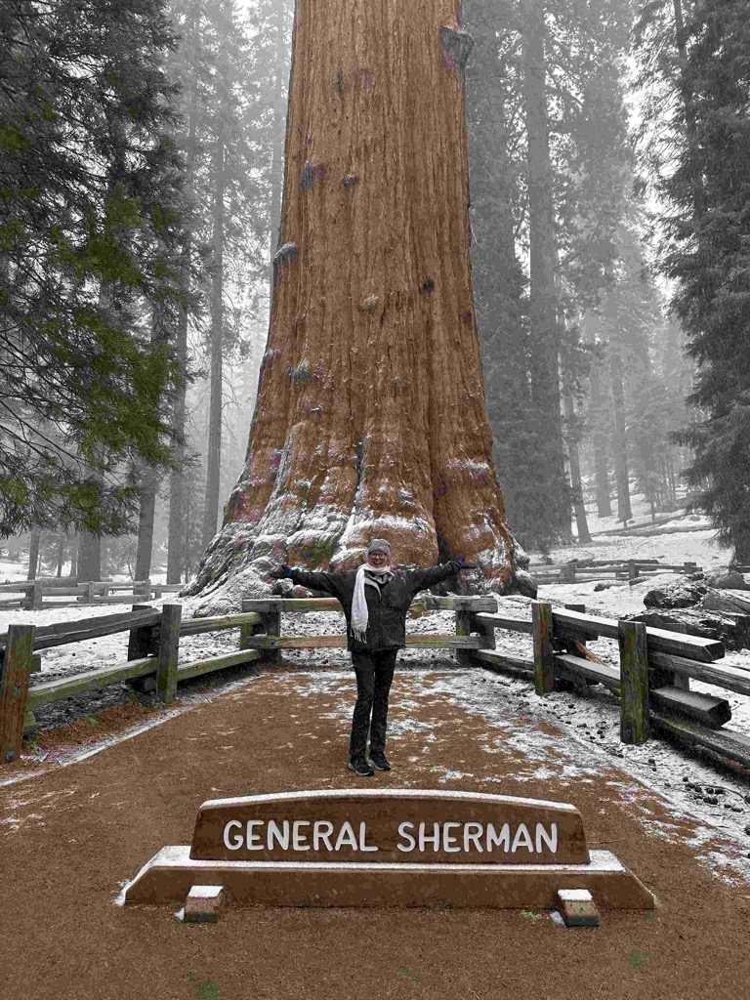
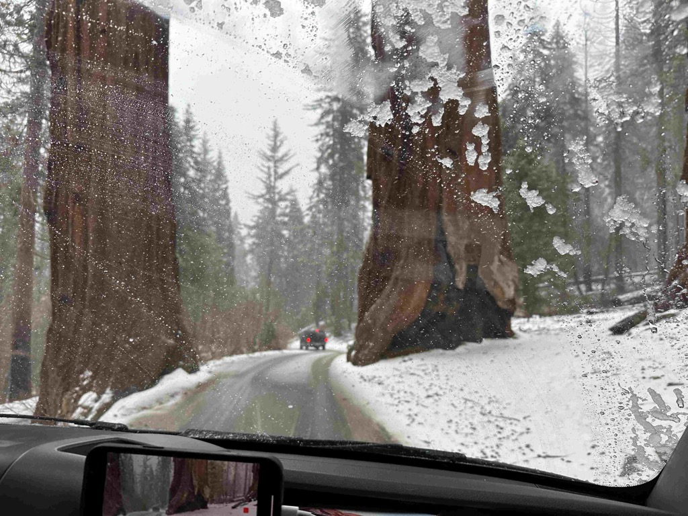

Day 22 saw us wake up in a cute little RV park called Mountain Valley RV Park.    It was a beautiful morning, and the bikes were already off the racks, so we decided to head out on a little bike ride to see what was to see.  Just down the road, a piece is the little [Skylark North Airport](https://skylarknorth.com/) that specializes in soaring. We rode along its perimeter and then amongst the hangers and the tow planes before realizing they had a coffee shop, so we stopped. I wandered in there, and they were also serving breakfast, so we decided to grab some breakfast and coffee from the cafe.   I started chatting with the women who worked there, and it turns out they have owned the place for the last 48 years.  I didn't quite get the relationship, but one was the mom, and one was the daughter, and I believe there are granddaughters in the operation as well.  The family bought it when the airport where they were running their glider flight school disrupted their operations just one too many times.   Being so close to Edwards Airforce Base, they have a very deep relationship with things over there.   And they have the longest-running contract with the military to teach the test pilots how to fly gliders.  The walls were just covered with signed memorabilia from all sorts of folks involved in the history of advanced flying craft from Edwards. 

They also offer sailplane rides out of place. Initially, I wasn't going to do it, then I decided that I would (and I even made their weight cut off, which means I have _lost_ weight on this trip), but alas, just as I was being introduced to my pilot, he reported that the winds had changed, and they weren't going up at the moment.   :(.  as a consolation prize, I bought one of their shirts.   

From there, we set our sites on Sequoia National Park and started driving north, again staying off of the major highways.   They dirve along here was much prettier, as we were in farmland now.  And we drove through mile after mile after mile of Citrus groves.  Just orange trees as far as the eye could see.   

We entered the park, and the weather was just glorious.  The road that goes through the park, called "[General Highway](https://en.wikipedia.org/wiki/Generals_Highway)" was open only far enough for us to get to the [General Sherman Tree](https://www.nps.gov/seki/learn/nature/sherman.htm) about 22 miles in.  But that was enough for us to get quite the experience driving the road.   It went up and up and up to over 7,000 feet.  As we approached the 6,000 foot level, we could see clouds swirling over the ridges, and eerily coming down the sides of the mountains.   As we got even higher we were driving through the clouds, with mere feet of visibility at times.    By the time we arrived at the General Sherman, it was full on snowing!    We parked, turned on the heater to keep Athena warm and then headed down to see the largest tree, by volume of wood in it's trunk, in the world.    It was quite impressive.    We will definitely have to come back this way when the road is open all the way, and we can spend more time exploring these great parks.

Once we were back down in the farmland, it was full on raining cat's and dogs.  We decided that we drive north a ways to get closer to Eric and his family, and find a place to camp along the way.   We had debated if we do a rest stop, or a campground, or a wallmart, and settled on doing a campground just so we could have a little quite and comfort.   Using iOverlander, and other resources, we settled on Lindy's Landing.   And we would even be able to get there before they closed.   We arrived, checked in, and went and put eyes on our campsite, and then headed into the town of Kingsberg Ca

[Day 22 - Skylark airport and sequoia national park](https://www.gaiagps.com/public/kNUMgmzz9utsvMNCoLwICgFh/)

[<< Previous - 2024-04-12-day21-joshua-tree-national-park](./2024-04-12-day21-joshua-tree-national-park.md)

<iframe src="https://www.gaiagps.com/public/kNUMgmzz9utsvMNCoLwICgFh/?embed=True" style="border:none; overflow-y: hidden; background-color:white; min-width: 320px; max-width:420px; width:100%; height: 420px;" seamless />

