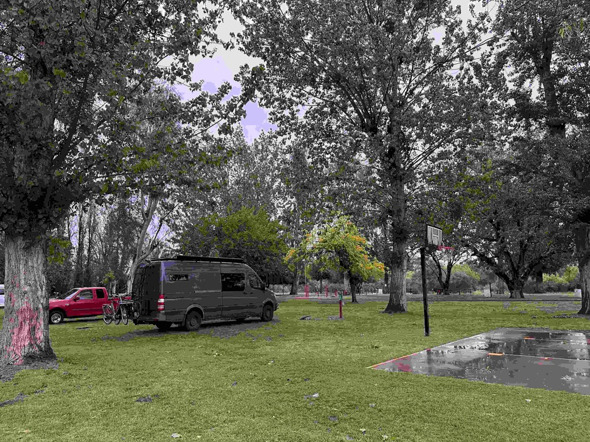
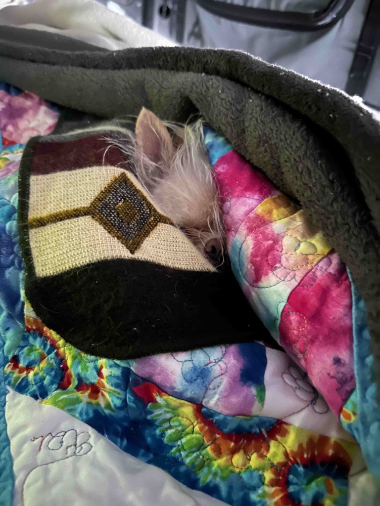
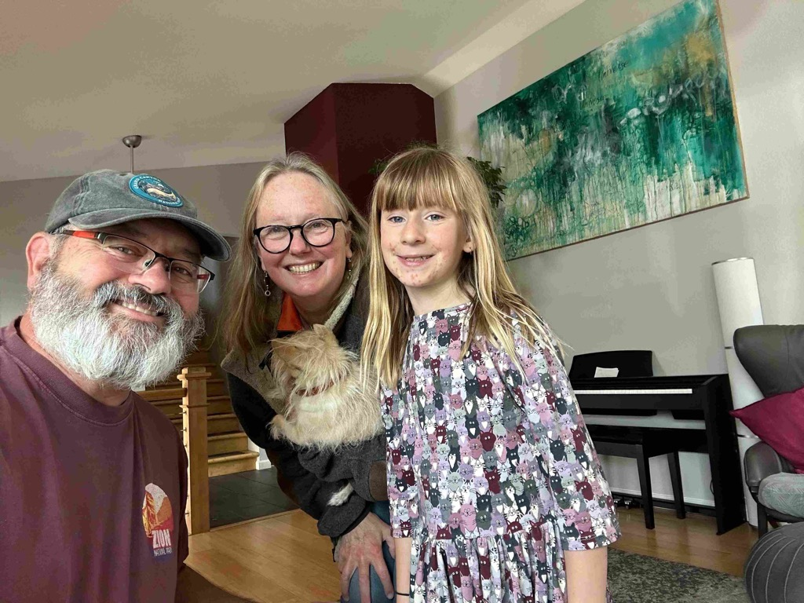
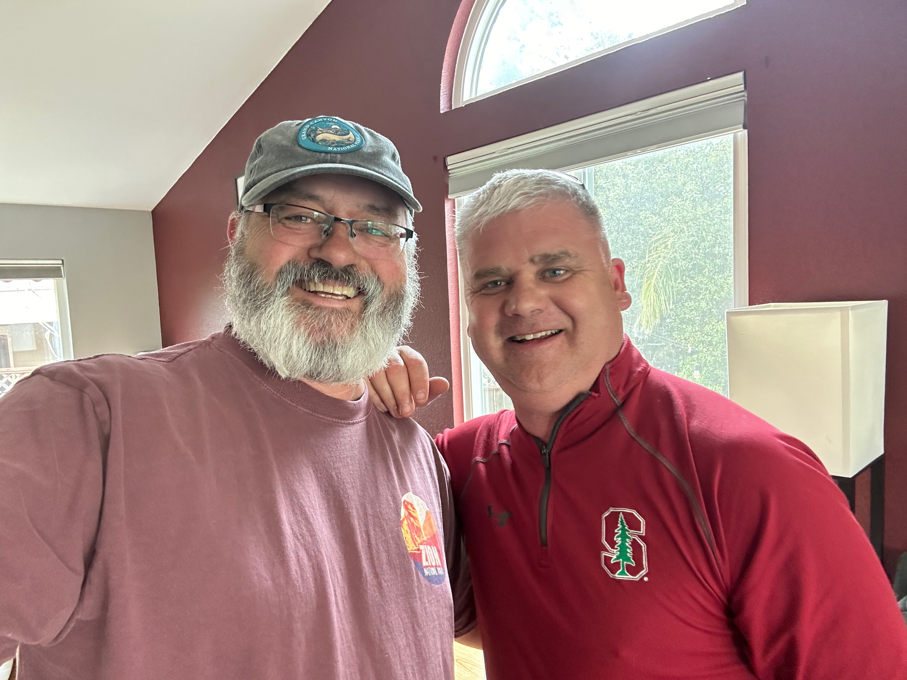
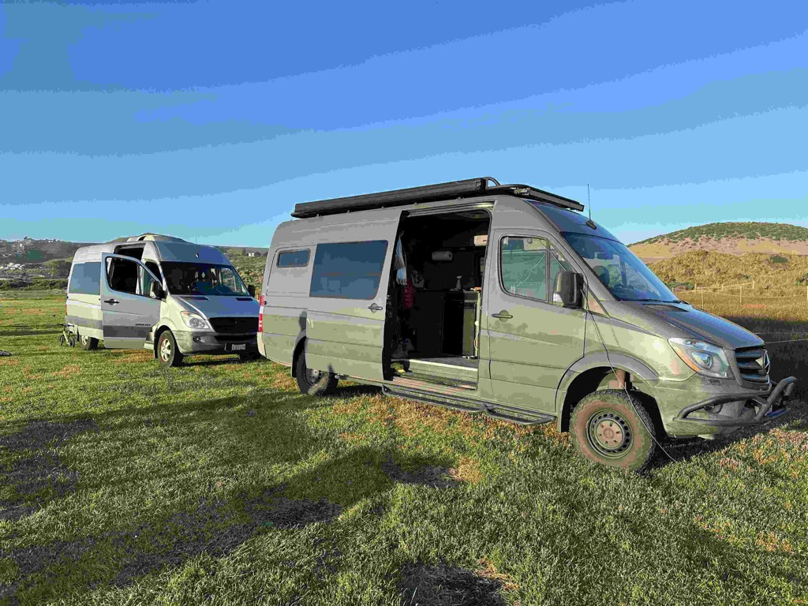
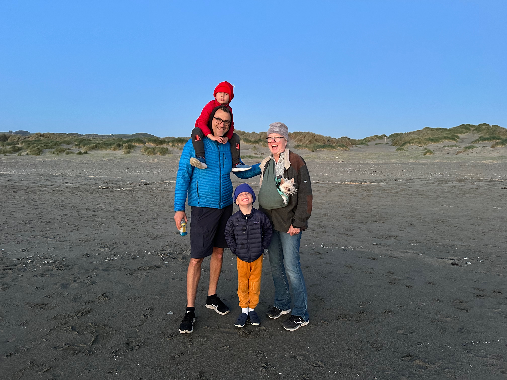
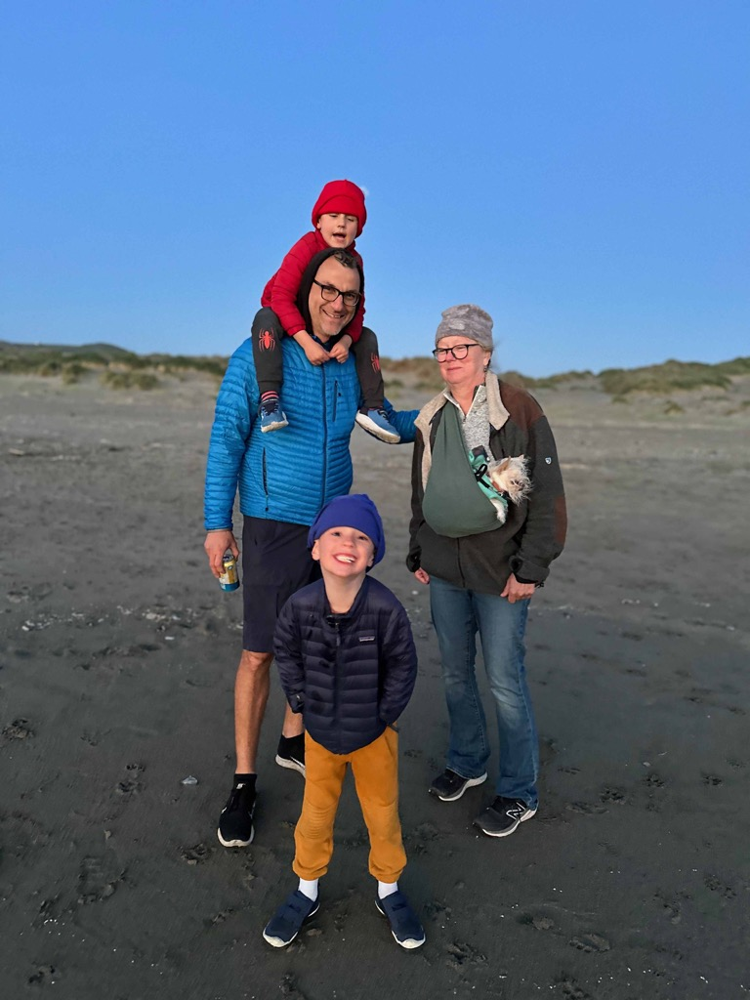
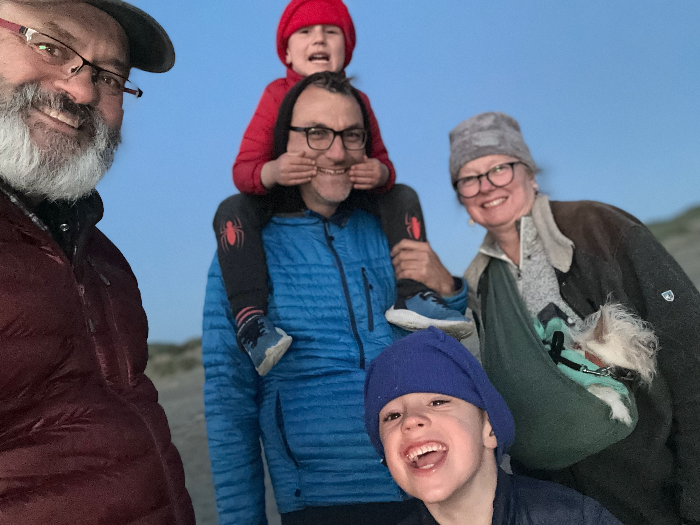
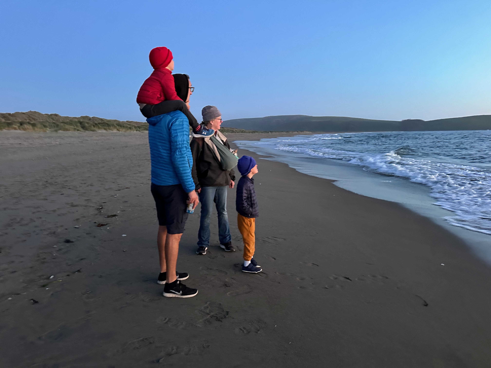

Good morning everyone!  Sunday Catherine and I drove from the Kingsburg area up to Petaluma.  Not much of an exciting leg as it was raining when we left, and we wanted to get up to see Eric and the Fam to maximize our time with them.  

It was great to see Eric, Maggie, and Sahale and their two dogs, Neva and Apple.  We chatted well into the evening and just had a wonderful visit.  Eric used his smoker to cook us up some Salmon for dinner, which was just fantastic.   

Catherine and I slept in the Van in the Driveway.    Maggie left at 5 am for a flight to Washington DC for her job, and Eric and Sahale flew out on Tuesday to join them.  
On Monday, Eric and I poked around the Vans and the rigs.   We took off all of the tires on our Van, checked the brakes, and discovered that the brakes on the rear passenger side were shot.  There is enough to get us home, but I will do a brake job when I get home.  

After a beautiful lunch at Sahale's favorite Mexican restaurant and some slushies and ice cream, Catherine and I said our goodbyes and had a nice short trip to Dillon Beach at the top of Tamales Bay.   We set up camp, took a nap, and waited for George and his boys to show up in their sprinter.   We had a wonderful time with them and will also be spending Tuesday night here with them.   

Rain Rain Rain Rain Rain in the morning at Lindsay's landing.   Not conducive for exploration.

Athena Loves to sleep in!

Me, Catherine and Sahale 

Me and my cousin Eric Peterson.

Georges Van and ours and Dillon Beach

Everyone down on the beach.

Enjoying the sunset.

[Day23 Lindy’s landing to Eric’s](https://www.gaiagps.com/public/JJNE0oIx1N43hAYBbfwtr68e/)

[Day24 From Eric’s to Lawson’s landing ](https://www.gaiagps.com/public/Dy8yjUxti5vmgaaM9nG5V3Ej/)

[<< Previous - 2024-04-13-day22-skylark-airport-to-sequoia-national-park](./2024-04-13-day22-skylark-airport-to-sequoia-national-park.md)

[Next >> 2024-04-16-day25-lawsons-landing-with-george-and-the-boys](./2024-04-16-day25-lawsons-landing-with-george-and-the-boys.md)

<iframe src="https://www.gaiagps.com/public/JJNE0oIx1N43hAYBbfwtr68e/?embed=True" style="border:none; overflow-y: hidden; background-color:white; min-width: 320px; max-width:420px; width:100%; height: 420px;" seamless />

<iframe src="https://www.gaiagps.com/public/Dy8yjUxti5vmgaaM9nG5V3Ej/?embed=True" style="border:none; overflow-y: hidden; background-color:white; min-width: 320px; max-width:420px; width:100%; height: 420px;" seamless />

