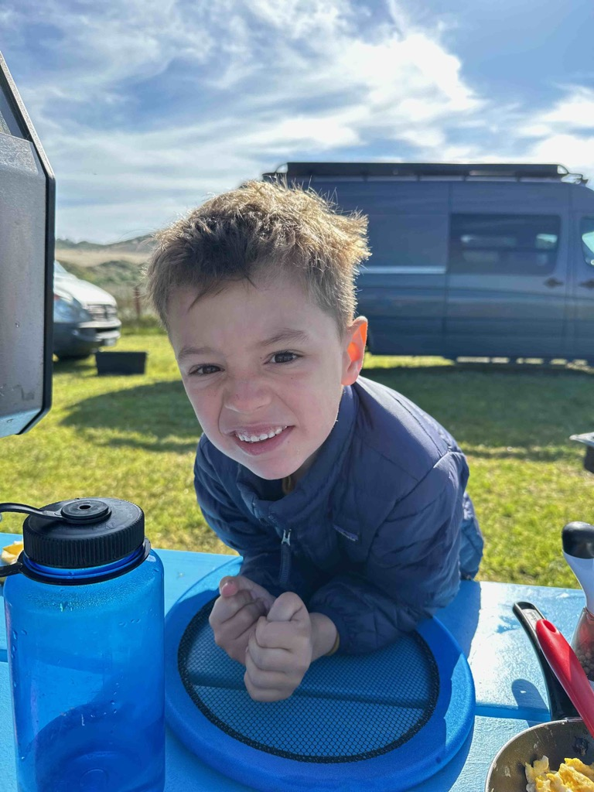
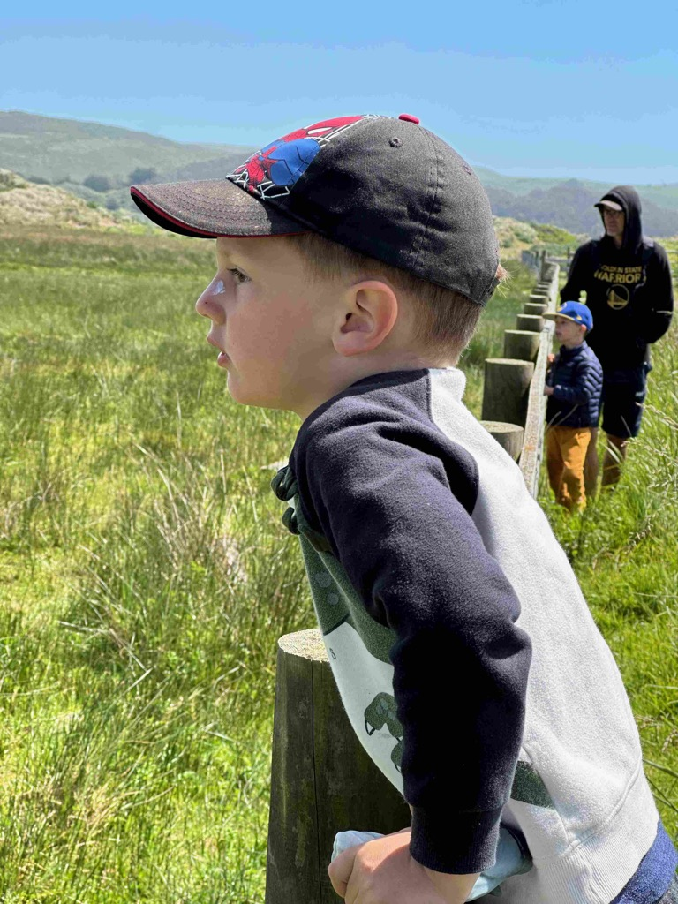
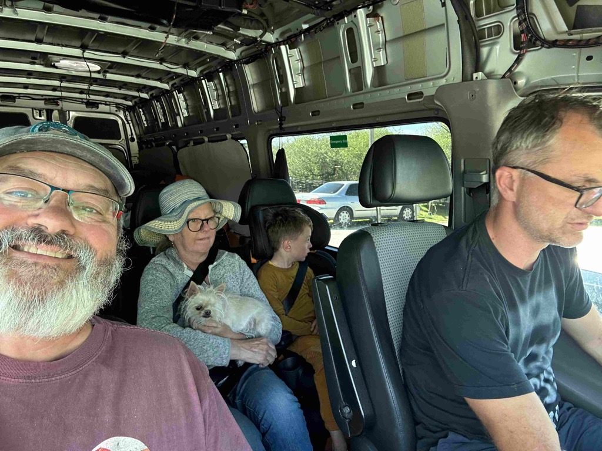
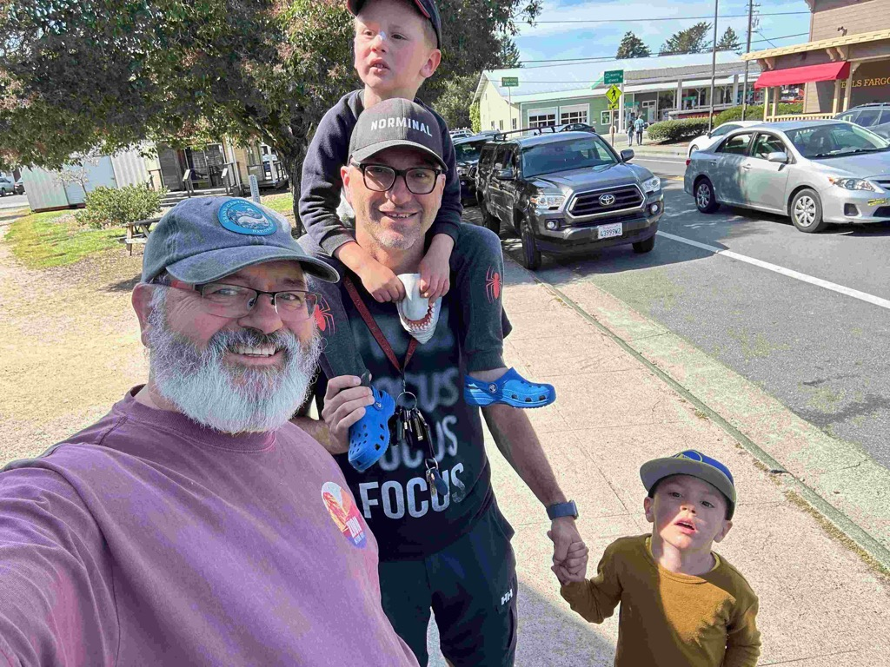
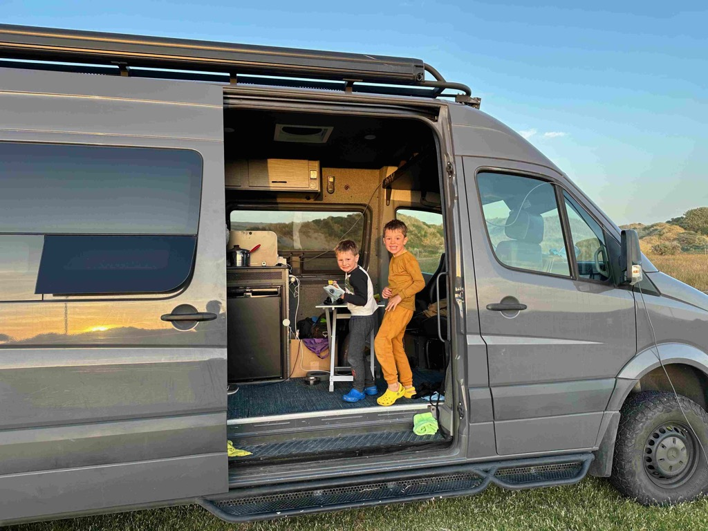
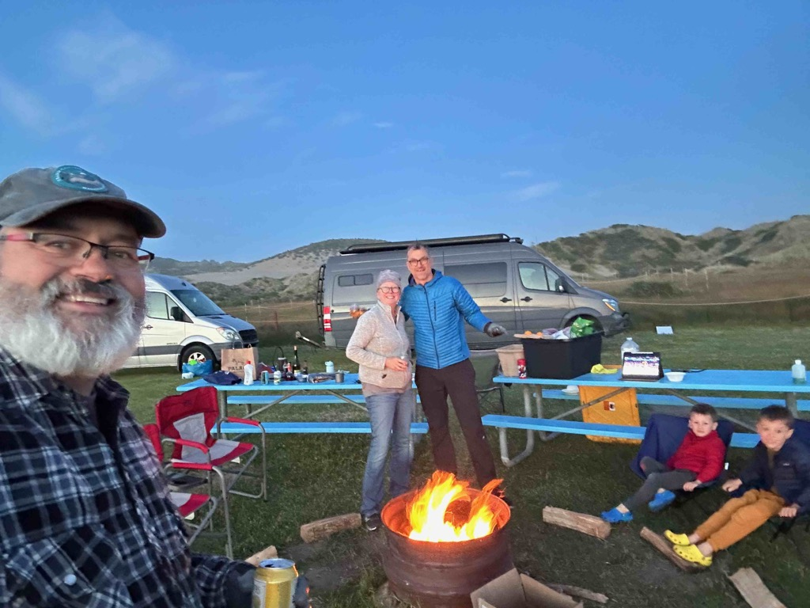

[Day25 day Trip to Oysters and  pt Reyes station](https://www.gaiagps.com/public/aeuL15lzDjwuTW4rSrnSe51c/)

[<< Previous - 2024-04-15-day23-and-24---petaluma-with-eric-and-dillon-beach](./2024-04-15-day23-and-24---petaluma-with-eric-and-dillon-beach.md)

<iframe src="https://www.gaiagps.com/public/aeuL15lzDjwuTW4rSrnSe51c/?embed=True" style="border:none; overflow-y: hidden; background-color:white; min-width: 320px; max-width:420px; width:100%; height: 420px;" seamless />