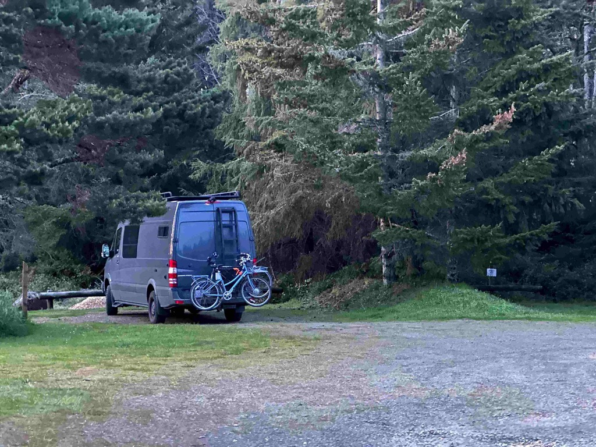
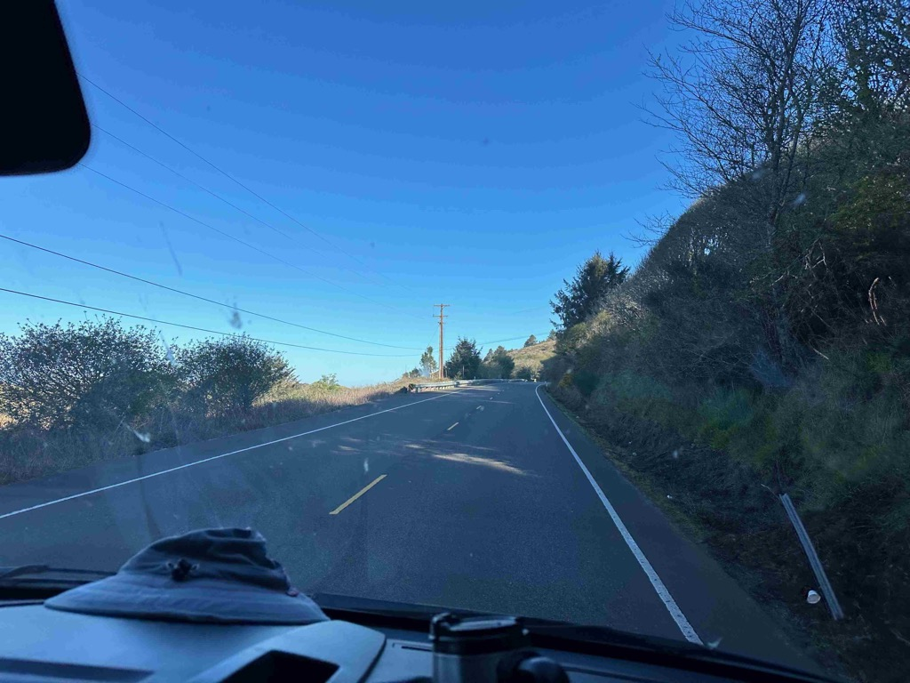
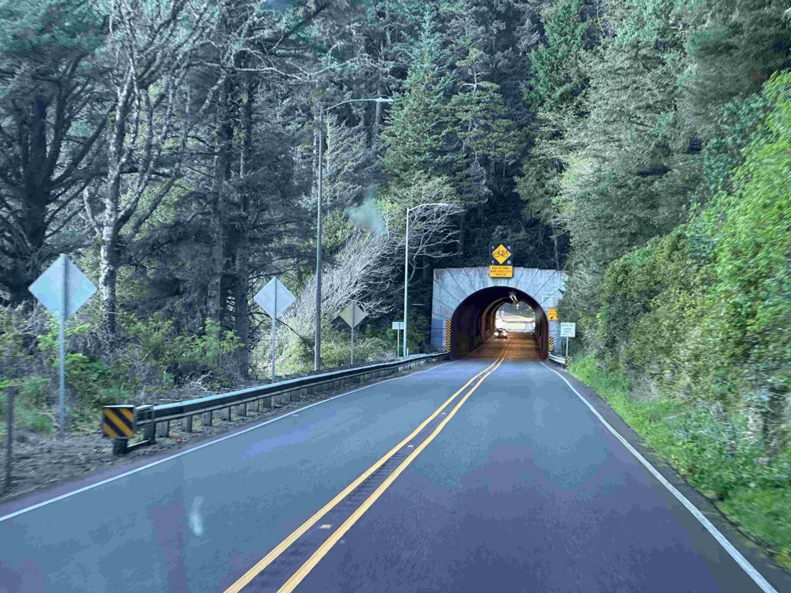
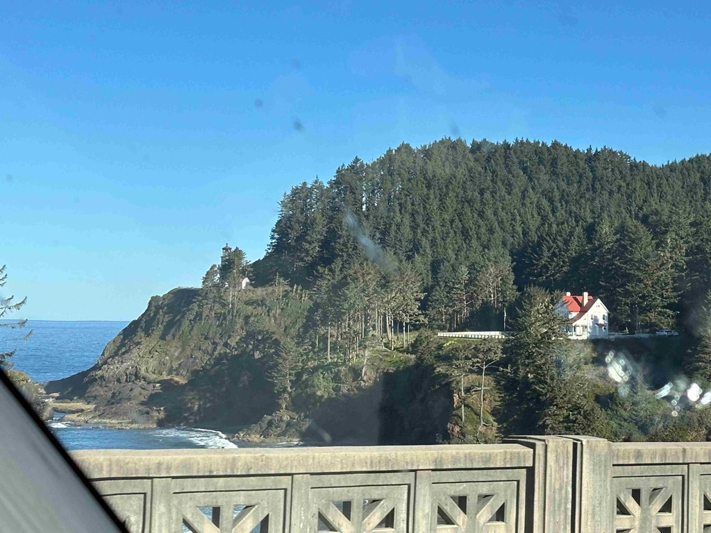
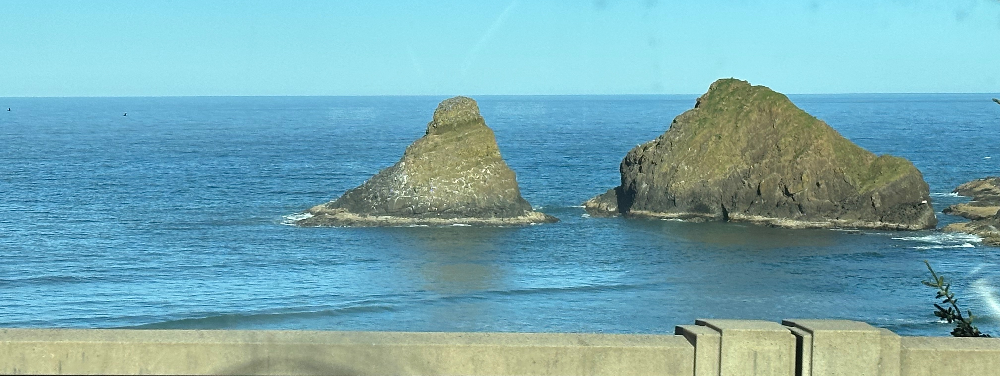
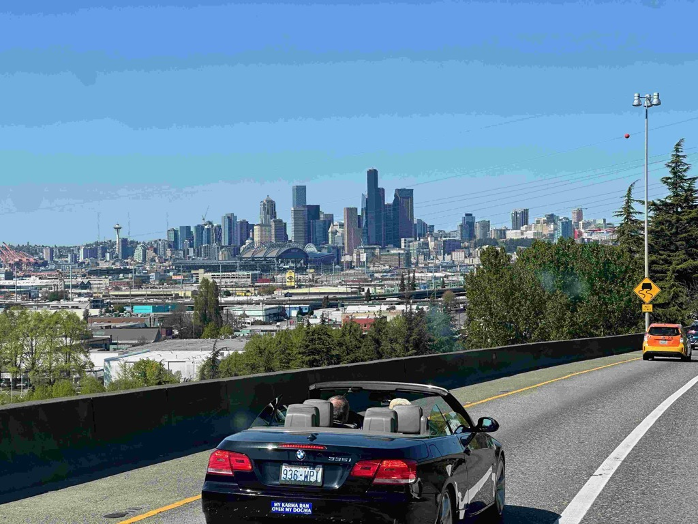
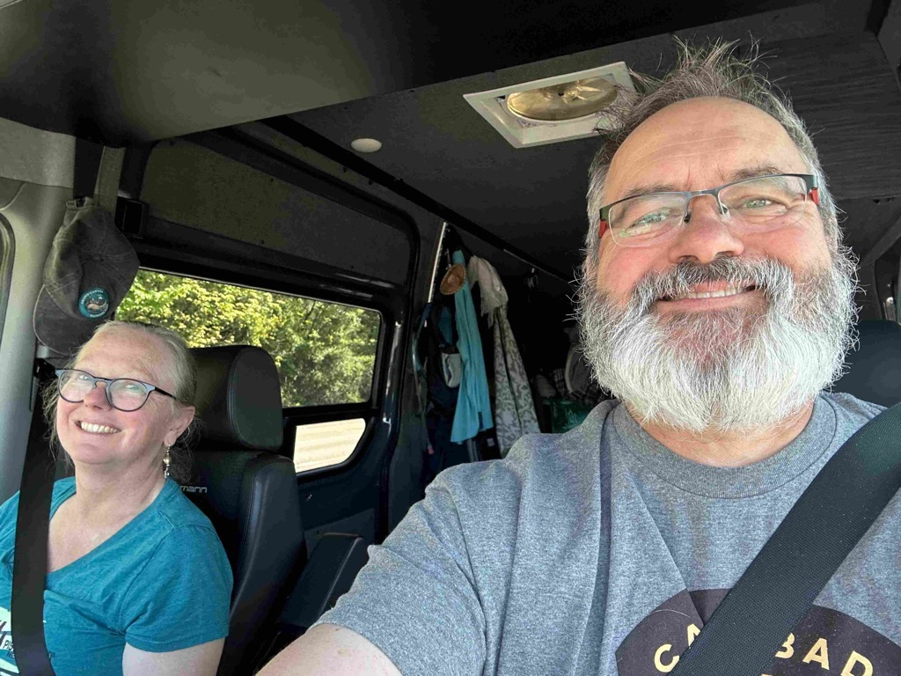
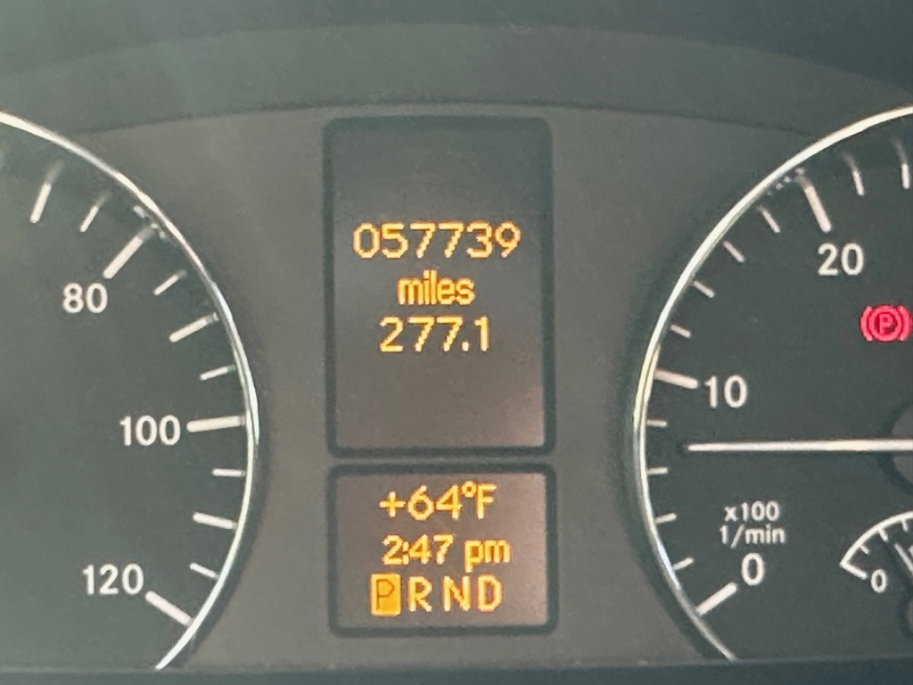
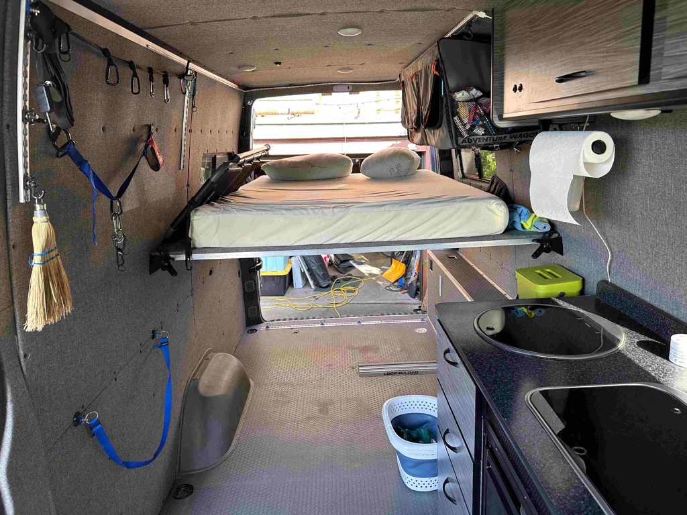

Day 28 saw the horse smelling the barn, and we drove with determination to get home.  The weather was beautiful, and the portion of the Oregon coastline that we were on deserves a week just by itself, but as always happens at the close of the trip, you want to get on home.  So we drove consistently and got home just before 4 in the afternoon.  Another motivation for driving so hard was that Catherine wanted to join Katarina at a cabinet consultation in the evening.

Once we got home, we completely unloaded the van and cleaned it.  Once Catherine was done with the session with Katarina, she ordered some Teriyaki for us all, and I went and washed the van at the local car wash while the food was being prepared.

Today we will do laundry, put things away, and prepare for the upcoming work week.  

I hope everyone has enjoyed following along with these daily trip reports as much as I have enjoyed writing them!   

I'll keep the list around and mail out to it periodically as we do trips that I want to capture on this blog.  It's been a fun trip!

Here are some stats for the trip.

```


| Title                               | Value                                                                                                                                                                                |
| ----------------------------------- | ------------------------------------------------------------------------------------------------------------------------------------------------------------------------------------ |
| How long was the trip               | 28 days                                                                                                                                                                              |
| How many days of driving            | 23 days of significant travel                                                                                                                                                        |
| How many times were the bike ridden | four or five days                                                                                                                                                                    |
| Miles Driven                        | 6,604                                                                                                                                                                                |
| Fuel Stops                          | 28                                                                                                                                                                                   |
| Fuel Consumed                       | 432 Gallons                                                                                                                                                                          |
| Fuel Cost                           | $1,724                                                                                                                                                                               |
| MPG                                 | 15.27 mpg                                                                                                                                                                            |
| Cost Per Gallon                     | $3.98                                                                                                                                                                                |
| Cost Per Mile                       | $0.2611                                                                                                                                                                              |
| Most expensive Fuel                 | $5.60 / Gallon - Peteluma CA [[trip-reports/2024-04-15-day23-and-24---petaluma-with-eric-and-dillon-beach\|Day 23 & 24 in Peteluma]]                                                 |
| Least expensive Fuel                | $3.30 / El Passo TX - [[trip-reports/2024-04-01-day10---moms-house-to-guadalupe-mountains-national-park\|Day 10 - Mom's house to Guadalupe]]                                         |
| Oil                                 | I checked the oil pretty regular - and never needed to add any                                                                                                                       |
| Most miles on a single tank         | 345 miles [[trip-reports/2024-04-01-day10---moms-house-to-guadalupe-mountains-national-park\|Day 10 - Mom's house to Guadalupe]]                                                     |
| Most miles in a single day          | 608 miles [[trip-reports/2024-04-11-day20-white-sands-area-to-joshua-tree\|Day 20 - to Joshua Tree]]                                                                                 |
| Highest elevation                   | 8,154 feet [[trip-reports/2024-04-11-day20-white-sands-area-to-joshua-tree\|Day 20 - to Joshua Tree]]                                                                                |
| Maintenance issues                  | No significant issues.   I did check the brakes at my cousin Eric's place, and we discovered that the passenger side rear pads were shot - we made it home and have new ones coming. |

```


Our Trip



Our campsite Friday morning before leaving



What a beautiful day for a drive



We could \ should spend a whole week just on this portion of the drive.



The Hecate head lighthouse



Some sea rocks on the Oregon Coast



The Seattle skyline as we roll into town.


This is how we looked at the start of the trip



And how we looked a the end.



Our odometer at the end of the trip



The van is all cleaned out and ready for the next adventure.


[https://www.gaiagps.com/public/aLRD3ABlCcF3Ga6gcPTT0rb7/](https://www.gaiagps.com/public/aLRD3ABlCcF3Ga6gcPTT0rb7/)

[<< Previous - 2024-04-18-day27-clam-beach-to-oregon-coast](./2024-04-18-day27-clam-beach-to-oregon-coast.md)

<iframe src="https://www.gaiagps.com/public/aLRD3ABlCcF3Ga6gcPTT0rb7/?embed=True" style="border:none; overflow-y: hidden; background-color:white; min-width: 320px; max-width:420px; width:100%; height: 420px;" seamless />

