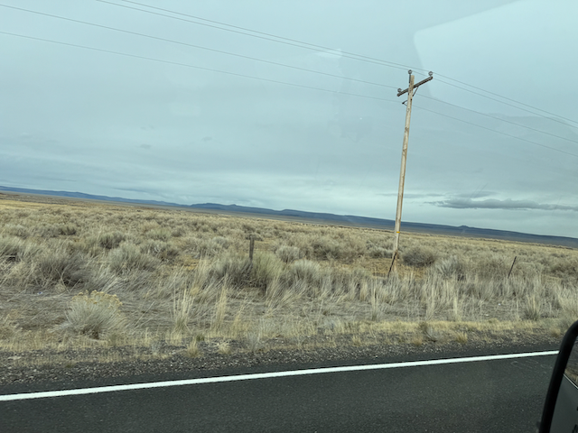
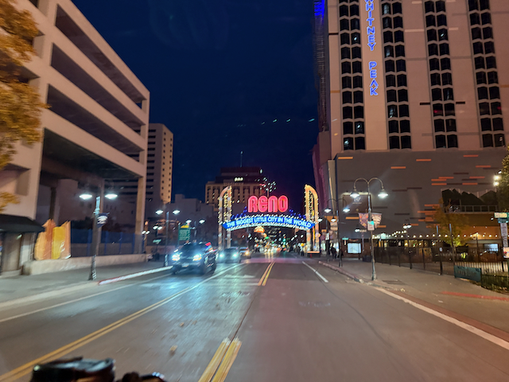
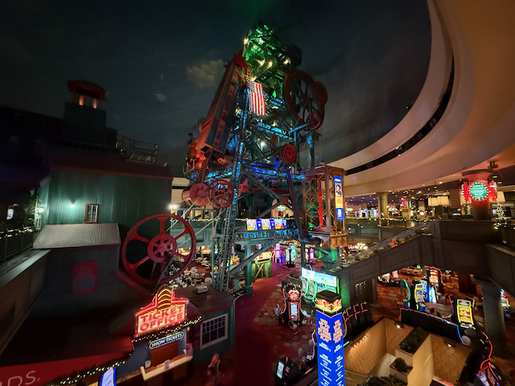

Good Morning all!

Yesterday was a long day of driving, longer then I expected.   I started the day off by revisiting Crack in the ground, and walking the length of it.  I've captured a short Video of that experiende and shared it up on you tube [2411 Crack in the ground - YouTube](https://www.youtube.com/watch?v=yKK_qdkORH0) 

the rest of the day was spent driving through the oregon scenic byways.  I didn't get to Reno until after dark (which was only 5pm!).    I found a place to Park, and then wandered for about 90 minutes through a couple of Casino's.    I had a board meeting at 8pm, that I had to zoom into, so got back in the Van and headed to a place with good cell coverage.    By the time that meeting was over, I decided that I would head towards the bay area, and stop at the Dover pass rest area about 30 minutes away for the night.

This morning I got up, made coffee, and did some work to edit that Video.  Now I'm heading over to pleasenton to meet up with some coworkers for the day. 

Love ya all
Dan W

Didn't take a lot of pictures yesterday.

Ariving in Reno

Inside the Silver Load casino.