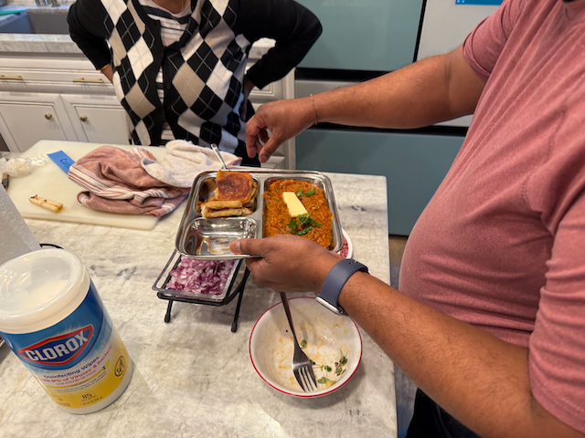

Good Morning!

Yesterday I woke up at the Rest Area at Donner Pass on i80, where i had spent the night the night before.  I had intended to spend the  night in Reno, but I just wasn't feeling it (it didn't help that I had an 8pm meeting that i needed to attend)

I spent some time editing my [Crack in the ground](https://www.youtube.com/watch?v=yKK_qdkORH0) video, and uploaded it to YouTube, and then headed on over to Pleasanton, where I met up with my good friend and coworker Arun.  Arun and I have been working together these past couple of months on the Vrbo project, and have become quite tight.   We went for a walk around his lovely neighborhood, and he and his wife fed me very well with a lovel Paav Bhaji Masala dish.  After lunch I took a quick nap before his team showed up and we headed out for a local escape room, where we managed to solve the puzzles and save Frankenstein with all of 6 seconds remaining on our timer.

After that we went to a wonderful india restraunt for dinner before heading back to Arun's place. 

Tesla solar panels in Arun's neighborhood

Arun making a wonderful meal.

Such good food!

Dobbie!

The team went out for a lovely dinner.

Me, Nagarjun, Arun, Remus and Sravan

We solved the escape room with six seconds to spare, and we had only one kind of hint :)

Arun and I finished off a whiskey bottle and chatted.