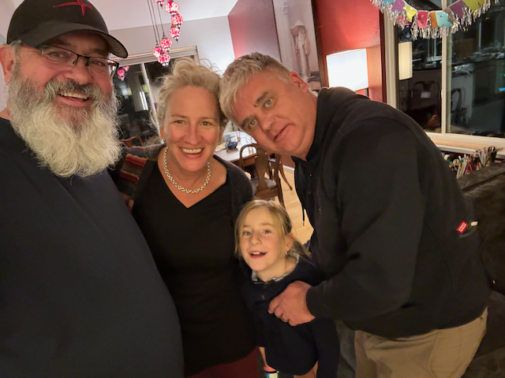

For this race, I took my own sweet time getting down to the track.  It was the week before thanksgiving, so I took the week off.  started by going to Dan Tedrows place and hanging out with him on Saturday night, and then racing with him on Sunday - Sunday Night I went down to Scott Mitchel's place and took them out to dinner, and then loaded up the suspension parts in the van in the morning, and headed towards [2411 Crack in the ground - YouTube](https://www.youtube.com/watch?v=yKK_qdkORH0&t=10s) where I spent the night before heading towards reno.  I spent two hours in a casino there having a shitty meal, before heading to donner pass, where I slept in the rest area, before heading to Arun's place.   I had a nice visit wit Arun and his Family, and then the rest of the team came over, and we all went and did an escape room.  Thursday I headed over to Eric's place and hung out with him.  Friday it was out to the track to Meet up with Kyle and Andy, and then we all went back to Eric's place and hung out for a while.  Eric showed up and we had some pizza.   Eric gave Andy and Kyle a ride back to the hotel.

On Saturday we had an hour or so of rain in the morning (it had rained buckets the week before) and then it cleared up, and we ran on a clean track the whole time. 

Driver order was 

- [eric westmeyer](eric%20westmeyer.md)
- [Kyle morris](Kyle%20morris.md)
- [andy supernaut](andy%20supernaut.md)
- [Dan Weatbrook](People/Dan%20Weatbrook.md)
-

with one stint each day.  

Car ran really well.  On my stint on Saturday the car was louder then I had remembered but I didn't really think anything of it.   after racing we put the car away for the night, and headed into Russian River brewing for dinner and beer.  I slept in the parking lot of the hotel, as Eric had a. bunch of people over for the night.   

Eric went out for his stint, and when Kyle went out, he came right back in, and the rear drivers side wheel was loose.  so we spent 90 minutes changing out the rear bearing, and recalculating stint lengts.  and we still all got 70 minute stints, which were plenty long enough.

George Ionkov came out on Saturday with Stephan, and his buddy Haley showed up with his twin boys.   Eric and his gang came out for a bit during my stint, so I didn't get a chance to see them there.   ON Sunday George came out again with both Felix and Stephan, and Haley and the boys showed up with his wife as well.  so we had quite the little fan club.  

This was the first race that I had with the new insta360 X4 camera (and Eric loaned me his as well). and I am still working on the workflow, but it is going pretty well.   

Visisting with Sahale and her new Dog Sitka.  Sitka is quite the sweetheart

Me, Maggie, Sahale and Eric

One of the teams for Lemons was "Save our peckers". something that my dad would have appreciated ;) 

Dodging the rain drops on Friday.

The crew hanging out in my cousin Eric's garage on Friday night.

Kyle borrowed Catherines sun hat

George and Stephan showed up on Saturday.

George and Stephan crawling on the van.

Dinner Saturday night was at Russian River brewing.

The road from Petaluma to Sonoma had some lovely trees.

Sunrise heading to the track

More sunrise.

Kyle's turn to go racing.

fuzzy car.

Whoops - the bearing wore out - we didn't figure that out until the second stint on Sunday - so we had to spend 90 minutes getting it changed.

Andy has the same oppinion.

Ky;e and Andy spring into action

Fortunately Kyle has all of the tools we needed.

And the parts we needed.

On Sunday George brought Felix out as well,  And his friend Haley, his wife, and twins.

Our fan club.

Eric and Andy ready to fuel the car and get Andy out on the track,

Turns out sprinter vans are good bouncy houses.

Car 110 going through the "bus stop" at the race track.

Dan, Andy and Kyle after the race (Eric headed out early for his long drive home)

Saying good night to George

I Stopped by Eric's place on my way out of town for a quick dinner and shower.

When things go wrong, this can happen.