Good Morning!   This is a daily trip report, but I will send it out to the Sunday list since I didn't get a chance to write my Sunday note this week.

I'm currently on a road trip to Sonoma, California, where I will race with the Close Enough engineering team (Kyle, Eric, Andy, and myself). As soon as the race is over, I will roll on over to Flagstaff, Arizona, to meet Catherine, Alex, and Katarina at Jack and Jay's place for Thanksgiving with the family. Sue Judy Balin and _all_ of the nieces and nephews will be there with Mom.

I'm looking forward to that time.

So I spent the week curating a list of all the things I would need to take with me, and then, on Friday, I gathered it all up and loaded it into the van.  On Saturday, I slowly rolled the final packing, went over to help Scott take the rooftop tent off of his car, and then hit the road.  I drove straight down I-5 towards Portland in mostly driving rain.  When I got to Portland, I stopped in at the Apple store to pick up some items that my coworker Arun ordered (I'm going to see him tomorrow afternoon) and then headed over to my friend Dan Tedrow's place for the evening.   

I met Dan several years ago when our mutual friend Liesl connected us with sailing.  Dan needed someone to go sailiing with him, and I said sure.   And we have been pretty good friends ever since.   I stayed with him and his family at the end of 2021 road trip [Day 43 – drive into Portland – Weaties RoadTrip 2021](https://weatiesroadtrip2021.com/2021/06/15/day-43-drive-into-portland/)   I had a wonderful time hanging out with him, his wife Alex and his two kids Bryon and Kira.     Dan and I talked way into the evening about his engineering work, and I found it fascinating.   It turns out that one of his Mentors and very good friends works at KPFF in Special Project with Alex. Small world.

Dan and I headed down to the Portland Yacht Club on Sunday morning to race in the Sailing on Sunday series on the Columbia River.  There were quite a few boats out there and quite a bit of current.   The format of the race was different than what I am used to.  Instead of rounding marks, they identify these wing walls that come out of the river's shore and tell you to turn around (to port) once you have gone beyond those wing walls (and it's pretty easy to identify that line).   This makes it so boats aren't trying to go around the same point.   Anyway, we had a pretty bad start, as we had to peal out at the last minute at the pin end, as the boat to leeward was "shutting the door" on us.  We still managed to do quite well in the race.   Afterwards, we hung out in the Yacht Club, which was quite nice, we had a beer and a sandwich and a nice chat.

After we got back to Dan's, I said my goodbyes and headed to Albany, Oregon, to meet Scott, one of Alex's close friends from College. I had some parts for the sprinter shipped to his place. I took Scott and his wife out to dinner at a local brewery and had a very nice visit with them. Scott is a Phd student who is studying bees in the forest.     

In the morning, we loaded the parts into the van, and then I headed out.  Scott had suggested a place called Crack in the ground.  so that's where I am at right now.  The drive down here was pretty easy.  The Willamette pass was quite snowing, so that was some slow going.   So I arrived at Crack in the Earth and did some driving around before setting in for the night, just as the sun was setting.  After dinner and a nap, I went for a beautiful moonlit walk.   I decided not to scramble down into the crack in the ground, as it looked quite treacherous, and the risk wouldn't be worth the reward.

Today, I am going to stop at the crack in the ground and explore it a little more before heading toward the Reno area.

Love ya all
Dan W

Stopping at the Portland Apple Store.  I did not buy myself anything ;) 

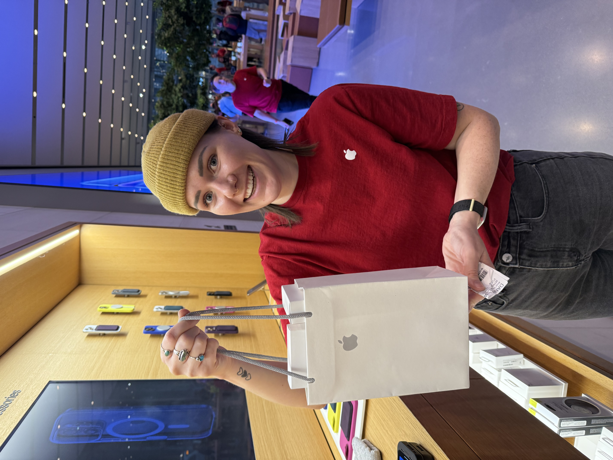

Picking up a phone and two watches that my buddy ordered.

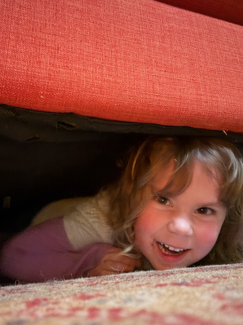

Kira playing hide and seak.

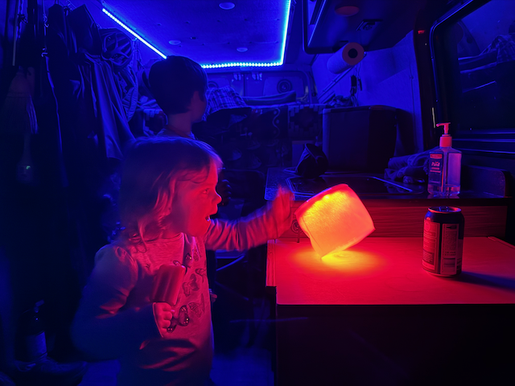

Kira and Byron _LOVED_ the van.

Getting ready for some cottage pie for dinner - it was so so good.

This is their rescue cat Cuddles.  He is a fearsome hunter in spite of the fact that he is missing his left rear leg.

The mighty resolute in it's slip at the Portland Yacht Club

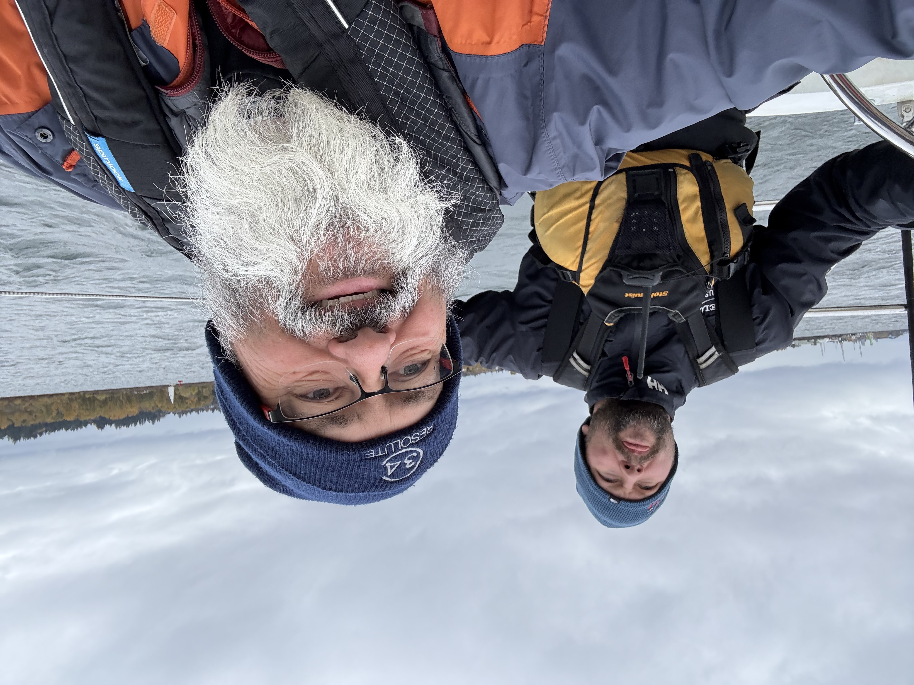

Dan and I preparing for the start

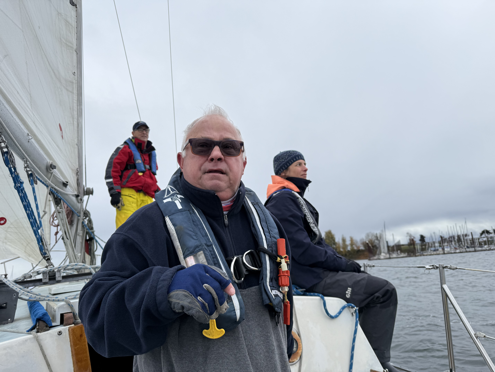

Doug, Max and Amanda preparing for the start

Bill and Doug are an offsetting match

The yacht club was very nice facility 

All of the parts loaded up in the van and (hopefuly) secure.

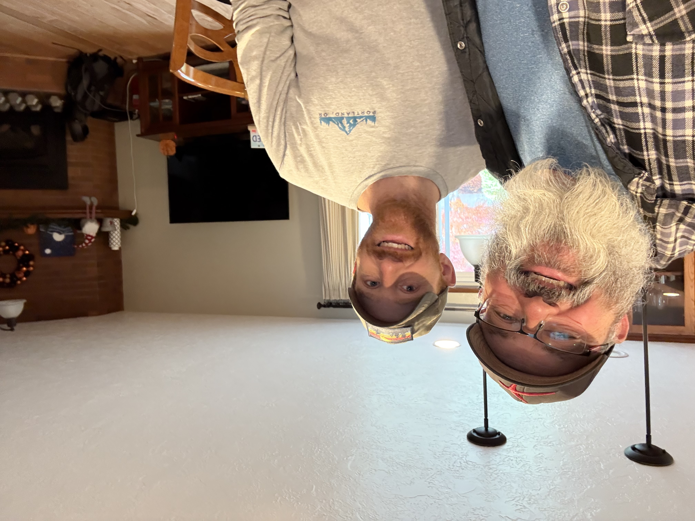

Me and Scott

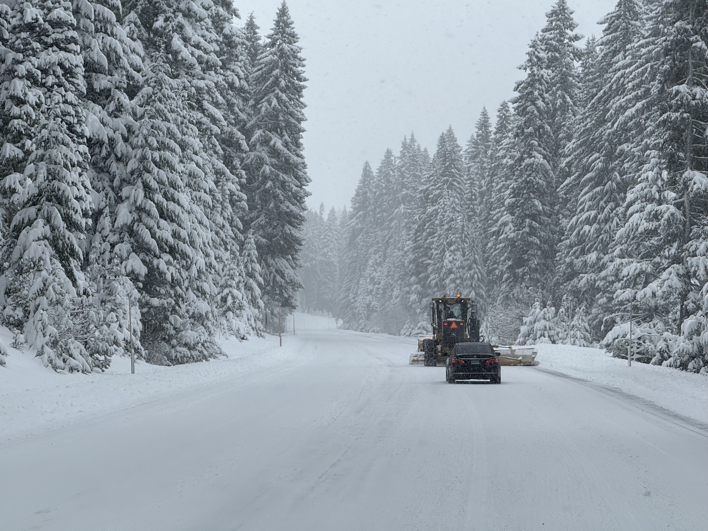

Driving over the Willamette pass.   The van was awesome in these conditions.

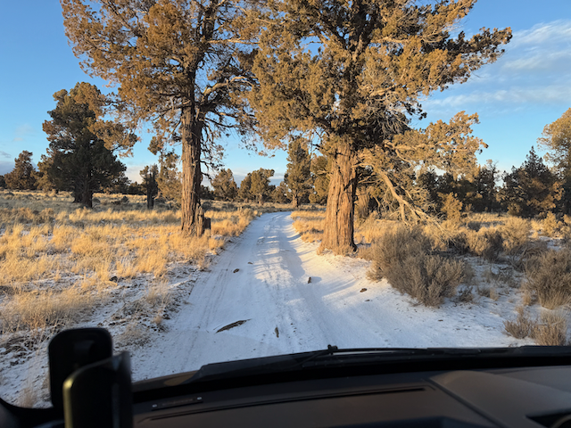

Driving around beyond the trail head at Crack in the earth

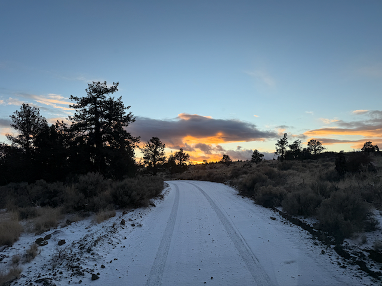

Looking for a place to spend the night

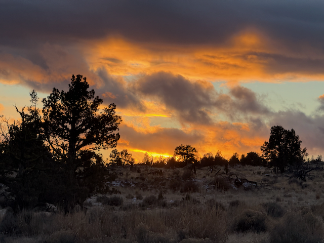

Lovely sunset at Crack in the Earth

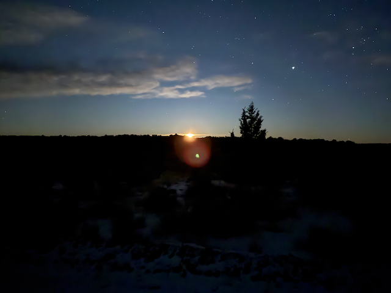

Moonrise on my walk.

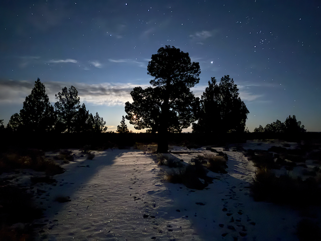

The moon behind some trees.

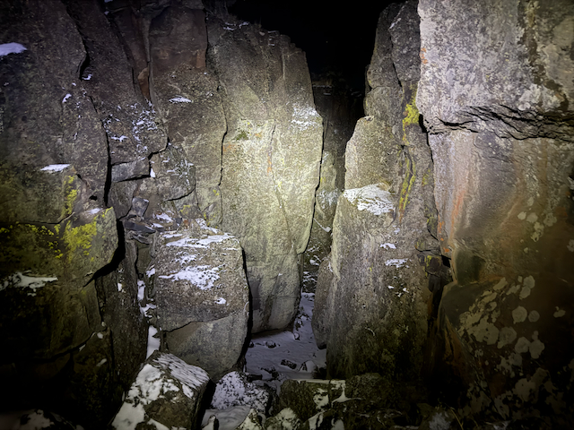

Looking into the crack in the ground - decided not to crawl over those boulders in the dark

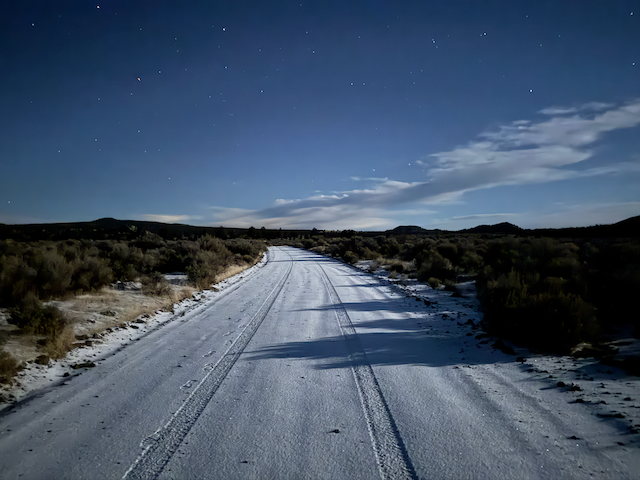

The road back to camp - it wasn't quite this bright.  that's mostly the camera doing it's thing, but it was pretty close.

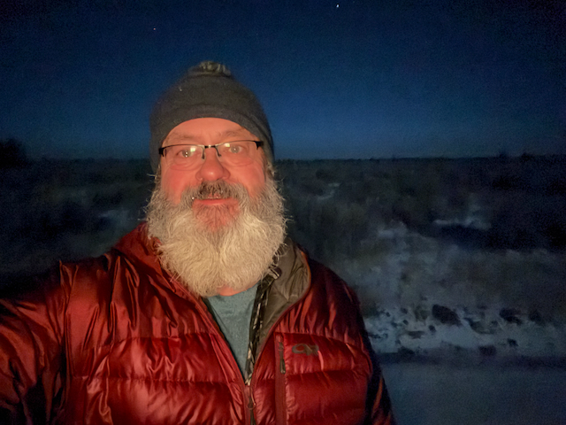

A selfie as I returned/

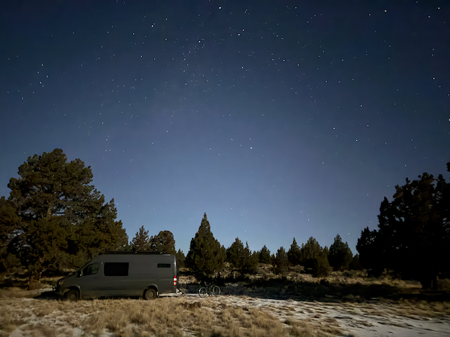

The van as I returned  from my moonlit walk 