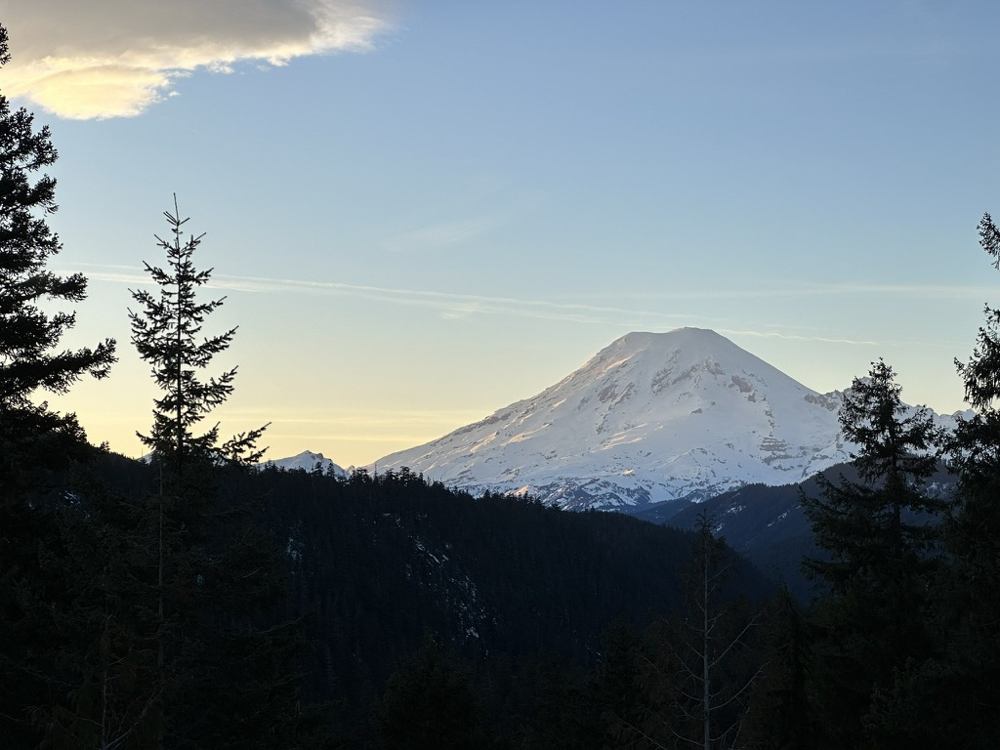
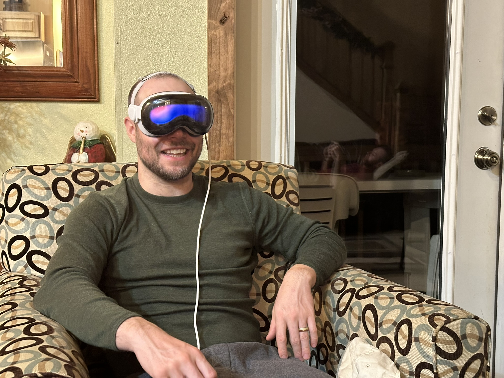
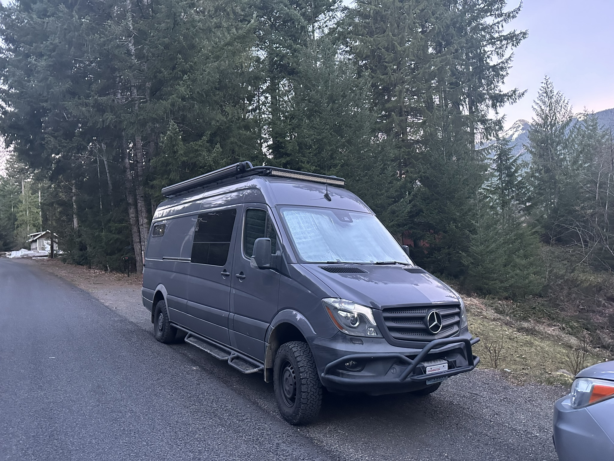
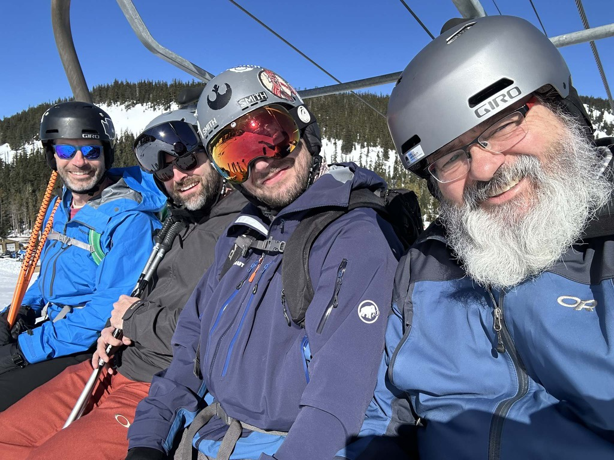
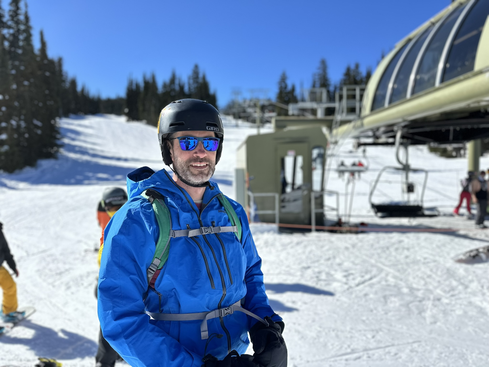
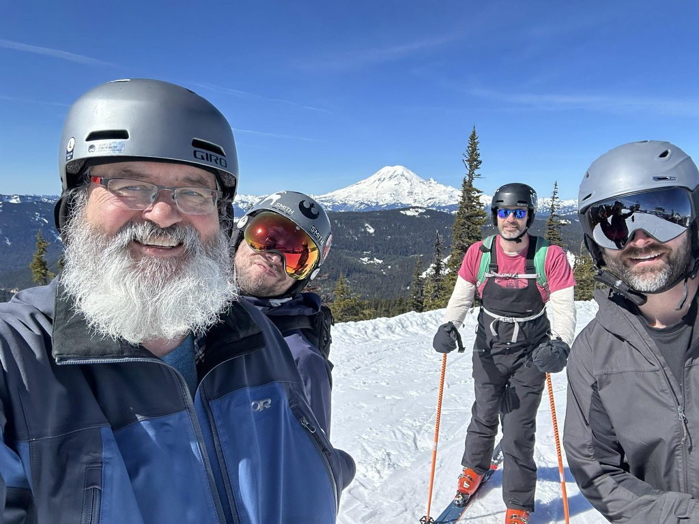
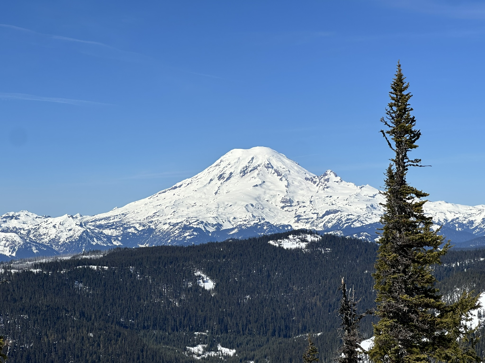

Well...  It's seven Days until Catherine and I hit the road for the eclipse.  We have a list that we have been building for the past couple of weeks, and we will start pulling it together this week.

One thing that was on the list we have taken care of already is getting Starlink to have internet along the trip. That arrived on Thursday, and I tested it out Thursday night when I got home, and it worked just fine.  

Yesterday (Friday), I headed down to White Pass, Washington, for my friend [Eric Shamay's](https://www.youtube.com/@cloud-pants) Birthday celebration. Where I met up with Eric, Brandon, and Jaron.   I didn't leave the house until later in the afternoon, and I decided to take the "long" way and went out i90 to Ellensberg, then down to Yakima, and then out Highway 410 and 12.    It was an absolutely stunning drive through the mountains.   I arrived a bit after 7pm.  Eric, Jaron, and Brandon were playing cribbage, so I fixed myself some dinner and settled into a nice, pleasant evening of hanging out. After the three-handed cribbage game, we pulled out the poker chips.   I was the first one out, with Eric taking the pot.   

Today, we all got up slowly and slowly made coffee and breakfast before rolling out of the cabin to head on to the ski area.  

Today was my first day ever at [white pass ski area](https://www.skiwhitepass.com), and I have to say that I quite enjoyed it.   

We managed to get seven runs in before we stopped for lunch.   After lunch, we went back out again, but my feet were killing me, so I bailed and waited in the lodge for the others to finish their day.   

Back at the cabin, we had a lovely meal of corned beef, potatoes and cabbage, and then just had the most wonderful time hanging out. 

Tomorrow we will likely head back out for some more time on the mountain, before heading home.

I created a [music found on 3/16](../../music-found.md#^cd039e) entry for the music that I discovered today.

This week will be the week of final planning and packing.

.jpg)
These are the stats from my day of skiing..

A nice view of Mount Rainier from highway 12

Brandon checking out the Apple  Vision Pro

The van out at the cabin

Eric, Jaron, Brandon, and me

Eric half way up the mountain.

awesome bluebird day with the mountain in the background.

aint that sumthing!

<iframe src="https://www.gaiagps.com/public/OGF96ZVZbBXUF2l5xkGA5RGB/?embed=True" style="border:none; overflow-y: hidden; background-color:white; min-width: 320px; max-width:420px; width:100%; height: 420px;" seamless />

