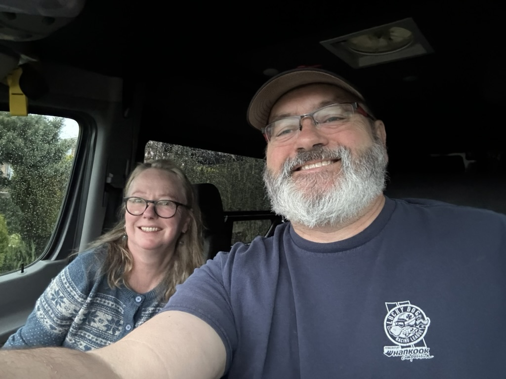
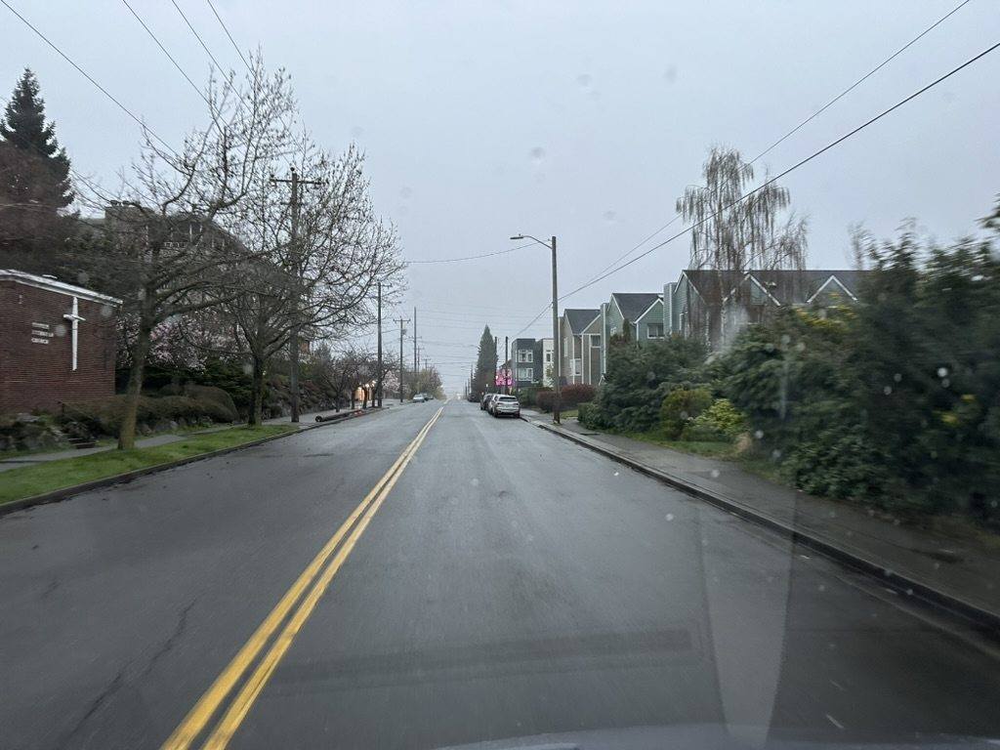
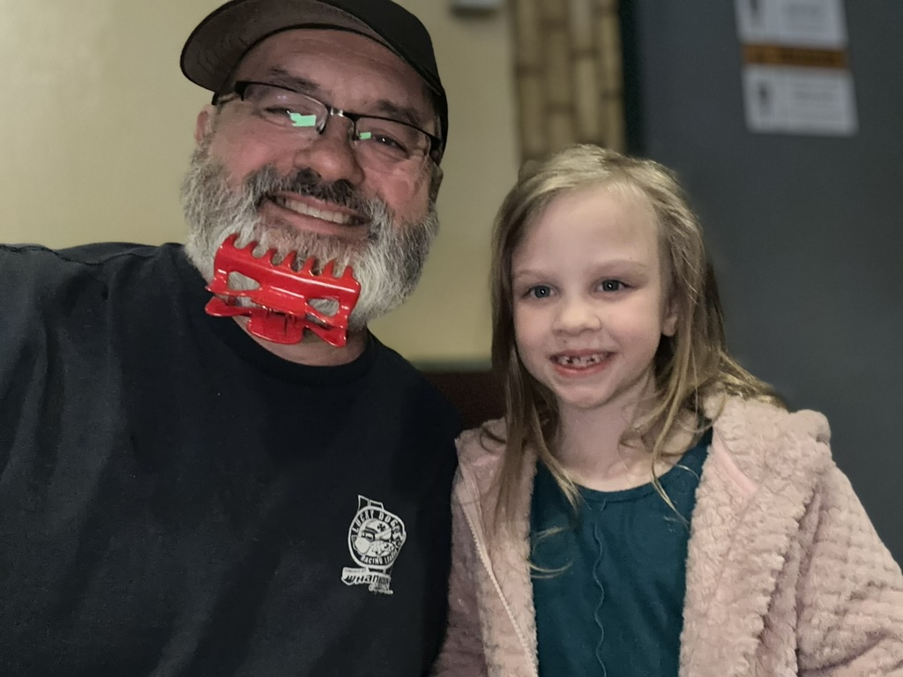
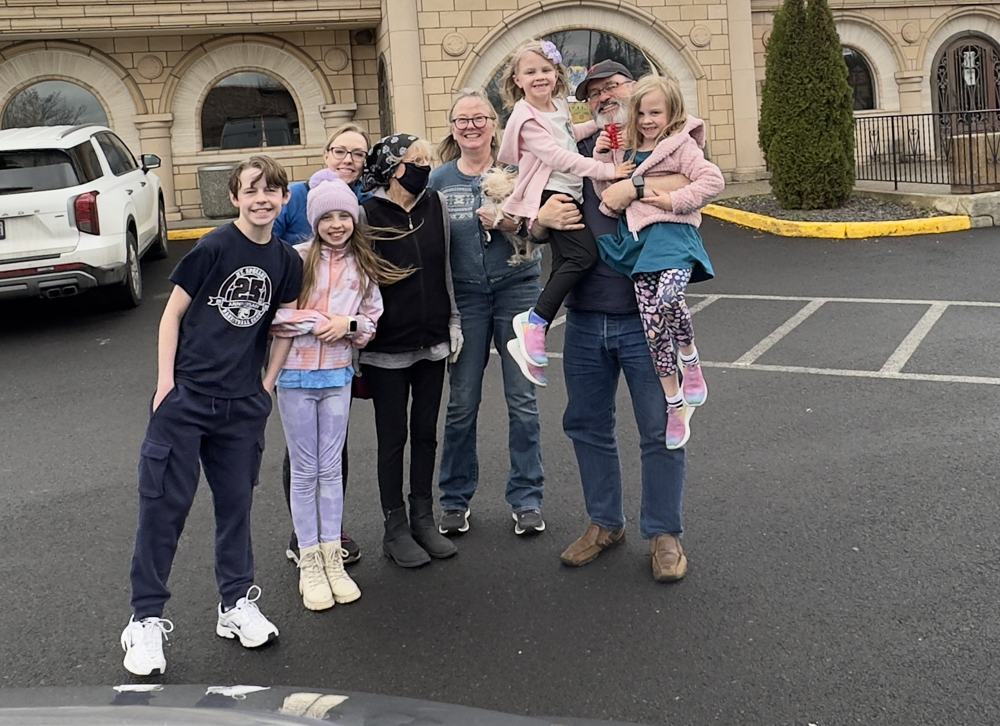
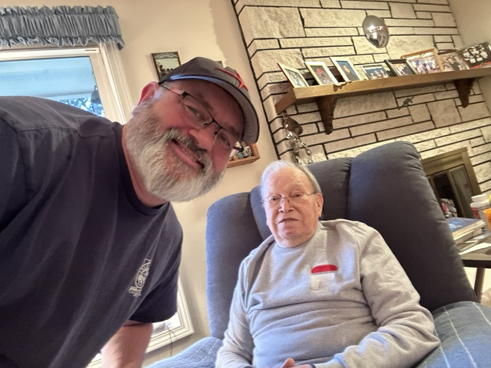

Well, Day One of this adventure is in the books! And so far so good!  The weather is working in our favor since we are enjoying ourselves, and with the gray clouds, every day from here on out has the opportunity to have better weather, that is for sure!   

The first destination of this trip was over to Spokane to pay a visit to my Aunt Gloria, as well as Uncle Tom and Aunt Do.  

We arrived at Aunt Glo's just before one, and my cousin Kim was there with her four kids, Mick (13), Julie (11), Liz and Liv (6 - yes, they are twins :) ).   While we visited, I played a game of High Ho Cherry-o with the Twins, and they loved it!   

It's been a while since we have had the chance to see Aunt Glo, as she has been dealing with some health issues over the course of the past year.  and while she doesn't have these behind her, she is always so positive, and full of light and goodness.   it was just wonderful to have a chance to hang out with her.   I Had a nice visit with Mick.  He is a wonderful young man.  Julie was a little harder to entice out of her book, but we had good interaction as well.   My cousin Kim has recently switched careers and is now a software developer working for Sinclair Digitial, and she is thriving in that role.  She is working on a really cool project of rebuilding the video player that will go on the websites of all of the TV Stations that sinclair runs.  

After a bit, we all headed out of Aunt GLo's place to head to Azteca for lunch, and to visit some more.  

After lunch we headed over to my Aunt Dorris and Uncle Tom's house.    We were lucky that we got to see them, as they were suppose to be at a birthday party, but that was postponed for a day, as the venue didn't have electricity on Saturday.  We had a wonderful visit with Aunt Do and Uncle Tom.  While we were there, Cameron (My cousin Steve's grandson) dropped by to take Aunt Do's car to the filling station and fill up the tank for her.  when he got back from that we had a nice visit with him.  Cam is a junior in high school and is planning to enter the electrician trade.  He is also quite the athlete - playing hockey in the fall and winter, and this year he is doing track and field.

In the evening we headed towards colfax and stopped at the [Horn School Safety rest area](https://maps.apple.com/?address=101%E2%80%93105%20Old%20Thornton%20Highway%20Rd,%20Rosalia,%20WA%20%2099170,%20United%20States&ll=47.182200,-117.377330&q=101%E2%80%93105%20Old%20Thornton%20Highway%20Rd) for the evening.    

Today we are off to Boise!

beginning our great adventure!

When the weather starts like this, there is a good chance for it to get better!

Me is Liz (or is this Liv? :)

Mick, Julie, Kim. Gloria, Catherine, Liz, me, Liv outside of Azteca

Me and my uncle Tom.  Alas, the picture of me and Aunt Do didn't come out well enough to share.

[<< Previous 2024-03-22-fri-day0-the-night-before-we-leave](./2024-03-22-fri-day0-the-night-before-we-leave.md)

[Next >> 2024-03-24-day2-sun-to-boise-to-visit-patrick](./2024-03-24-day2-sun-to-boise-to-visit-patrick.md)

<iframe src="https://www.gaiagps.com/public/NXYph8XmPBdl4wLmWE5wCj5C/?embed=True" style="border:none; overflow-y: hidden; background-color:white; min-width: 320px; max-width:420px; width:100%; height: 420px;" seamless />

