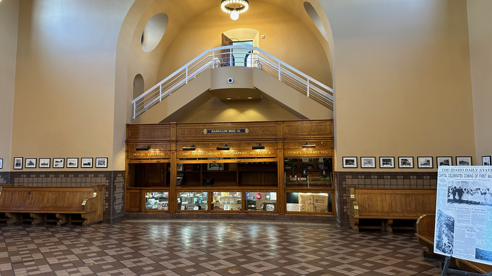
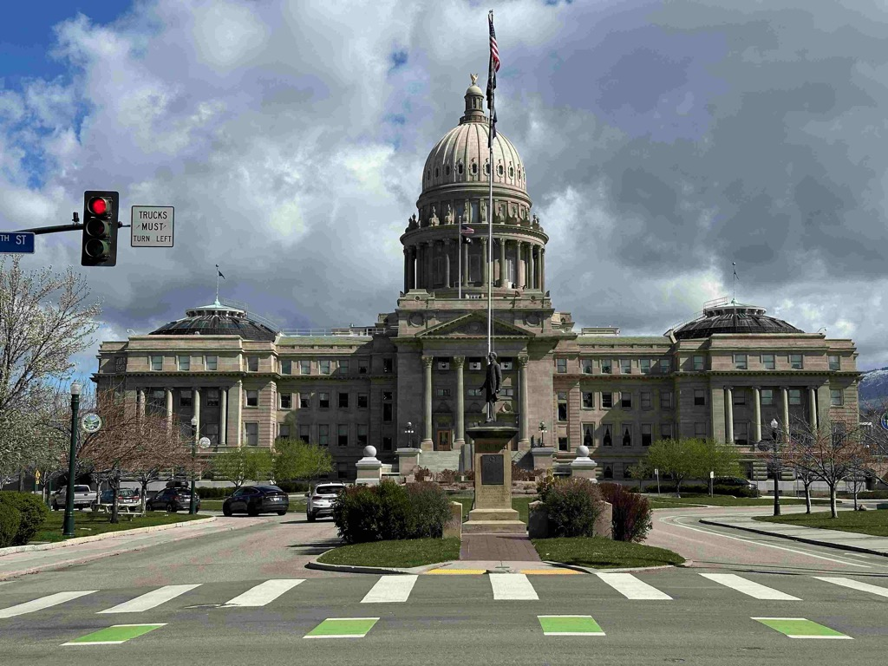

Today was a good day.   

Catherine wanted to finish some work today, so Patrick and I headed into Boise and he gave me a wonderful tour of the town.  We started at the old Union Pacific depot, which has been lovingly restored.  The docent that tended to us was full of knowledge about the train station's history.   From there we headed past the campus of Boise state, before parking the car and wondering around downtown Boise.  What a wonderful city.  The [Treefort music festival](https://treefortmusicfest.com/) wrapped up on Sunday, so we just missed it, but I heard so many good things about it, that I think I will try and make a trip out of next year.  

As we wondered, we stopped into the [Boise Fry company](https://www.boisefrycompany.com/), which specializes in, you guessed it, french fries.   Man, they were really good.  From there, we headed to a pizza place that Patrick really likes and split a slice of pizza before ducking into a bookstore and picking up [American Red by David Marlett](https://www.amazon.com/American-Red-David-Marlett-ebook/dp/B096HNXLBF) and [Four Treasures of the Sky by Jenny Tinghui Zhang](https://www.goodreads.com/book/show/55987334-four-treasures-of-the-sky), both of these on the _strong_ recommendation of the woman that was working there.   

Catherine and I said our goodbyes to Patrick in the early afternoon and set our sights on the [City of Rocks](https://www.nps.gov/ciro/index.htm), where we are spending the night.  The drive down was uneventful, with some beautiful vistas.    Our campsite is about 7 miles up a dirt road, and the scenery here is absolutely fantastic!

Tomorrow, we are heading down to see Cousin Dan, and we are hoping to be able to drop in on Uncle Dan for a quick visit as well as we go through.  While we are in Salt Lake City, I want to check in on the [Temple renovations](https://www.thechurchnews.com/temples/2023/9/28/23894284/temple-square-renovation-update-video-photos-latest-work-october-2023/)that has been happening.

The old Union Pacific train station.  When the building was restored, they discovered the original concessions stand, with all of it's original equipment, hidden behind a sheet rock wall.

This is Boise's [Freak Alley Gallery](https://www.freakalleyboise.com/)  

Me and Patrick in Freak Alley Gallery

Some more pictures from Freak Alley - there was a lot of art here.

The state capital.

Rolling down the road.

In our campsite in City of Rocks

More vista's in the city of rocks

We went for a bike ride.  Man it was cold!  turns out we are at over 6,000 feet of elevation here!

it is just stunning here!

The sun setting on the hills.  We discovered only one other set of folks here camping.

Nestled in for the night.

This picture was taken in the pitch blackness of the light, with nothing but moonlight.

Another moonlight shot.

That shadow is cast by the moon

An overview of our journey today.

[<< Previous - 2024-03-24-day2-sun-to-boise-to-visit-patrick](./2024-03-24-day2-sun-to-boise-to-visit-patrick.md)

[Next >> - 2024-03-26-day4-tue-city-of-rocks-to-vernon-resevoir---visit-with-uncle-dan-aunt-linda-and-cousin-spencer](./2024-03-26-day4-tue-city-of-rocks-to-vernon-resevoir---visit-with-uncle-dan-aunt-linda-and-cousin-spencer.md)

<iframe src="https://www.gaiagps.com/public/NYfMQTiyBD5NHaiNJQHgOPl9/?embed=True" style="border:none; overflow-y: hidden; background-color:white; min-width: 320px; max-width:420px; width:100%; height: 420px;" seamless />

