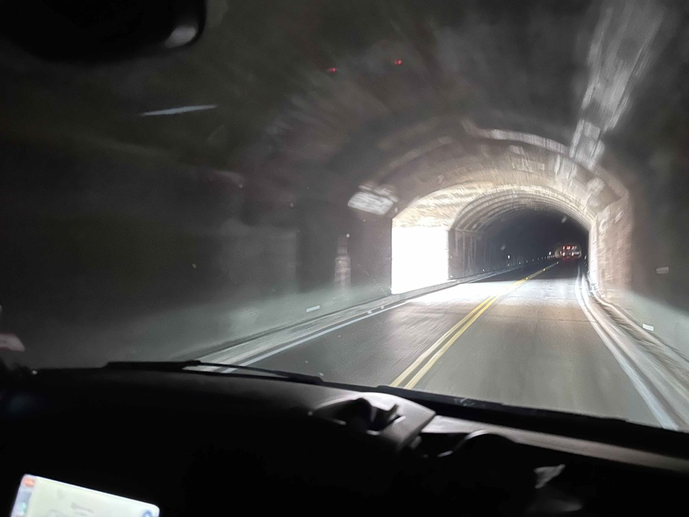
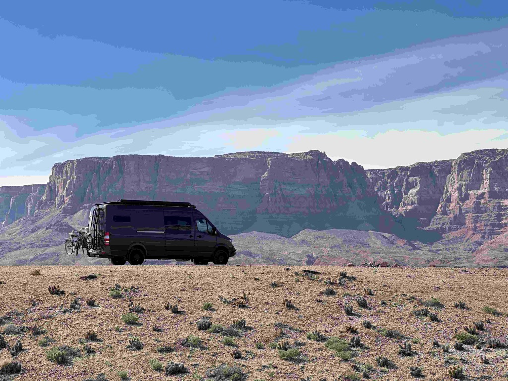

Our sixth day on the trip was visiting Zion National Park.   We got out of bed early and hit the road from our campsite on the [North Creek outside of Pocketvill UT](https://www.campendium.com/north-creek),  and headed towards Zion.  The previous day, while we were visiting Kolob Canyon, the manager mentioned that by 9:00 am, the parking lots would be full, so we wanted to make sure that we were there before things got too crazy, and that was definitely a good call.   I think one of the unique aspects of Zion National Park is just its level of accessibility.   Back in 2000, they started a shuttle service and removed private cars from the roadway, as it led to nothing but frustration and traffic jams for everyone.   So we got there just as things were opening up, and then got in the shuttle and headed up the canyon.  Even at 7:30 in the morning, the shuttle was absolutely packed.   

At the top of the canyon, I hiked up the trail as far as I could without crossing the river.  There were a _lot_ of people who had rented waders, shoes, and poles so that they could continue the hike past that point.   Catherine headed back down, as her ankle was bothering her, and she wanted to give it a rest.   

One of the big draws of Zion is its accessibility. The trail was smoothly paved and relatively flat, all the way up to the point where you had to cross the river to continue.   For masses of humanity, hiking is the single attraction.  And while there are also several other hikes that folks can do, just about anyone can see the grandeur of the canyon with little effort.  The difference between this canyon and the Grand Canyon (other than size, of course) is the fact that Zion Canyon is experienced from the canyon floor as you walk along the Virgin River.

If we thought things were nuts when we arrived, they were absolutely bonkers when we left.   The lines to get on the shuttle filled the entire holding area and then snaked through the visitor center grounds as far as the eye could see.

Once we left there, we headed out to Highway 9 and through the Zion Tunnel and met up with Highway 89a.   The drive along there was absolutely stunning.     

I've been very fortunate in that I have only had one thing about work sneak into my consciousness, and that was the meeting that I took yesterday to provide interview feedback for a position that is being hired for.  So we pulled over in [Kanab, UT](https://kanab.utah.gov)  so I could take that call.

From there, we continued.  We considered visiting the north rim of the Grand Canyon, but alas, that road was still closed for the season.   

The views coming down off of that high plateau and seeing the [vermillion cliffs](https://www.blm.gov/national-conservation-lands/arizona/vermilion-cliffs) were just stunning.   We decided that we were interested in stopping early, so we found some glorious BLM land overlooking the Colorado River and spent the night here.    It got pretty windy and stayed windy, but at least it wasn't cold. 

The shuttle bus in Zion was bonkers

Looking along the virgin river in Zion Canyon

This is as far as the paved trail goes - you can see the waders that folks would rent from outfitters to continue the hike up the river.

this is as far up the river as I went.

Heading back down the river with the sunlight painting the walls of the canyon.

One of my fellow hikers offered to take a picture of me ;) 

an alternative trail that goes right along the river.

Approaching the Zion Tunnel

One of the view portals in the tunnel

an overlook with the Vermillion Cliffs in the background

The colorado river.

Catherine at the edge of the canyon.

Our rig.

Another shot of the rig.

[Day 5 blm near Zion to bim near marble canyon](https://www.gaiagps.com/public/pv2tG5gQ7rudZFHx55VWSQwG/)

[<< Previous - 2024-03-27-day5-wed-vernon-resevoir-to-kolob-canyon-](./2024-03-27-day5-wed-vernon-resevoir-to-kolob-canyon-.md)

[Next >> - 2024-03-29-day7-fri-vermillion-hills-grand-canyon-jack-and-jay](./2024-03-29-day7-fri-vermillion-hills-grand-canyon-jack-and-jay.md)

<iframe src="https://www.gaiagps.com/public/pv2tG5gQ7rudZFHx55VWSQwG/?embed=True" style="border:none; overflow-y: hidden; background-color:white; min-width: 320px; max-width:420px; width:100%; height: 420px;" seamless />

