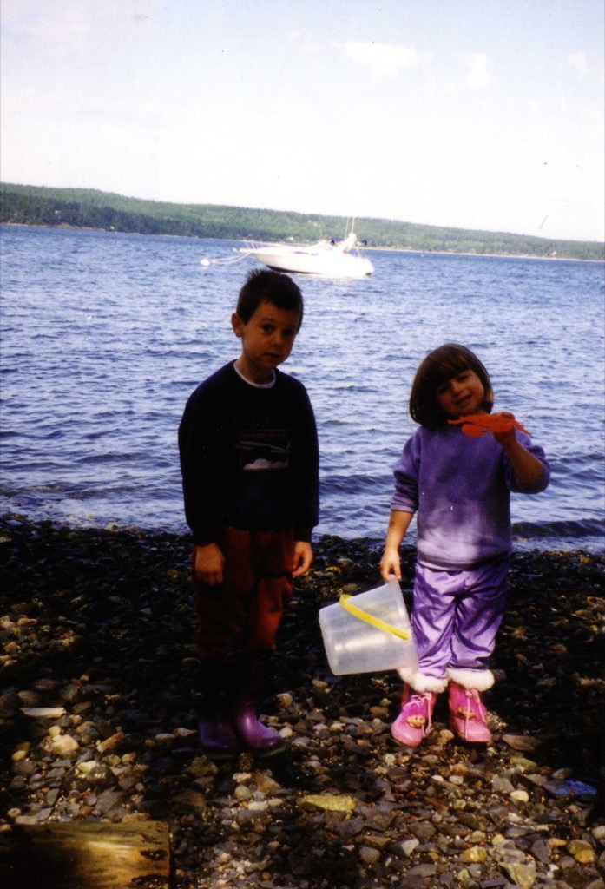
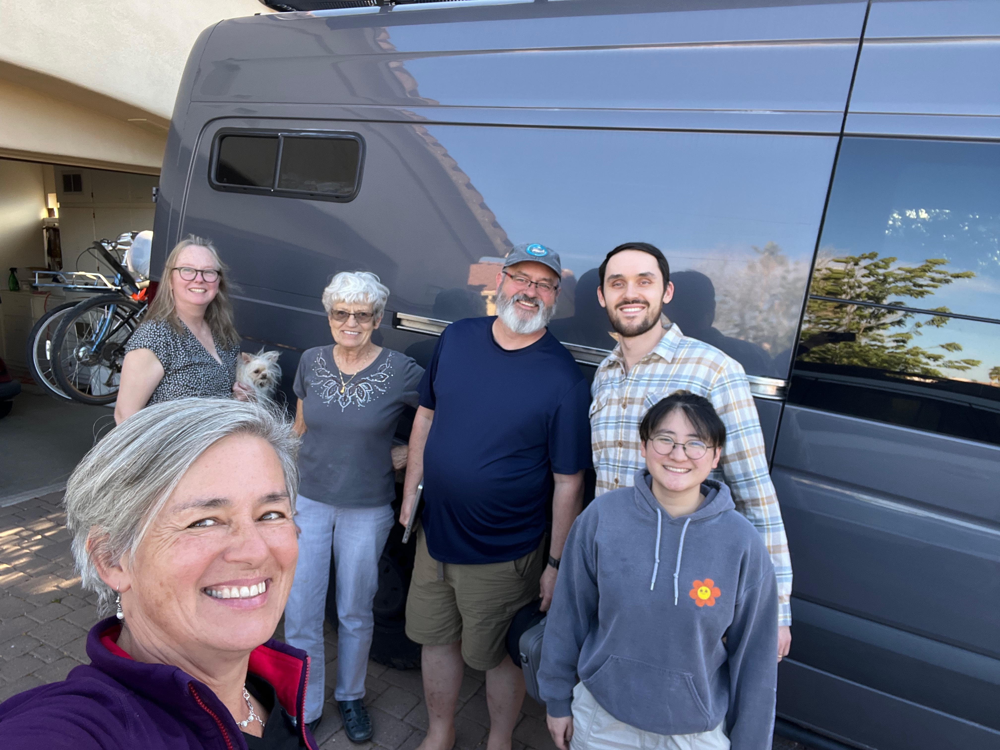
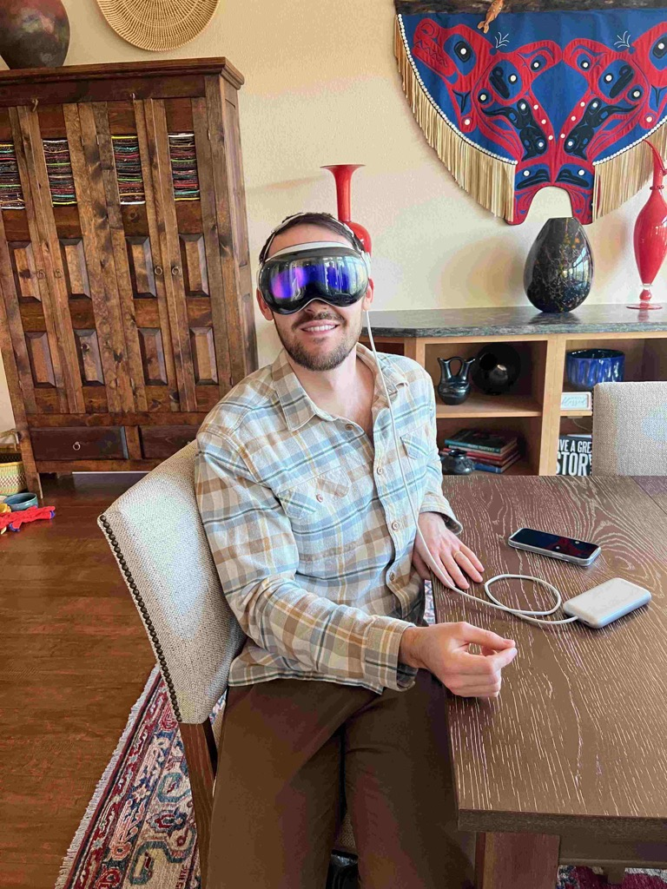
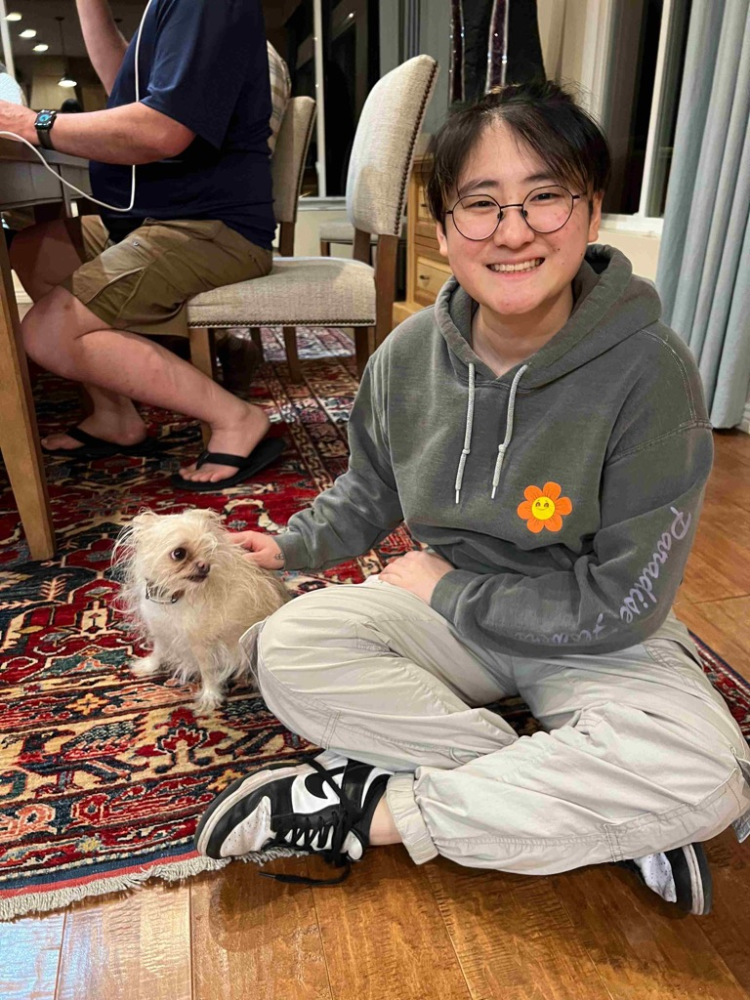
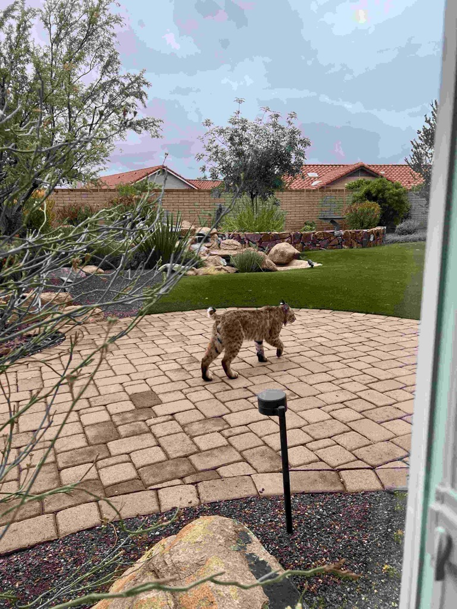
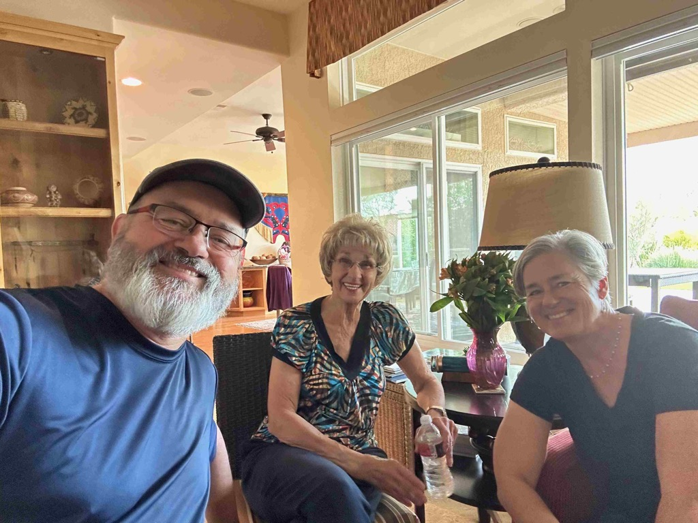
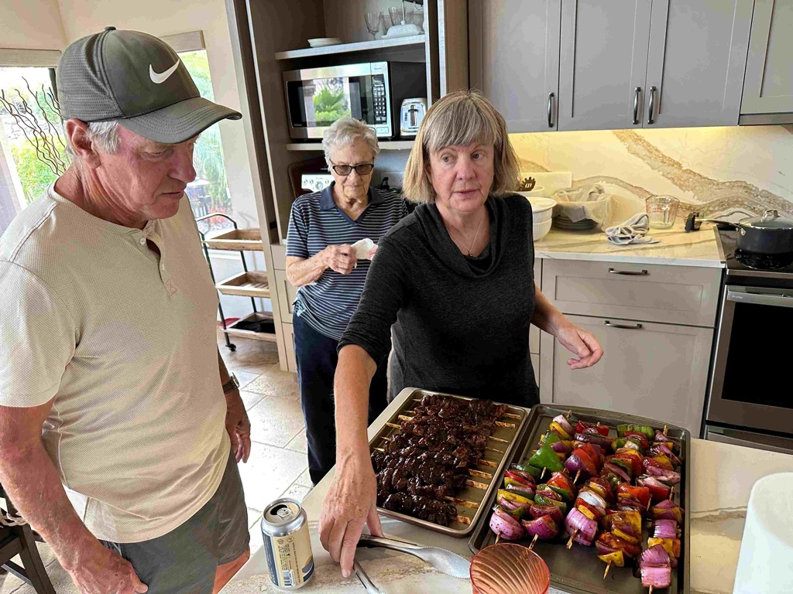
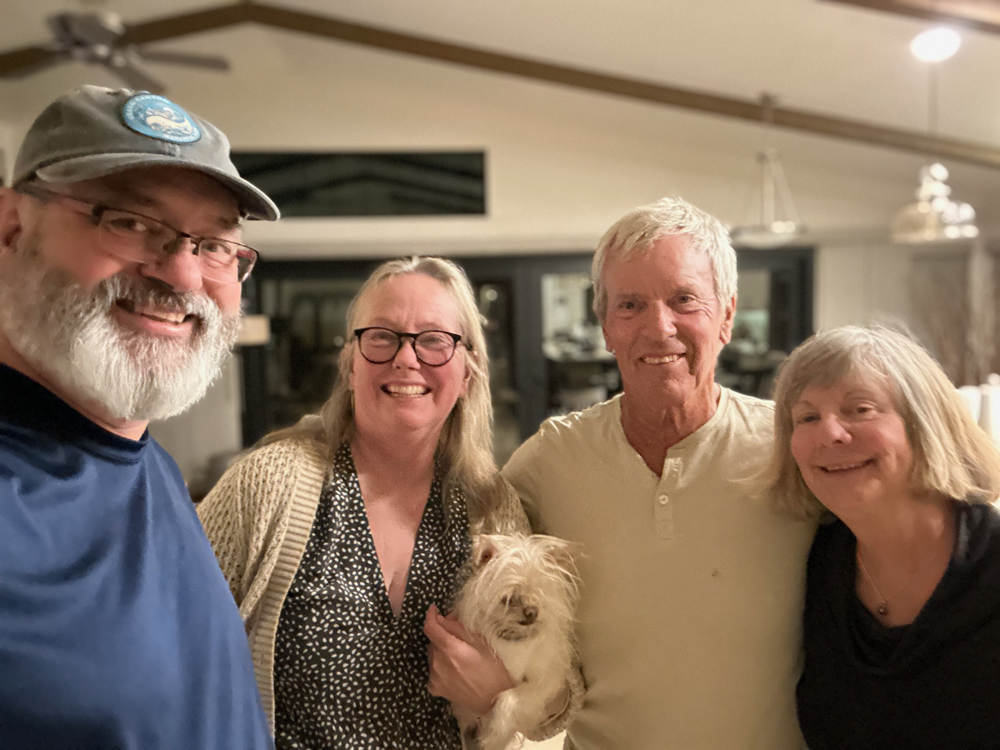
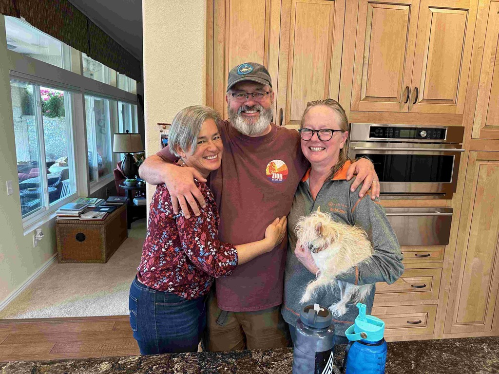

Sunday, and what a nice way to spend the day - we spent most of the day just hanging out and bullshitting with Mom, Sue, Peter, and Sophie.   It was nice to catch up and share our stories without pressure to be anywhere or do anything special.   Peter is doing well.  He started his Ph.D. program in Norway, and he and Mari have settled well in Norway. The first winter back home went better than they expected.   Sophie is almost done with her first year of college and reports that it exceeds her expectations regarding how much she would like it.  She is really getting into her art efforts and showed us some fun projects she has been doing [shout paradoy trailer](https://www.youtube.com/watch?si=b5e1AOU5W7hglllt&v=wtT3B0cS0CE&feature=youtu.be&themeRefresh=1) and [another parody trailer](https://www.youtube.com/watch?v=utjkHnsm6po) .  Peter and I chatted a bit about AI and Large Language Models and their implications. . 

In the afternoon, some of Mom's friends came over (Mary Lou, Cathy, and Don), and we chatted with them for a bit before Catherine and I excused ourselves to go see our old friends Bob and Lynette over in Peoria. 

We know Bob and Lynette from way back in the day.   Catherine's officemate's sister was a nursing professor in Atlanta, Georgia, who knew a nursing professor in Seattle who had a student who was looking for a developer to help her with some database work.  That student was Lynette, and the developer ended up being me.  Their daughter Annie and Alex were buddies when they were much younger, and we took several boating trips together when the kids were little. We have maintained contact with them over the years.   Bob and Lynette are now retired, living in Peoria, and loving life there.   We had a wonderful evening with them, as well as Lynette's mom, Mavis, and their friend (whose name escapes me at the moment).   

I showed Bob my Apple Vision Pro, and I think he is going to go pick one up for himself, and Lynette gave me the stink eye :) 

Once back at mom's house, we shot the shit a bit longer before everyone headed into bed. 

Alex and Annie when they were but wee children

Sue, Cathering, Mom, Me, Peter, Sophie

Peter playing with the Apple Vision Pro

Athena and Sophie

One of the three bobcats that mom sees regularly walking through her backyard.

Me, Mary Lou and Sue

Bob, Mavis and Lynette

Me, Catherine, Bob, Lynette
Sue, Me and Catherine before heading out Monday morning.

[<< Previous - 2024-03-30-day8-Sat--jack-and-jays-to-moms-via-sedona-and-jerome](./2024-03-30-day8-Sat--jack-and-jays-to-moms-via-sedona-and-jerome.md)

[Next >> - 2024-04-01-day10---moms-house-to-guadalupe-mountains-national-park](./2024-04-01-day10---moms-house-to-guadalupe-mountains-national-park.md)
