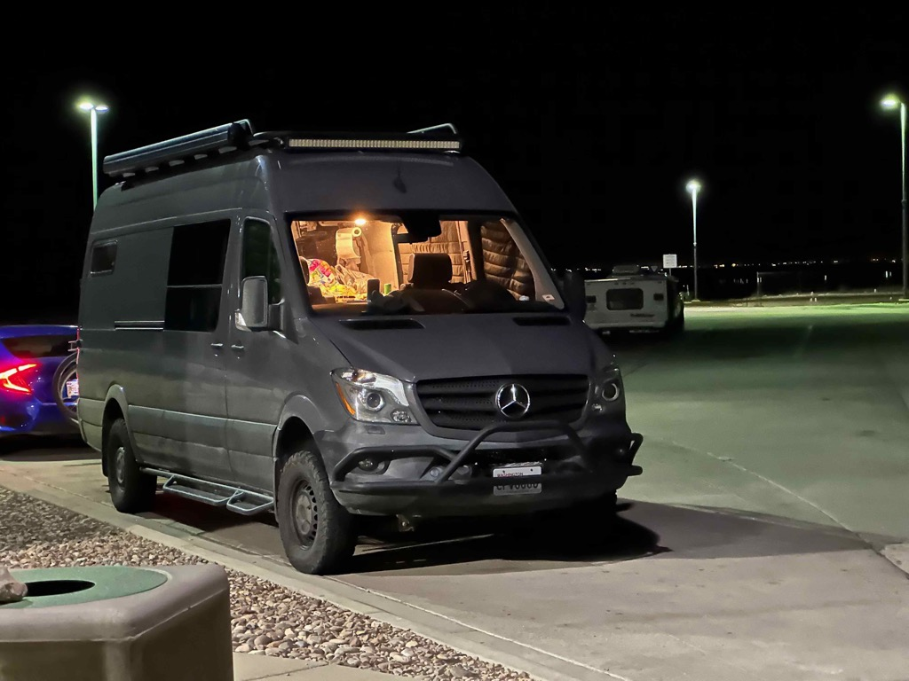

Day 10 was a big big day of driving.   We had a nice, slow, and lazy breakfast with Mom, Sue, and Peter (Sophie is a sleeper) and did some visiting before saying good buys and hitting the road for destinations to the east.    We decided that we wanted to do a _BIG_ push day and have a couple of slow days.   Seeing that we have an 8:30 am appointment for the Carlsbad caverns on Wednesday, we decided to push through to the [Guadalupe Mountains National Park](https://www.nps.gov/gumo/) area so  we would have just short distances to go on Tuesday.   Catherine spent some time connected to the LTE (we have had _far_ more cell coverage than I expected!) and booked us campsites for Monday Night, Tuesday night, and Wednesday nights. So off we went.   We drove for 10 hours and 589 miles.   

Along the way we stopped at Cabela's, in El Paso, and picked up two chairs that will work better for us in the van, then the ones we brought, as well as a new little table (the table that we brought is really not that useful for us).  and then headed over to a Wall Mart Supercenter where we picked up a water hose, fire extinguisher, three totes, some groceries, and some other misc supplies.     By this time, the sun was setting, so we drove towards the park in the dark.   As we approached the park, we had the realization that the campground we had booked was on the north side of the park...   well, that is an _extra_ two hours of driving to get to, since you can't drive from the southern part of the park to the northern park, so....   We started looking at iOverlander and some other sources to see if we had any options for where to spend the night.  We identified a BLM campground where we could stay.  Along the way to that campground was a rest area, so we just decided to stay there.  

This is another aspect of the van that is working really well for us.   We pulled in, put the window covers in, turned on the heater, organized some of the supplies we had just purchased and slept like babies all night.

Me, Sue, Catherine, Peter, Mom

Sue, Me and Catherine

Stopped at a rest stop on I-10 just before leaving Arizona

This was a super long straight road we were on to get to El Paso.

Solving some problems we discovered we had.

Getting ready to tuck in for the evening.

Getting ready to roll down the road.

[D10 moms to Guadalupe national park area](https://www.gaiagps.com/public/G3HpdoUcyaGfm6pV0ccbHHFx/)

[<< Previous - 2024-03-31-day9-Sun-hanging-at-moms-visiting-bob-and-lynette](./2024-03-31-day9-Sun-hanging-at-moms-visiting-bob-and-lynette.md)

[Next >> - 2024-04-02-day11-guadelupe-mountains-national-park](./2024-04-02-day11-guadelupe-mountains-national-park.md)

<iframe src="https://www.gaiagps.com/public/G3HpdoUcyaGfm6pV0ccbHHFx/?embed=True" style="border:none; overflow-y: hidden; background-color:white; min-width: 320px; max-width:420px; width:100%; height: 420px;" seamless />

