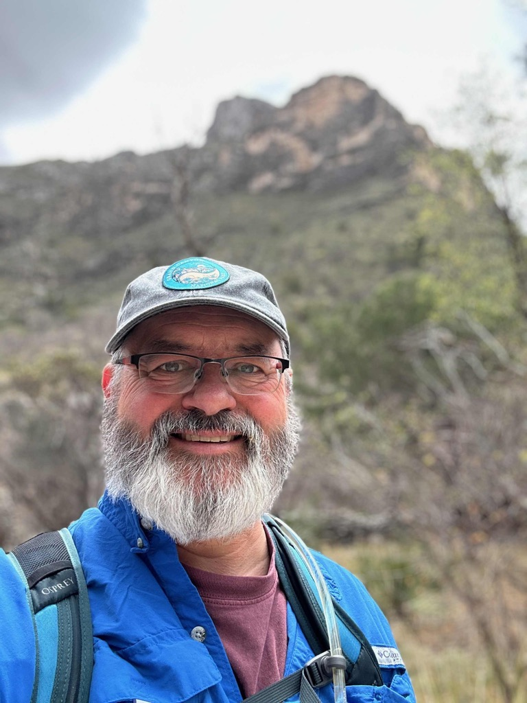
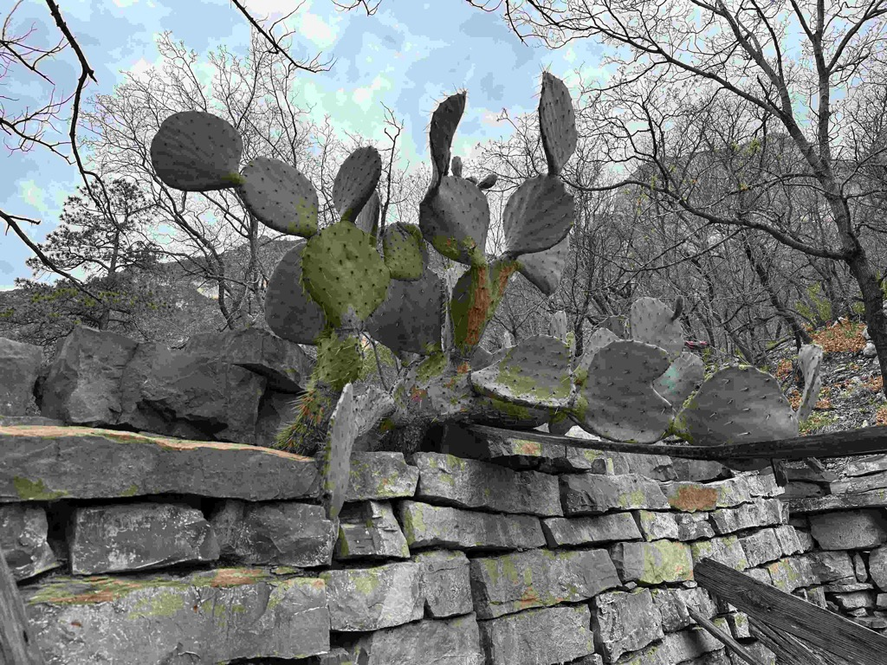

Day 11 found us actually traveling only a short distance.  We woke up in the morning at the Texas Safety rest area, where we had stopped the night before because the campground we had booked was on the _other_ side of the park, and there wasn't a road through the park to get there, and we would have had to drive two and a half hours to get there.   We felt fortunate with the unexpected discovery of the rest area.

Anyway - got up, made our coffee, and then headed towards the [Guadalupe Mountains National Park](https://www.nps.gov/gumo/).  We stopped in at the visitors center, where we checked things out, and checked in.   After talking to the rangers, I decided to hike up the [McKittrick Canyon](https://www.nps.gov/gumo/planyourvisit/mckittrick.htm).  We set up the Starlink so Catherine could work, and I headed out.  The hike was just fantastic.  It was not too hot, the elevation gain was minimal, and the scenery was just stunning.   All in all, it took me four hours and was just about eight miles.  I had hoped to make it to "The Notch," but as I got up there, I was looking at my watch and realized that I was running low on time, and I had to turn around to make sure I got back to the rig before the gates were closed on us. The park is in a weird place, and Phones report the wrong time, so I could have made it.  Oh well.

Once I got back to the rig, I relaxed for a little while and finished up the trip report from the day before.  Once that was out, we packed up the rig and headed down the road toward Carlsbad Caverns.  We decided to stay at a BLM campsite.  These are not fancy campsites at all.  think more of a dusty parking lot in the desert with a composting toilet.  This one did have some sheltered picnic tables for tent campers.  We found a spot, set up, and just settled in for the evening.   Catherine made us a wonderful dinner of grilled asparagus and steak.

Today it we are going to visit [Carlsbad Caverns](https://www.nps.gov/cave/) and then head toward [Big Bend National Park](https://www.nps.gov/bibe/)

At the rest area getting ready to head out.

El Capitan - the largest exposed reaf in the world.

The old Pratt Lodge up in the McKittrick Canyon

Mountains in the back ground.

This is [The Grotto in McKittrick Canyon](https://www.earthtrekkers.com/mckittrick-canyon-trail-to-the-notch/)

This is the hunting cabin just beyond the Grotto

a cactus growing out of the wall

This is the Grottos - kind of a mini cave.

I found a pay phone!

Our Dinner - this little table is working out pretty well.

Me, Catherine and Athena as the sun sets.

This mornings Sunrise

[Day 11 Guadalupe mountain to blm outside of Carlsbad](https://www.gaiagps.com/public/uaeg5HhQhDYW11VsSPRlyCe9/)

<iframe src="https://www.gaiagps.com/public/uaeg5HhQhDYW11VsSPRlyCe9/?embed=True" style="border:none; overflow-y: hidden; background-color:white; min-width: 320px; max-width:420px; width:100%; height: 420px;" seamless />

[Day11 McKittrick Canyon hike](https://www.gaiagps.com/public/9OzpbJpjTreIHI3EYs9wjIdM/)

[<< Previojus -2024-04-01-day10---moms-house-to-guadalupe-mountains-national-park](./2024-04-01-day10---moms-house-to-guadalupe-mountains-national-park.md)

[Next >> 2024-04-03-day12-carlsbad-caverns-to-big-bend](./2024-04-03-day12-carlsbad-caverns-to-big-bend.md)

<iframe src="https://www.gaiagps.com/public/9OzpbJpjTreIHI3EYs9wjIdM/?embed=True" style="border:none; overflow-y: hidden; background-color:white; min-width: 320px; max-width:420px; width:100%; height: 420px;" seamless />

