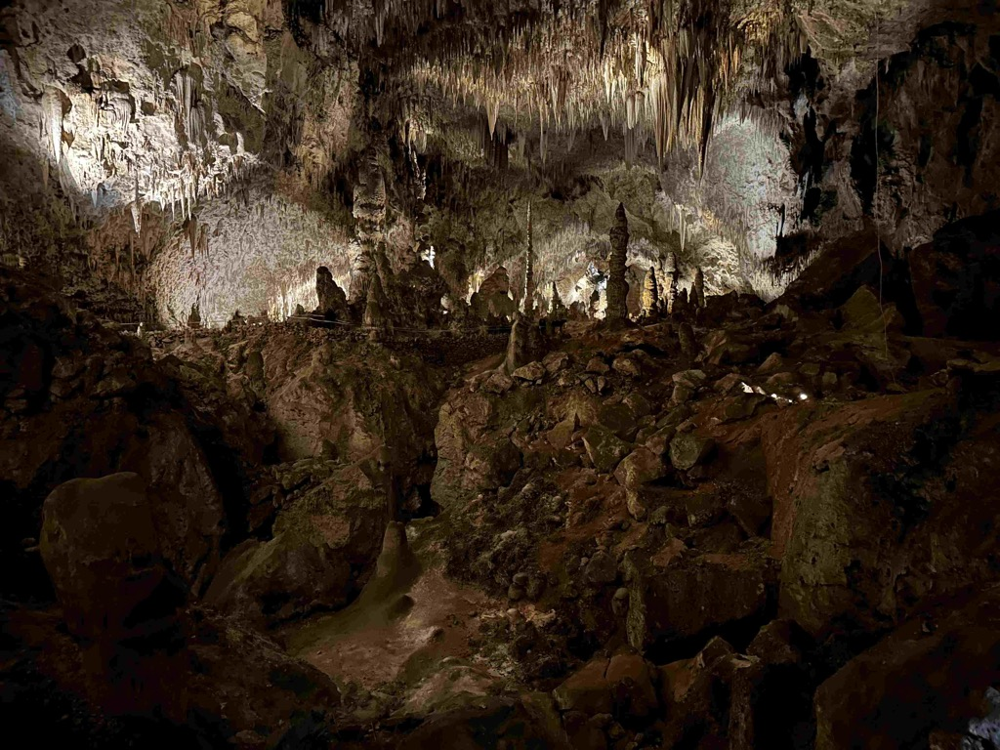
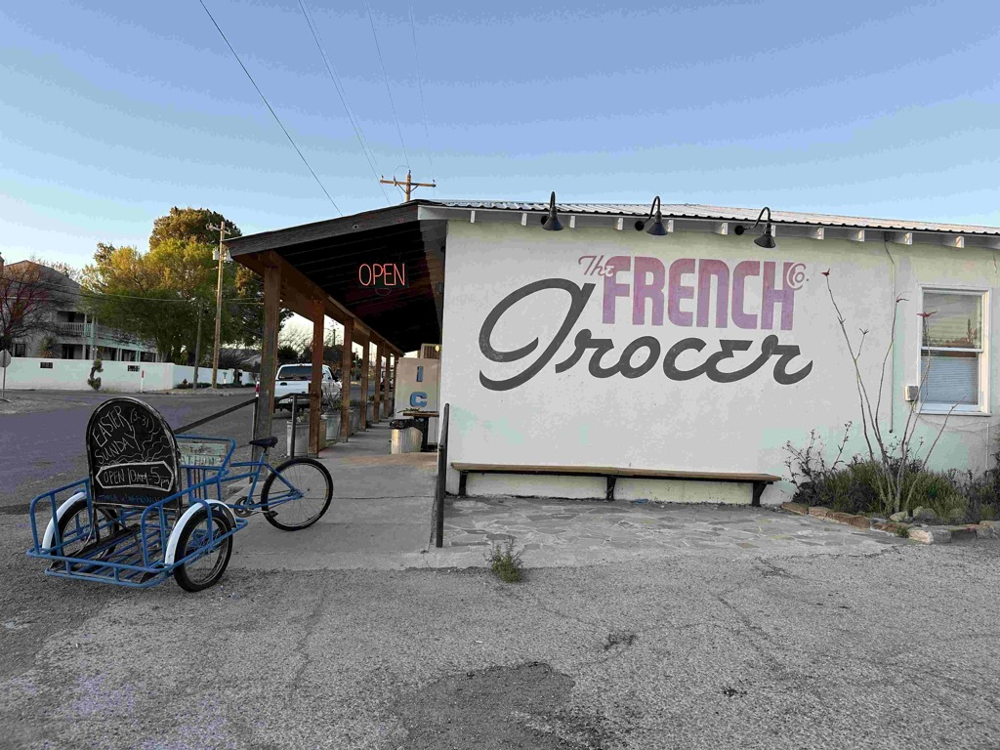

Day 12 sees us leaving the BLM campground that we stayed at and driving about 23 miles to Carlsbad Caverns National Park.   We had tickets for the 8:30 entrance, so we were out of the campsite before I even had a chance to make our coffee. Fortunately, we are pretty robust ;). Before we left, Catherine took a little tumble and skinned her knee pretty well.  It functions fine, but it is a little tender to the touch at the moment.

At the Caverns, a sign declares that animals are not to be left in vehicles and must be kenneled.  So Catherine dropped Athena off at the kennels for $15.  Athena was not really all that pleased, but she survived.  We checked in, and were part of the first wave of tourists that went into the caves.   There are two ways to get to the [big room in the Carlsbad caverns](https://justgoexploring.com/destinations/carlsbad-caverns-big-room-the-most-amazing-cave/) part of the cave.  Walking down the natural entrance and through some elevators (the shafts were created in 1936 and expanded in the 50s, and the mechanisms were replaced in the 70s). We chose to walk down the 75 stories that it takes to get to the big room.  And I am glad that we did, as it really gave you a sense for how far down you are really going, and just how big the Caverns are.  But I am also glad that the elevators were there to get me out, as the trail was _very_ steep :) 

The caverns were quite impressive. It is awe-inspiring to consider the scale of time these things operate on.  The "young" parts of the system are still millions of years old.  And the amount of turmoil that the earth went through is mind-boggling. Imagine the ocean floor was pushed, in this case, up 3,000 feet. Just mind-boggling.

Once we had toured the caves, we took some time to gather ourselves and make some lunch for the road, and then we headed out to [Big Bend National Park](https://www.nps.gov/bibe/)   

The route took us through [west texas and the oil fields](https://en.wikipedia.org/wiki/Permian_Basin_(North_America))  which I have to say, is not the most picturesque stretch of land that there is between the plastic bags stuck to fences and plants as far as the eye could see, to the oil depots, the flares, and endless powerlines.  And we had a chance to stare at that for quite a while on highway-285 since there was a truck that flipped over at the intersection.  We sat there, unmoving, for over two and a half hours before we finally listened to our routing apps, and turned around and took some back country roads. Adding yet another 90 minutes to our trek for the day.    

We stopped at the [French Grocer in Marathon Texas](https://frenchcogrocer.com/) just as the sun was getting ready to set.   The store is quite eclectic, and apparently very well known far and wide.   From there we approached the park as the sun was going below the horizon, and drove through the park in the dark.  We missed a lot of pretty scenery there.  The adventure wasn't over yet, though.  As we pulled out of the park's far side and started looking for the camp spot we had reserved, the location started looking more sketchy.  When we arrived at the location, it felt like we were in the middle of some run-down mobile home's backyard, with junk heaps everywhere and stray dogs running around.    So we decided not to stay there, and headed back a bit, and see what we could find for stealth camping.   We ended up at a motel \ Campground combo.  The guy closing up was kind enough to unlock the door and give us a parking pass, I have to go in this morning and pay.  

Today, we will not go to far and explore Big Bend National Park,

The entrance to the vistors center.
 
 This is the Bat Amphitheater, which fills up with people at sunset to watch the bats fly out of the caverns. 

Looking down the natural entrance.

This is the last of the daylight.

What follows are a number of pictures from in the Caverns.

This gives you a sense of scale, and we haven't even reached the big room yet.

So while we were waiting in traffic, I sent the drone up to check out the situation.  This is looking towards the accident. 

This is looking away from the accident.

And this is the scene of the accident.   I have no idea why they couldn't figure out a way to route traffic around that.

that was an extra 40 mliles to our trip, but we were parked for almost 3 hours.

Entering Pecos - I think this captures the essence of the place.  

Long shadows as the sun sets.

The French Grocer

[Day 12 BLM to Carlsbad to big bend](https://www.gaiagps.com/public/askVxrzmgL9xMwGSw1x92rsG/)

[<<Previous - 2024-04-02-day11-guadelupe-mountains-national-park](./2024-04-02-day11-guadelupe-mountains-national-park.md)

[Next >> - 2024-04-04-day13---big-bend-national-park](./2024-04-04-day13---big-bend-national-park.md)

<iframe src="https://www.gaiagps.com/public/askVxrzmgL9xMwGSw1x92rsG/?embed=True" style="border:none; overflow-y: hidden; background-color:white; min-width: 320px; max-width:420px; width:100%; height: 420px;" seamless />

