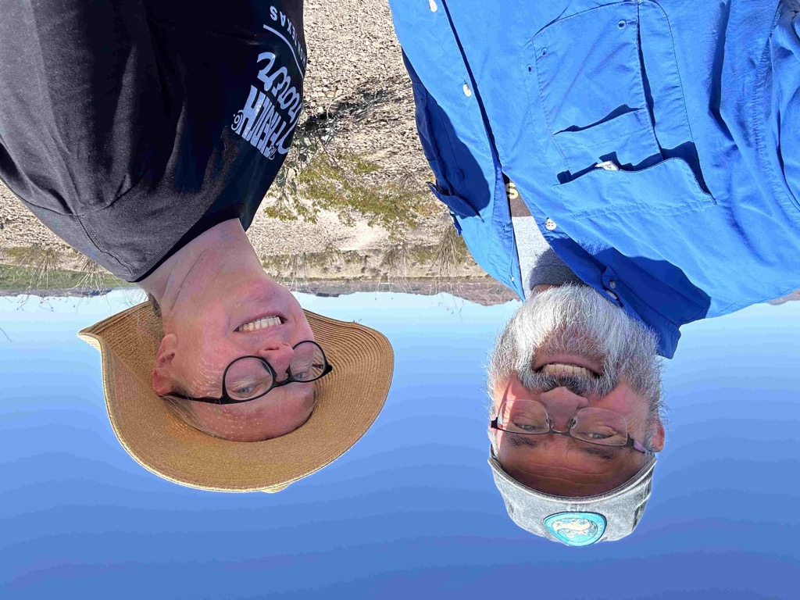

After driving through Big Bend National Park in the dark the evening before, it was wonderful to go through the park in the daylight.  This park is massive.   We decided to drive along the scenic road that is 30 miles out to the Rio Grande and 30 miles back to the main road through the park and hike the Santa Elena canyon.   When we arrived at the trailhead, we realized that Athena wasn't going to be allowed to join the hike. As it was getting quite warm, we decided that Catherine would stay behind and use this as an opportunity to catch up on some of her work while I hiked up the canyon. 

The canyon was impressive and immense.  The trial went only a mile or so before coming to an end at the water's edge.  The Rio Grande is nothing of its former glory, with all of the water being sucked out of it upstream, so I was able to wade across the river to Mexico, and the water never came above the mid-calf.    I spent some time on the Mexican side of the river just hanging out before wading back.  It might be the case that there is not much water flowing, but it was still plenty cold and it took a while for my toes to thaw out.

After I returned to the van, we headed back, stopping at many of the scenic overlooks in the park.   We fueled up at [Panther Junction](https://www.nps.gov/bibe/planyourvisit/big-bend-visitor-centers.htm) and headed to a camping spot in the [Black Gap Wild Life management area.](https://tpwd.texas.gov/huntwild/hunt/wma/find_a_wma/list/?id=2)   We were the only folks in the campsite when we arrived before another rig showed up and took the other campsite.  It is super peaceful here as I write this.

Today, we are headed towards Ingram.  We will not get all the way there, but plan on stopping short and camping in another wildland area.

Looking at the entrance to the Santa Elana Canyon, where the Rio Grande flows.

That is the Rio Grand river coming out of the canyon

There are a number of switch backs as you enter the canyon.

The cactus are in bloom

More cactus blooms

And yet even more cactus blooms.   I wonder why there are different color of flowers on the same cactus.

Look at me!  I'm in Mexico!

coming out of the canyon.

Catherine and I with some mountains in the back ground (this picture doesn't do them justice)

Jeez Dan, can you be done with the pictures of cactus flowers already?

Our campsite in the Black Gap Wildlife management area

on our evening walk

and the sun goes away.

[Day 13 big bend national park](https://www.gaiagps.com/public/qNxtByHp6zeslWctBA09yjyZ/)

[Day 13 Santa Eliana canyon. Big bend national park](https://www.gaiagps.com/public/mraNYu74XiHEoQfbj5hxfFuh/)

[<< Previous - 2024-04-03-day12-carlsbad-caverns-to-big-bend](./2024-04-03-day12-carlsbad-caverns-to-big-bend.md)

[Next >> - 2024-04-05-day14-black-gap-wma-to-hill-country-arts-foundation](./2024-04-05-day14-black-gap-wma-to-hill-country-arts-foundation.md)

<iframe src="https://www.gaiagps.com/public/qNxtByHp6zeslWctBA09yjyZ/?embed=True" style="border:none; overflow-y: hidden; background-color:white; min-width: 320px; max-width:420px; width:100%; height: 420px;" seamless />

<iframe src="https://www.gaiagps.com/public/mraNYu74XiHEoQfbj5hxfFuh/?embed=True" style="border:none; overflow-y: hidden; background-color:white; min-width: 320px; max-width:420px; width:100%; height: 420px;" seamless />

