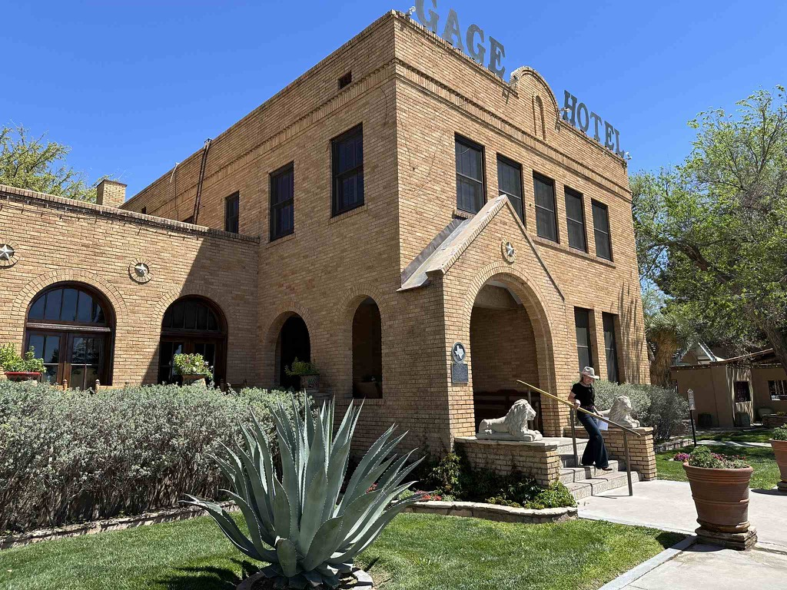

Day 14 finds us heading from the Black Gap Wildlife Management area toward Ingram and the [Hill Country Arts Foundation](http://www.hcaf.com/) where we will be spending the next several days viewing the eclipse from.   We did not set an alarm so we managed to sleep in quite late, and it was glorious.   We slow rolled getting up in the morning, and getting out of the place.    And headed back the way we came towards Marathon.  Once we got to Marathon, we stopped at the grocer again and walked along the main street to check things out.   The art gallery that they have there was really quite impressive. and had a nice collection of books and art.  From there, we headed down the road.   The drive was very pleasant and uneventful today - there were some periods of high gusty winds, but the van handled them well.   My cousin Eric tells me that if I do the same suspension upgrade that he has done to his van, it will do even better.  I'm considering it.

We had considered stopping shy of Ingram (where the arts foundation is), but we are meeting my friend and co-worker Joyce on Saturday at 11 for lunch, and Kai arrives on Friday as well, so we decided that we would push all the way through to our campsite.  Boy, are we glad that we did.  This location is absolutely Beautiful!   We are the first folks to show up, and we are at "the point" where Johnson Creek joins with the Guadalupe River.   And that is just upstream of a dam, so we are on a lake.    Our campsite has a Beautiful view of a lawn extending downhill to a tree-lined shoreline.   And the facilities look absolutely fantastic.  This should be a great place to spend a few days unwinding.  

Before we settled in, we drove down the road a piece to Kerrville to see what there was to see there.  It is actually a rather pleasant town as well.   We stopped at the local HEB store, to get some beverages for Saturday.   

We set up camp and settled in once we were back at our campsite.   Catherine made an excellent steak and grilled vegetables dinner, and Kai joined us for dinner.   We chatted late into the evening before heading to bed.

Other than the stretch of Texas in the oil fields, I have found this land to be very beautiful and clean.  There is very little trash on the side of the roads, and I don't remember seeing any political signs or hats anywhere.   

The post office in Marathon Texas

The Gage hotel was absolutely beautiful

This is what the road looked like for a lot of the day.

The Van settled in to the campground

Another shot of our camp site.

"The point"

This is a piece of kinetic art that moves with the wind.

[Day 14 black gap wma to hill country art council](https://www.gaiagps.com/public/qc67rz1C3Gb2NjSWpsLL0Ba7/)

[<< Previous - 2024-04-04-day13---big-bend-national-park](./2024-04-04-day13---big-bend-national-park.md) 

[Next >>  - 2024-04-06-day15-day-trip-to-joyce's-place](./2024-04-06-day15-day-trip-to-joyce's-place.md)

<iframe src="https://www.gaiagps.com/public/qc67rz1C3Gb2NjSWpsLL0Ba7/?embed=True" style="border:none; overflow-y: hidden; background-color:white; min-width: 320px; max-width:420px; width:100%; height: 420px;" seamless />