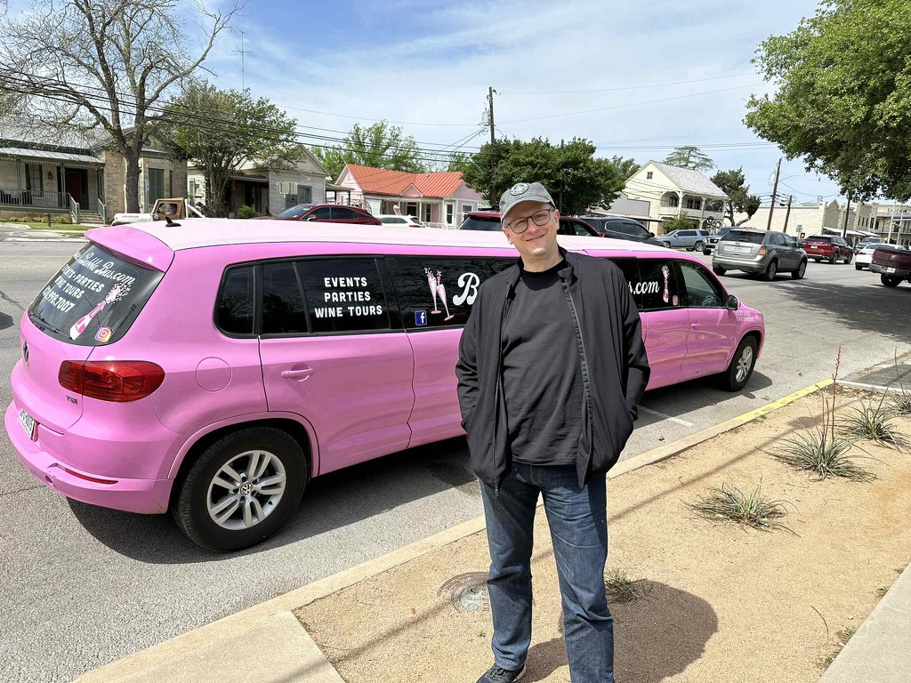
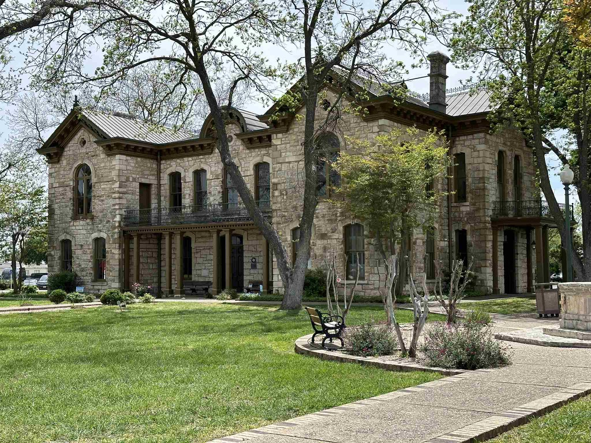
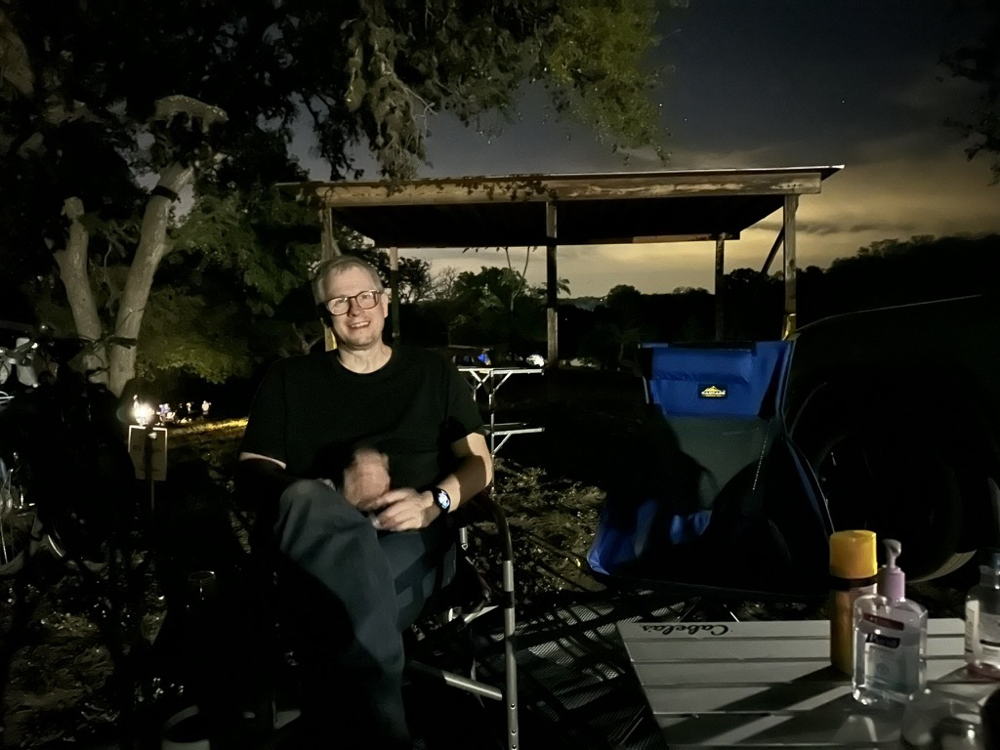

Sunday, Kai, Catherine, and I took a day trip from the Hill Country Arts Foundation out to [Fredericksburg Tx](https://www.fbgtx.org) about a 30-minute drive away.   Once there, we spent about three hours walking up and down the main street and poking our heads into different shops and galleries.   It was a rather pretty town.  It was founded by German immigrants in the 1840s and still has a lot of German Heritage and history.   

We popped our heads into two different art galleries, and what we found inside was absolutely stunning.  Alas, being that we are traveling, we didn't want to pick anything up (not to mention the prices were, shall we say, impressive).  

Kai and I tested the Pretzel from the German baker and let Justus know that Kaffeklatch pretzels are better.

From there, we headed back to the HCAF, where we met Scott and Martha.   And just had a wonderful time.  We went to a wine tasting, grabbed some food at one of the food trucks, and then just kind of hung out and enjoyed each other's company.

As I write this, it is rather overcast, but the models are saying that there _might_ be some clearing later today for the eclipse - so fingers crossed!

[Eastern United States - Clouds - 06 UTC - Environment Canada](https://weather.gc.ca/astro/clds_vis_animation_e.html?id=se&utc=06) 

This is what the European model is predicting for cloud cover around the time of the eclipse

There is a rather impressive [WWII museum in Fredericksburg](https://www.pacificwarmuseum.org/) - alas, we didn't go inside, since we didn't want to spend the whole day there, and I prone to be a very slow museum reader ;).  Interesting note - Admiral Nimitz was born in Fredericksburg.

Kai at the big pink limo.

That's a cute little smoker they had there.

Their fire department had a cool building, and this cool old fire engine.

The art in the [Charles Morin Fine Art gallery](https://www.visitfredericksburgtx.com/listing/charles-morin-fine-art/3088/) was something else. 

This is the old library building - not sure if it is still in use as a library or not.

Catherine, Athena and Kai walking in front of me.

Relaxing while we wait for the car to cool a little bit.

Nice Quilt for auction.

Kai sitting in the campsite at night.

Looking at the stars

[Day 16 - Day trip too Fredericksburg](https://www.gaiagps.com/public/wO7fg2WjjR8lDurpKoFaGd3x/)

[<< Previous 2024-04-06-day15-day-trip-to-joyce's-place](./2024-04-06-day15-day-trip-to-joyce's-place.md) 

[Next >> - 2024-04-08-day17-eclipse-day](./2024-04-08-day17-eclipse-day.md)

<iframe src="https://www.gaiagps.com/public/wO7fg2WjjR8lDurpKoFaGd3x/?embed=True" style="border:none; overflow-y: hidden; background-color:white; min-width: 320px; max-width:420px; width:100%; height: 420px;" seamless />

