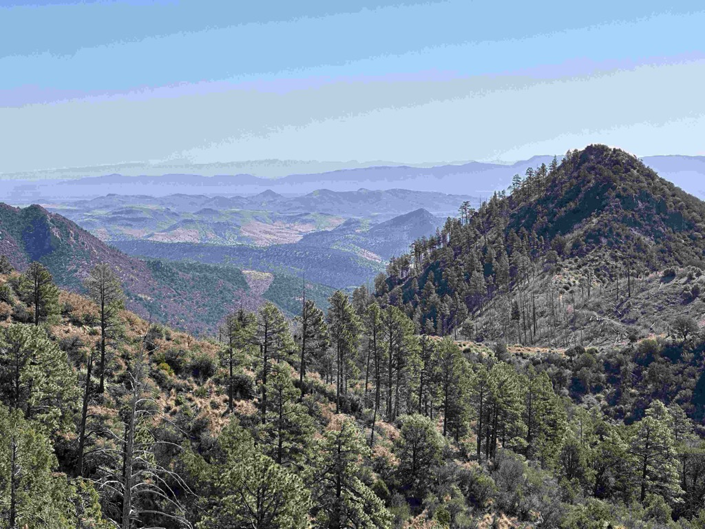

Day 20 was a push!   Our Goal, now, is to get up to Northern California to see my Cousin Eric and his Family and then hang out with my friend George and his family, so we decided that we would push on through to Joshua Tree in one _BIG_ day so that we could have a complete an unencumbered day at Joshua Tree, and then just a couple of easy days to get north.   So we got up early, made our coffee, and hit the road by 7:15 in the morning.   The weather was stunning, and the van was running well, so we went off.   We debated whether to do the fastest way or stay off the interstates.   We decided to stay off the interstates while there was daylight, so we set our sights on [Silver City, New Mexico](https://www.townofsilvercity.org), as our first stop, as that would force both Google and Apple Maps not to backtrack and take us on some interesting roads.   Well, on the way to Silver City, the exit we were supposed to take was closed, and the turnaround was a dozen or so miles up the road, so we changed our route to Silver City, and boy, are we glad that we did, since it took us over [Emory Pass](https://www.fs.usda.gov/recarea/gila/recarea/?recid=82313) on highway 162. What a stunningly beautiful road.   When we got to the top, we pulled into the vista to take some pictures and ended up chatting up a couple of folks on their way home after four months on the road.   They have over 400,000 miles on their Sprinter van.  We also talked to a couple of guys who were getting ready to start a hike, and they explained that the bicyclist who was leaving was on a 100,000-mile solo bike ride to visit 100 countries in that 100,000 miles.   He is reported to have said that this pass was not one of the hard ones since the grade was less than 10%.

We rolled into Silver City and stopped at the [Jalisco Cafe](https://www.zmenu.com/the-jalisco-cafe-silver-city-online-menu/) for lunch.  That was a pretty nice little spot, and conveniently located at one end of downtown, which allowed us to walk from one end of town to the other and enjoy ourselves.  Silver City is known as an arts community and provides a lot of cute and funky galleries and spaces to check out.

After Silver City, we had the chance to check out the [Chino Mine](https://en.wikipedia.org/wiki/Chino_Mine), the longest running mine in North America.

From there, it was out [highway 70 until we got to Globe AZ](https://en.wikipedia.org/wiki/U.S._Route_70_in_Arizona)  where we switched to the [highway 60 through Tempe](https://azdot.gov/adot-blog/road-trip-arizonas-piece-us-60-original-transcontinental-highway)  where we jumped on I10 to ride into the sunset.    As the sunset, we made our way to a great little dry camping spot outside of Joshua Tree National Park, where we pulled in, easily found a campsite, made up some dinner, and just vegetated for a while.

The view climbing up to the top of Emory Pass

More views from the road up to the pass

Our Van

When we got to the vista at the top of the pass the odometer read 55,555 miles.

Looking back towards where we came from

An explainer of the [2013 Silver fire](https://en.wikipedia.org/wiki/Silver_Fire) that roared through the area.

My love and Athena at the top of the pass

Looking into the [Chino Mine](https://en.wikipedia.org/wiki/Chino_Mine) 

An interesting Mural in Silver City - there are cast tiles adhered to the wall, so almost a combination of Mural and mosaic.

One of the cool buildings in Silver City

Oh how I love my lilaac's

One of the many artist' Galleries in Silver City

[Day20 - Aguirre springs to Joshua Tree - with Silver city and Emry pass ](https://www.gaiagps.com/public/rsb0cQBRRZZhnWw68FObobE1/)

[<< Previous - 2024-04-10-day19-lincoln-city---petroglyphs---white-sands](./2024-04-10-day19-lincoln-city---petroglyphs---white-sands.md)

[Next >> - 2024-04-12-day21-joshua-tree-national-park](./2024-04-12-day21-joshua-tree-national-park.md)

<iframe src="https://www.gaiagps.com/public/rsb0cQBRRZZhnWw68FObobE1/?embed=True" style="border:none; overflow-y: hidden; background-color:white; min-width: 320px; max-width:420px; width:100%; height: 420px;" seamless />

