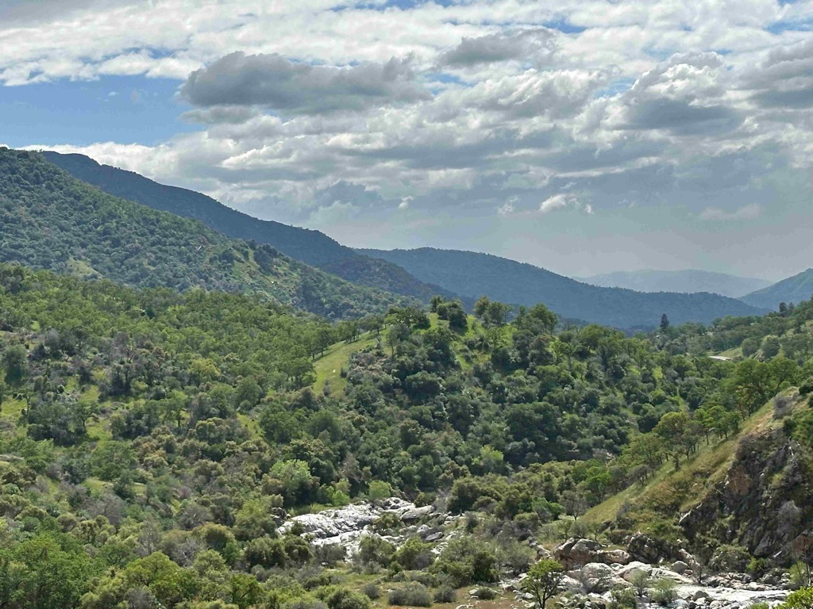
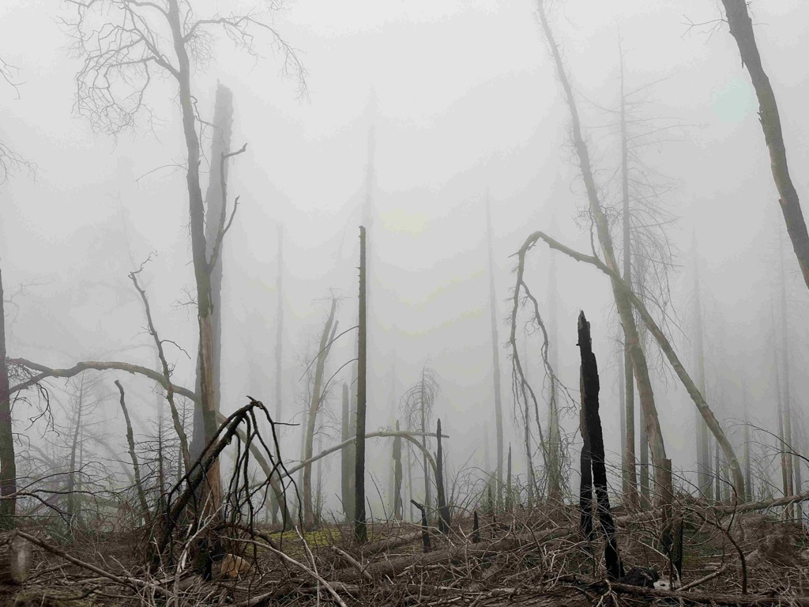

Day 22 saw us wake up in a cute little RV park called [Mountain Valley RV Park near Tehachapi ca](https://www.campendium.com/mountain-valley-rv-park).    It was a beautiful morning, and the bikes were already off the racks, so we decided to head out on a little bike ride to see what was to see.  Just down the road, a piece is the little [Skylark North Airport](https://skylarknorth.com/) that specializes in soaring. We rode along its perimeter and then amongst the hangers and the tow planes before realizing they had a coffee shop, so we stopped. I wandered in there, and they were also serving breakfast, so we decided to grab some breakfast and coffee from the cafe.   I started chatting with the women who worked there, and it turns out they have owned the place for the last 48 years.  I didn't quite get the relationship, but one was the mom, and one was the daughter, and I believe there are granddaughters in the operation as well.  The family bought it when the airport where they were running their glider flight school disrupted their operations just one too many times.   Being so close to Edwards Airforce Base, they have a very deep relationship with things over there.   And they have the longest-running contract with the military to teach the test pilots how to fly gliders.  The walls were just covered with signed memorabilia from all sorts of folks involved in the history of advanced flying craft from Edwards. 

They also offer sailplane rides out of place. Initially, I wasn't going to do it, then I decided that I would (and I even made their weight cut off, which means I have _lost_ weight on this trip), but alas, just as I was being introduced to my pilot, he reported that the winds had changed, and they weren't going up at the moment.   :(.  as a consolation prize, I bought one of their shirts.   

From there, we set our sites on Sequoia National Park and started driving north, again staying off of the major highways.   The drive here was much prettier, as we were in farmland now.  And we went through mile after mile after mile of Citrus groves.  Just orange trees as far as the eye could see.   

We entered the park, and the weather was just glorious.  The road that goes through the park, called "[General Highway](https://en.wikipedia.org/wiki/Generals_Highway)" was open only far enough for us to get to the [General Sherman Tree](https://www.nps.gov/seki/learn/nature/sherman.htm), which is about 22 miles in.  But that was enough for us to get quite the experience driving the road.   It went up and up and up to over 7,000 feet.  As we approached the 6,000-foot level, we could see clouds swirling over the ridges and eerily coming down the sides of the mountains.   As we got even higher, we drove through the clouds, with mere feet of visibility at times.    When we arrived at the General Sherman, it was full-on snowing!    We parked, turned on the heater to keep Athena warm, and then headed down to see the largest tree in the world by volume of wood in its trunk.    It was pretty impressive.    We will definitely have to come back this way when the road is open all the way, and we can spend more time exploring these great parks.

Once we were back down in the farmland, it was full of raining cats and dogs.  We decided to drive north to get closer to Eric and his family and find a place to camp along the way.   We debated whether we should do a rest stop, a campground, or a Walmart and settled on doing a campground for quietness and comfort.   Using iOverlander and other resources, we decided on [Lindy's Landing near Kingsburg](https://lindyslandingllc.com/).   And we would even be able to get there before they closed.   

We arrived, checked in, and went and put eyes on our campsite. Then, we headed into the town of Kingsburg Ca to see what there was to see and dropped in on the [Mogosh Brewing](https://www.magoshbeer.com/).  Well, the town had rolled up its sidewalks, and Mogosh was hard to find, but once we walked in there, the place was hopping!  There wasn't an empty table to be seen, so I asked a couple if we could join them, and they said sure.   So we got our beer and cider, which were quite good, and sat down and chatted with Steve and Vickie for the rest of the evening and just had a wonderful conversation with them while we listened to the musician on stage play his guitar and sing. 

The main building at the Skylark Airport.

Looking out the window at the runway and the sailplanes.

We saw this Raven and the entrance to Sequoia national park, and he was just checking us out.

The river heading up the Generals Highway.

Starting to see some clouds rolling in.

Holding up Tunnel rock.  When the CCC built the road, they excavated the soil out from under this rock, and routed the road under neath it.  It wasn't very practical once vehicles got to be more popular and larger.

The hillsides looked like they were covered with green velvet.

Some more clouds rolling in over the mountains.

Now they are really coming in.

There is a picture of this spot later as we are coming down.  Take note :) 

Some of the fire damage from a couple of years ago.

Me and Catherine getting ready to take a short hike to see the General Sherman

Here we are at the largest tree in the world.

It's a big tree!

Look how much snow has fallen since we came up!

Me, Vickie, Steve and Catherine at the end of a beautiful conversation. 

[Day 22 - Skylark airport and sequoia national park](https://www.gaiagps.com/public/kNUMgmzz9utsvMNCoLwICgFh/)

[<< Previous - 2024-04-12-day21-joshua-tree-national-park](./2024-04-12-day21-joshua-tree-national-park.md)

[next >> 2024-04-15-day23-and-24---petaluma-with-eric-and-dillon-beach](./2024-04-15-day23-and-24---petaluma-with-eric-and-dillon-beach.md)

<iframe src="https://www.gaiagps.com/public/kNUMgmzz9utsvMNCoLwICgFh/?embed=True" style="border:none; overflow-y: hidden; background-color:white; min-width: 320px; max-width:420px; width:100%; height: 420px;" seamless />

