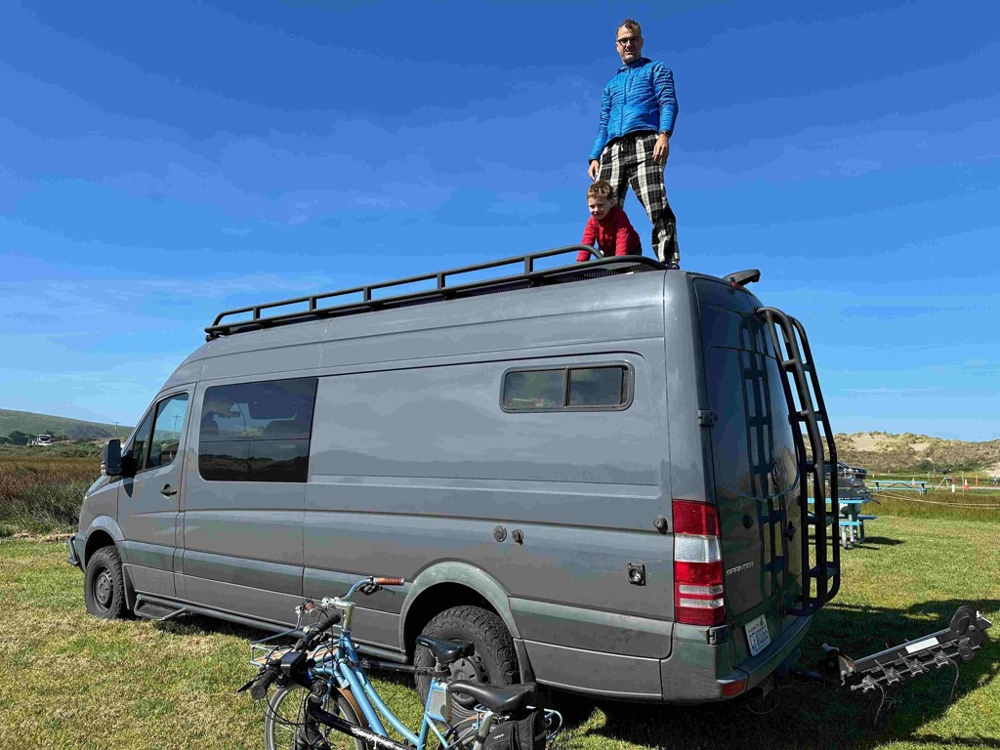

Day 25 of the trip was a great day of hanging out with George, Felix and Stefan.   It was a nice lazy day of not really going anywhere.  We got up slowly, and made breakdast of sausage and eggs for everyone, as well as some coffee, before George, the boys and I went for a walk down to the other end of the campground (this campground is _BIG_), visited the on site chandlery, and then went and flew a couple of kites for a while.  

This was a great opportunity for George and I to catch up, which we hadn't really done in two years.   

The walk with the boys took up a good portion of the late morning, and early afternoon.  And when we got back, we all got into Georges rig and headed in the direction of [Pt Reyes Station](https://en.wikipedia.org/wiki/Point_Reyes_Station,_California), stopping to pick up oysters along the way at the [Tomales Bay Oyster Company](http://tomalesbayoysters.com/), which is the oldest Oyster farm on the bay.  I asked the woman that was working there (she is a member of the second generation of the family that owns it) how many oysters is a lot of oysters for them to sell, and she said that during the fourth of July weekend, they will sell 150,000 oysters!   

We had a wonderful little walk around Pt Reyes Station.  Poking our heads into all sorts of cute little shops and stores.  

When we got back to Camp, Felix helped George replace the Fuel lines for the heater.  They spent the first night at camp without heat in the van, which gets pretty chilly.  

After vehicle maintenance was complete, we started the camp fire, started streaming the Golden State warrior playoff game, and started shucking oysters and eating dinner.    Alas the Warriors lost, but we won because we just had a wonderful time roasting marshmallows and chatting until it was time to pour the boys into bed.  

Felix getting ready to chow down on breakfast.

George and Stefan on top of mount Big Air.

The cows in the field were facinating.

Loaded up and heading to Pt Reyes Station.

Tamales Bay Oyster Company

A scene from Pt Reyes Station.

Me, Stefan, George and Felix enjoying our walk.

The local post office.

Felix loves to help George work on the Van

Doing the van work.

Stefan and Felix helping Catherine make dinner.

Enjoying the campfire.  Waiting for the embers to settle in to roast the Marshmallows.

[Day25 day Trip to Oysters and  pt Reyes station](https://www.gaiagps.com/public/aeuL15lzDjwuTW4rSrnSe51c/)

[<< Previous - 2024-04-15-day23-and-24---petaluma-with-eric-and-dillon-beach](./2024-04-15-day23-and-24---petaluma-with-eric-and-dillon-beach.md)

[Next >> -2024-04-17-day26---dillon-beach-to-clam-beach-with-a-stop-in-mancino-and-eureka](./2024-04-17-day26---dillon-beach-to-clam-beach-with-a-stop-in-mancino-and-eureka.md)

<iframe src="https://www.gaiagps.com/public/aeuL15lzDjwuTW4rSrnSe51c/?embed=True" style="border:none; overflow-y: hidden; background-color:white; min-width: 320px; max-width:420px; width:100%; height: 420px;" seamless />