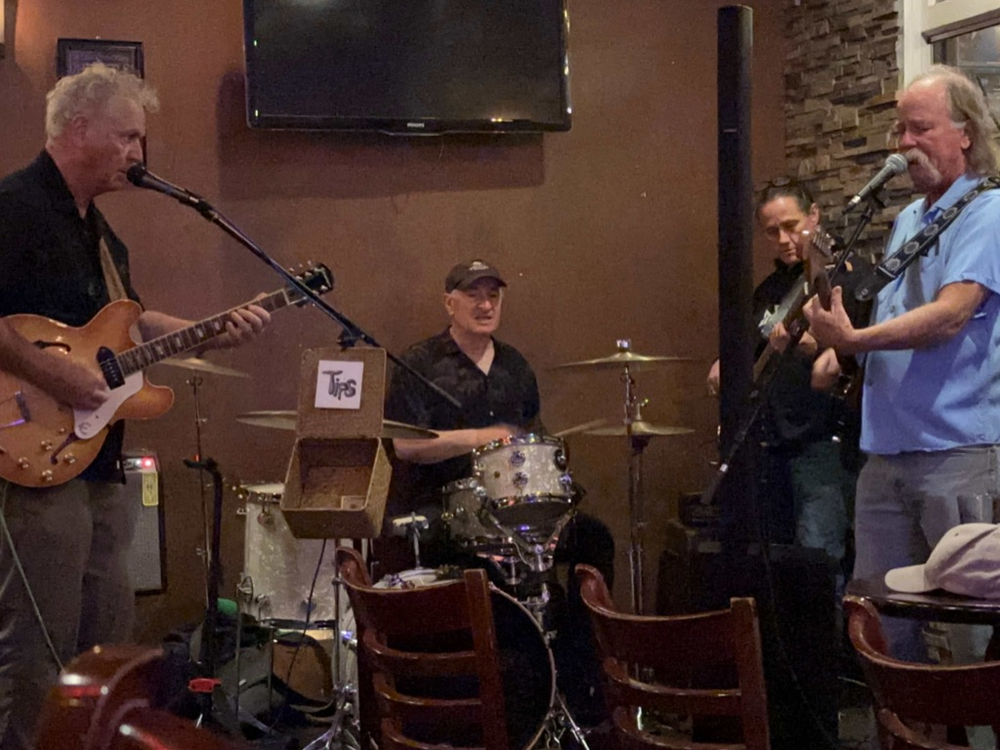

Day 26 sees us rolling out for the final leg of this beautiful trip that we have been on.   George and the boys had to roll out super early to get George and the boys back to school.  George was the walk parent this morning for the class walk.  So I got up early and made breakfast and coffee for everyone so they would have something in the car as they left at 7 am.  And since we were up, we also headed out, with an eye on getting at least to Eureka by taking Highway 1 all the way up the coast.

Man, what a beautiful drive that was.  I did this same stretch of road back on my 2021 road trip [Day 4 – Eureka to San Fransisco – Weaties RoadTrip 2021](https://weatiesroadtrip2021.com/2021/05/07/day-4-eureka-to-san-fransisco/) and it was just as spectacular this time.

Catherine and I stopped in Mancino on our way through and walked around a bit.   There is an absolutely fantastic bookstore there.  What a great collection of books and suggestions.  I _almost_ bought some new books, but I already have a collection of books I bought on this trip that I haven't started yet, so I took a pass.  I did pick up a bookmark and a magnetic poetry kit for the van.  

We headed toward Fort Bragg for lunch at the [Noyo Fish Company](https://www.facebook.com/noyofishcompany/) as I had a craving for some seafood for lunch.   Their fish and chips were delicious, and the prawns were even better!  While we were enjoying our lunch, we started talking with these two ladies at our table, and one of them showed us her Space Needle tattoo, told us that she was the proprietor of the local Tattoo shop and Museum, and encouraged us to go check it out.  So, as we rolled through town, I stopped and checked out the Museum.  It was quite interesting, and I chatted with the artist there.  I thought about getting a tattoo just briefly but decided against it ;) 

From there, we continued up the coast, drove along the Avenue of Giants in Humboldt State Park, and finally ended up in Eureka, CA, where we stopped for a bit of a walkabout.   That turned into a fun little evening as we couldn't get into the first place we had chosen because they didn't let dogs in.  So we ended up at [North of Fourth in Eureka](https://www.yelp.com/biz/north-of-fourth-eureka) , a wonderful little bar.   As we were walking out, we discovered that Erika, the proprietor,  her Son rowed for the UW back at the same time that Alex was rowing for WSU and he is on the National Team (alas, he missed the cut for the Olympic 8, and it seems that that was a raw deal) 

From there, we wandered over to [Tavern 1888](https://www.historiceaglehouse.com/tavern1888), which was a warm and lovely bar, where we had a wonderful Poke tower.  As we headed back to the Van we heard some music wafting over the street and decided to follow that and see where it led us, and we ended up in [the Speakeasy](https://www.yelp.com/biz/the-speakeasy-eureka)  .  This place was modeled after places found in New Orleans, and the four-piece band that was playing was fantastic.  So we watched the music for an hour or so before heading back to the van, where we drove up to Clam Beach to spend the night.

Saying "until next time" to George and the boys.

Beautiful coastline.

More Beautiful coast line.

This was a pretty cool quilt store that we stopped in in Mancino.

Lunch at Noyo Fish Company

The Tattoo studio and museum.

Big ass log

Heading out again.

More rugged coastline.

Me and Catherine in the bar north of fourth.

Talking about rowing with Erika

Our Poke tower in Tavern 1888

So at Tavern 1888 the bill was delivered in an old library book, and you were encouraged to write a note in the book.  It was _very_ cool.

The bar at Tavern 1888

The band at the speakeasy.

The story and menu at the speakeasy

The bar at the Speakeasy

Where I am writing this letter from.

[Day26 - Dillon beach to Clam beach with stops in Mancino and Eureka](https://www.gaiagps.com/public/9xi2hKz5a8AeGErhyfKOYgN2/)

[<< Previous - 2024-04-16-day25-lawsons-landing-with-george-and-the-boys](./2024-04-16-day25-lawsons-landing-with-george-and-the-boys.md)

[Next >> - 2024-04-18-day27-clam-beach-to-oregon-coast](./2024-04-18-day27-clam-beach-to-oregon-coast.md)

<iframe src="https://www.gaiagps.com/public/9xi2hKz5a8AeGErhyfKOYgN2/?embed=True" style="border:none; overflow-y: hidden; background-color:white; min-width: 320px; max-width:420px; width:100%; height: 420px;" seamless />

