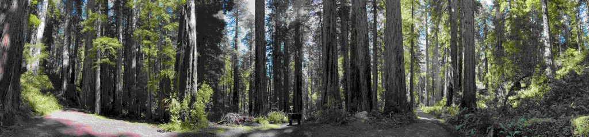
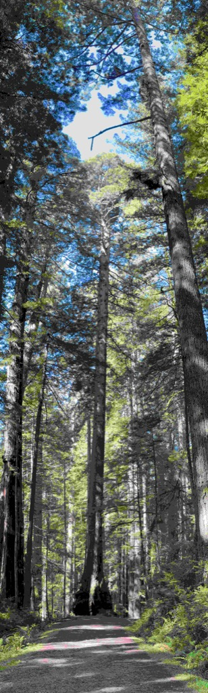
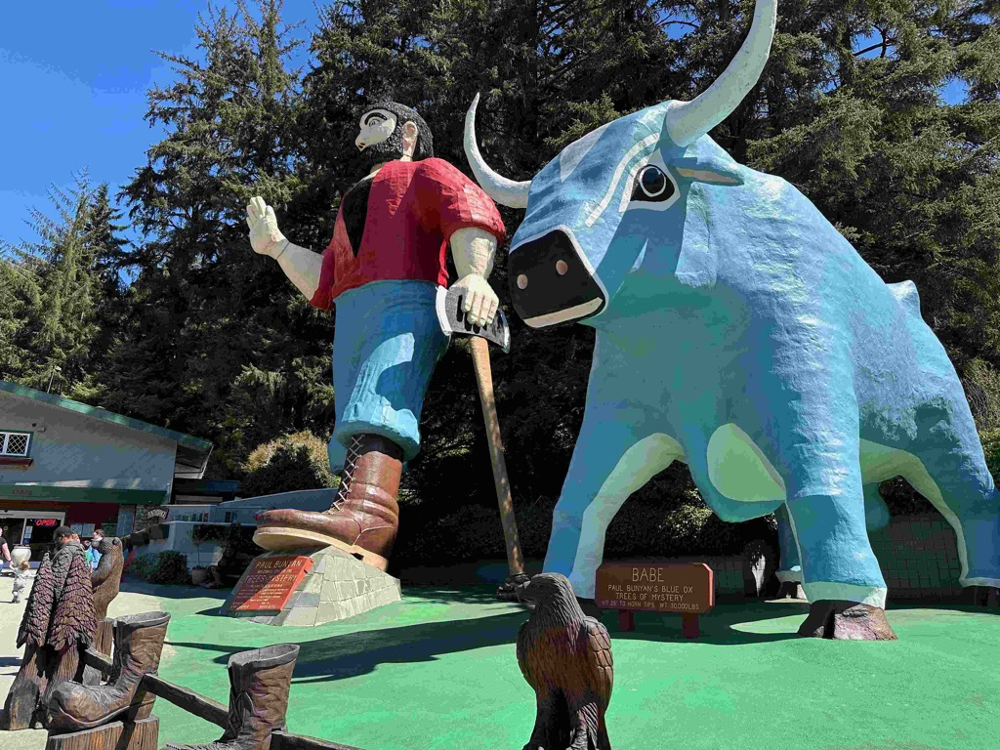
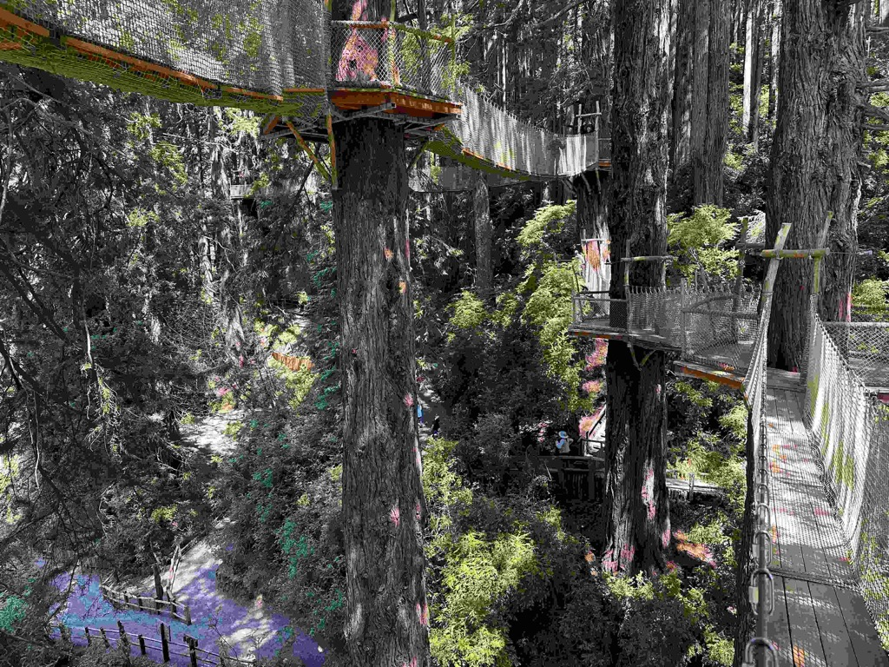
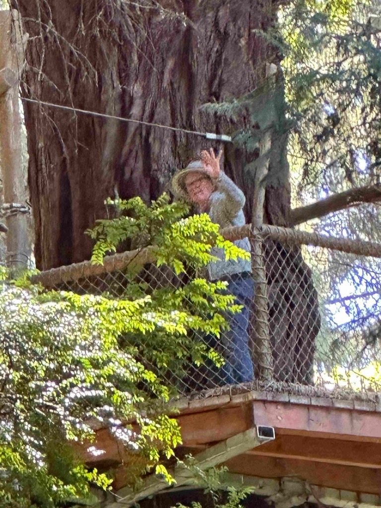
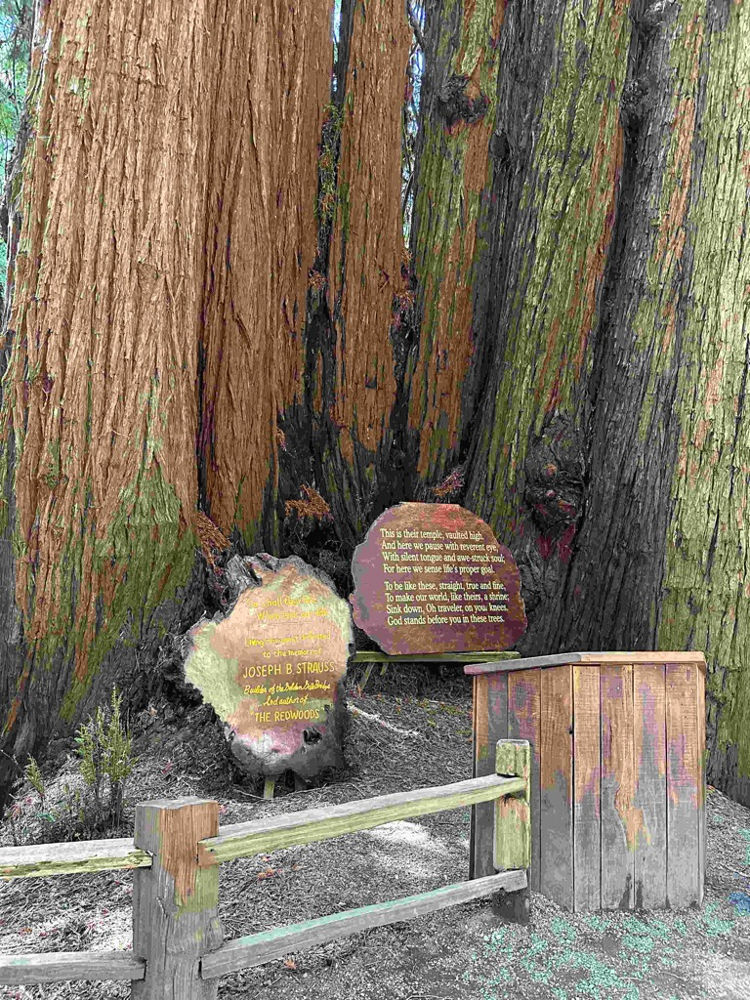
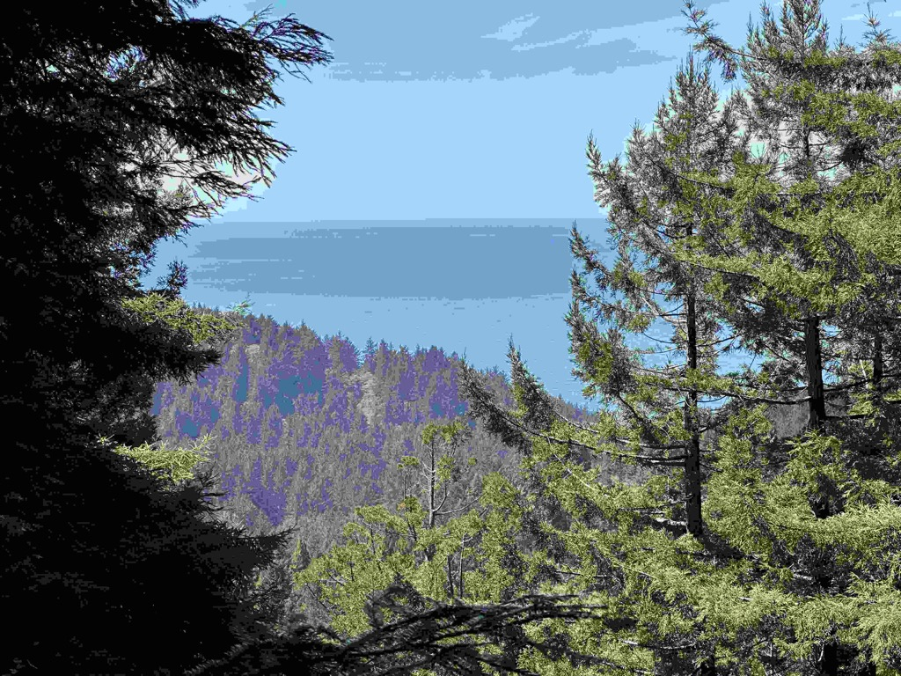
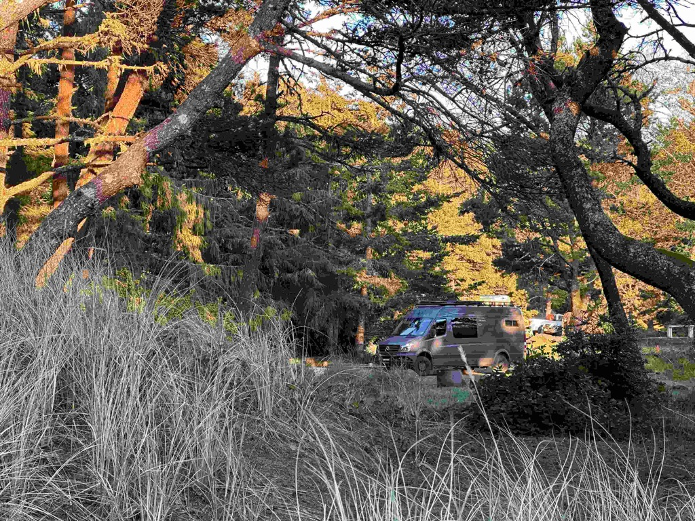
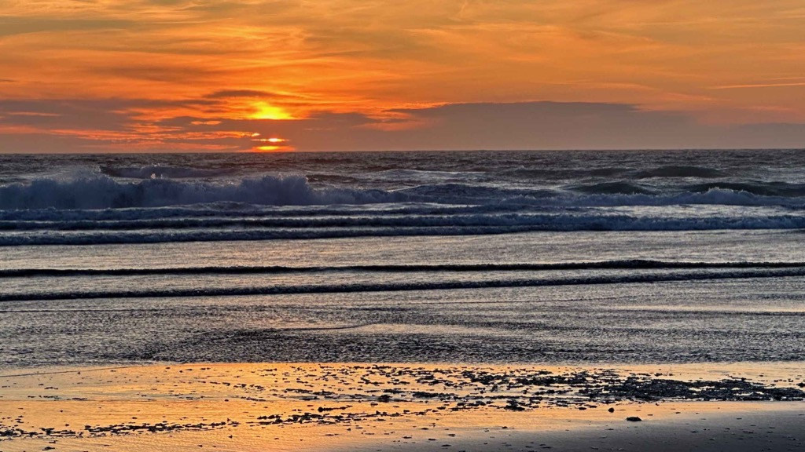

Day 27, and we are getting closer and closer to home!   We woke up at Clam Beach in California and started heading north on 101 and 1.   What a beautiful drive up the coast, with beautiful weather.  Along the way we stopped at the Redwood Forests and went for a fantastic hike amongst the giant trees. and we saw herds of elk as we drove through the forests.    

After that, we stopped along the way at the Trees of Mystery to visit their gift shop, and do their walk amongst the giants. The experience exceeded my expectations.   Their grounds were well maintained. They had nice interpretive signs, a rope walk suspended 50 feet above the ground we walked, and a gondola that took you to the top of the ridge where one can see from the ocean to Oregon.  

From there, it was back in the car to get north of Reedsport to make Friday's drive a little shorter.   We found a nice campground in ‎⁨Siuslaw National Forest and pulled in to set up camp.   After a nice walk to the beach, Catherine did some work, and I watched a movie. 

Me, Athena and Catherine walking amongst the redwoods.

A shot of the big trees.

A Panorama of the big trees.

A _very_ big tree indeed.

The Van at the trailhead.

Paul Bunyan and his Ox Blue at the trees of mystery.

A view from up in the trees.

Dogs weren't allowed on the rope walk, so I held Athena so Catherine could do it as well.

Catherine waving from the walk in the trees.

The Cathedral of trees.

The next Cathedral is under construction.

A view from the top of the Gondala

A typical view along the Oregon coastline.

Our campsite for the night.

Walking the beach at sunset.

Sunset at the Ocean

More Sunset.

Goodbye sunset.

[Day27 Clam beach to Oregon](https://www.gaiagps.com/public/juiYbc31YCsdpQre4SEAIGtn/)

[<< Previous - 2024-04-17-day26---dillon-beach-to-clam-beach-with-a-stop-in-mancino-and-eureka](./2024-04-17-day26---dillon-beach-to-clam-beach-with-a-stop-in-mancino-and-eureka.md)

<iframe src="https://www.gaiagps.com/public/juiYbc31YCsdpQre4SEAIGtn/?embed=True" style="border:none; overflow-y: hidden; background-color:white; min-width: 320px; max-width:420px; width:100%; height: 420px;" seamless />

