Howdy!

I'm currently in Washington DC with my friend Brian O'Neill.   We had an uneventful flight from Seattle to DC on Saturday, took the Metro to Foggy bottom where we navigated to the Hotel Hive, where we will be staying for the week, and then went for a rather extensive walk to get ourselves familiarized with the area, visiting the Mall, the whitehouse (where we saw a protest) and the Lincoln memorial.  Sunday saw us head over to the Air and Space museum, passing through the Mall again.  We very much enjoyed the Air and Space museum (even though only have of it is open as it undergoes renovations).  We spent a lot of time studying the 1903 Wright flyer.

After visiting the Air and Space museum we visited the Museum of the American Indian - that was quite impressive as well.  We didn't have a lot of time before it closed, but we did see the exhibit of the history of the Treaties.  Not a history to be really that prideful of.

In the evening we watched the first half of the super bowl at Penn Social, and the second half we watched at another underground bar that hide a fun vibe - Seems that most of the folks in Washington are Philly Fans, so that was fun to watch.

Yesterday (Monday) we walked over to Arlington National Cemetary, where we visited the arlington house and learned more about the complicated history of Robert E Lee, his relationship to The founding father (he married a great great granddaughter of George's) and some of the history of the slaves that worked the Arlington plantation.  

We also visited the tomb of the unkown soldier, and witnessed both the changing of the gaurd and the changing of the wreath.    It was quite the solemn experience.  

From their we walked over to the Airforce Memorial, and then to the Pentagaon, and the 9/11 memorial there.  I really appreciated the way that Memorial is put together.  It was quite moving.

Today we are heading to the library of congress, and then we will see where the day takes us.  We have been doing a TON of walking on this trip.

Love ya all

Dan W

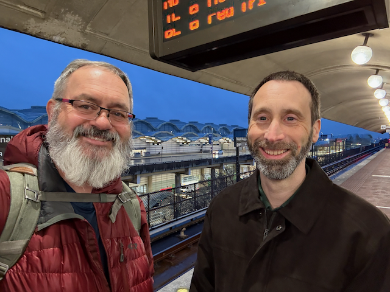

Me and Brian arriving in DC

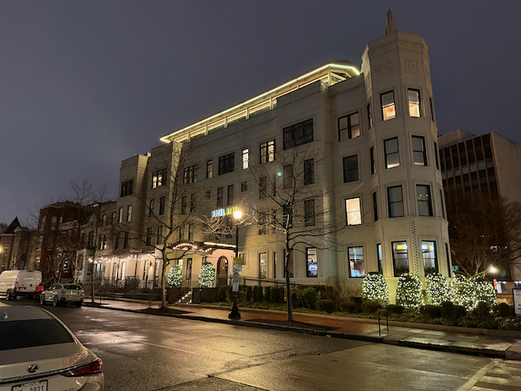

The Hotel Hive, in Foggy Bottom, where we are staying this week.

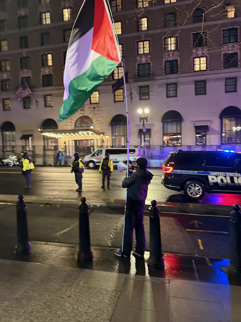

Protestors outside of the Whitehouse were chanting "War Criminal".  There were quite a few protestors, and even more police.

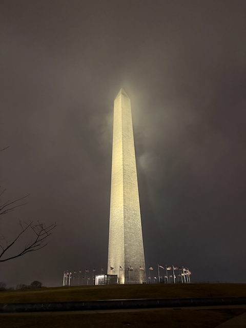

Washington Monument in the dark.

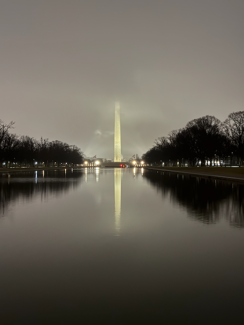

Obligatory shot of the washington monument in the reflecting pool

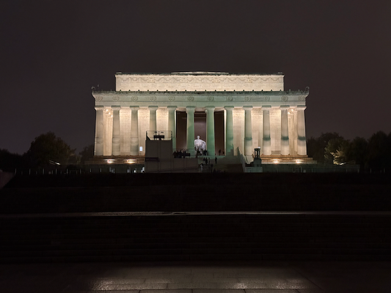

The Lincoln memorial at night.

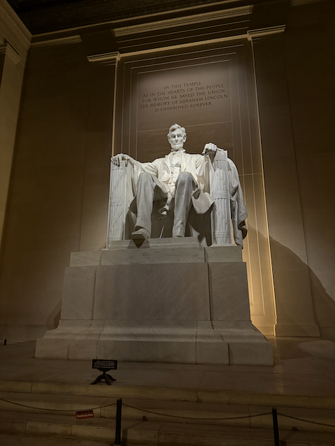

It is an impressive statue.

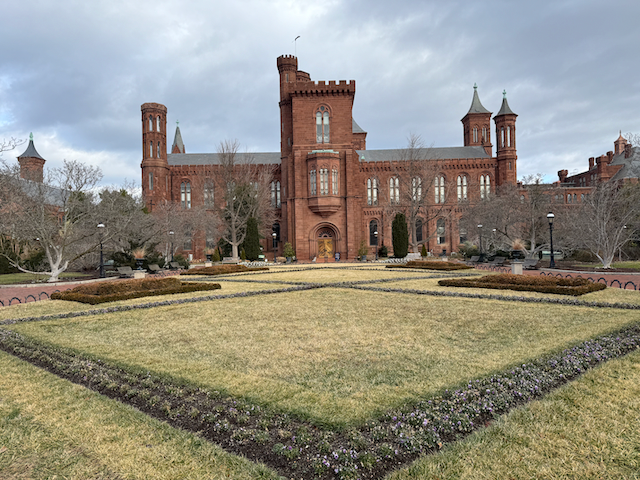

The Smithsonian Castle - currently closed for renovation.

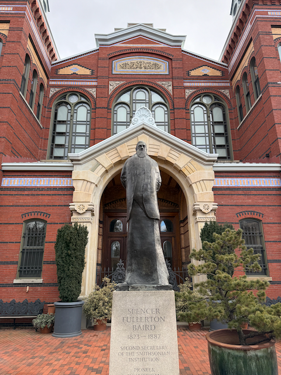

There are a LOT of statues in DC.

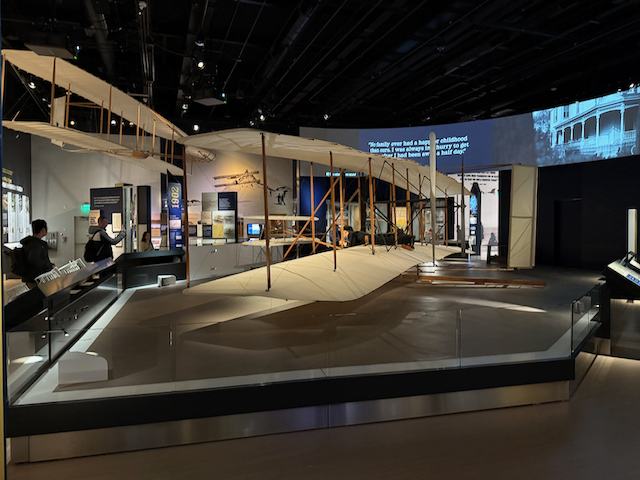

The original (well, 70% of it :) )  Wright Flyer.

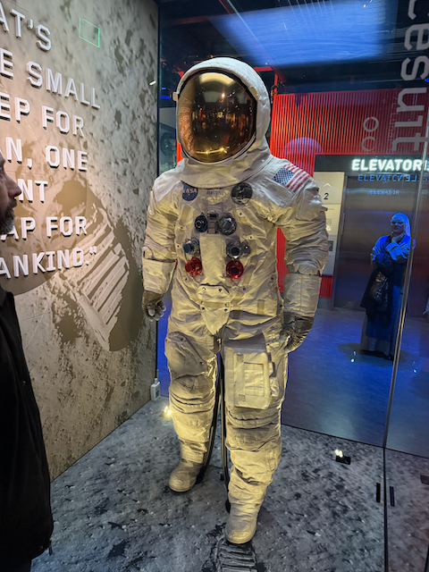

This is the suite that Neil Armstrong wore when he stepped onto the moon.

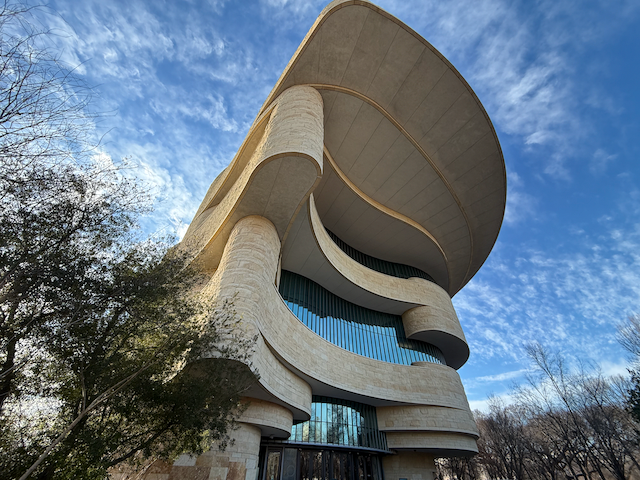

The National Museum of the American Indian

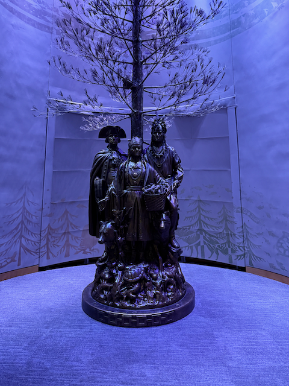

One of the Statues in the Mueseum

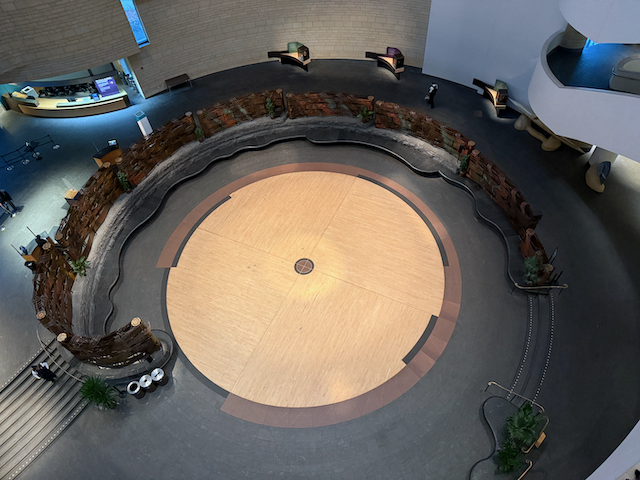

The central space of the Museum as viewed from the fourth floor.

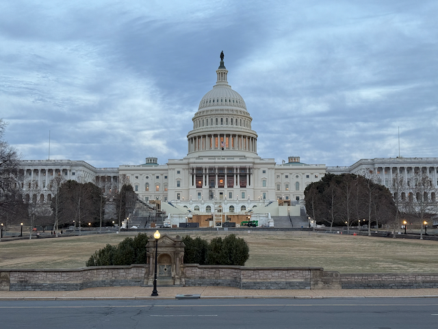

The capital.

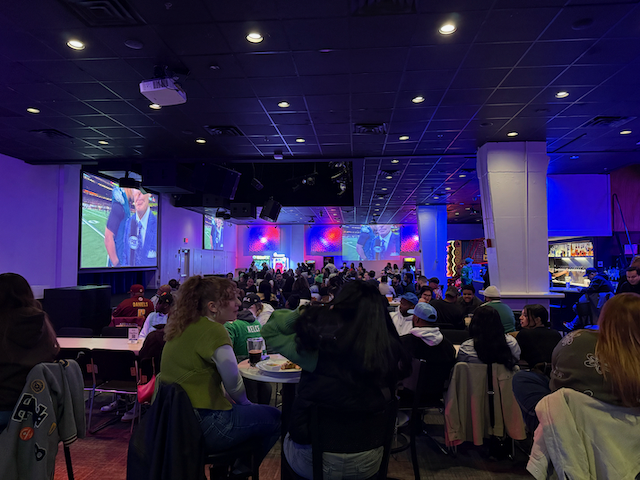

Watching the first half of the super bowl.

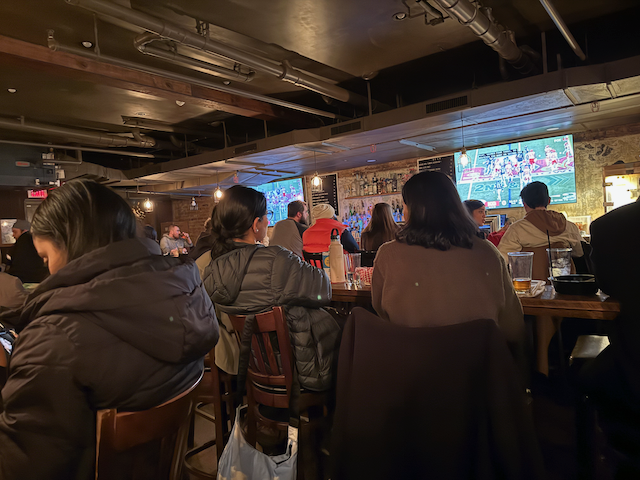

And the second half

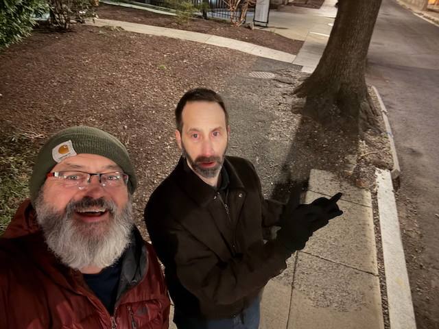

THis is the RARE Exception that we have found about wide well matintained sidewalks.

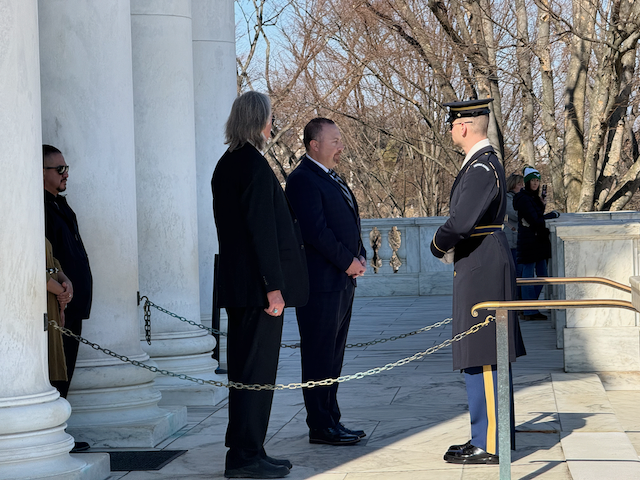

These were part of the ceremony of changing the Wreath at the tomb of the unknown Soldier.

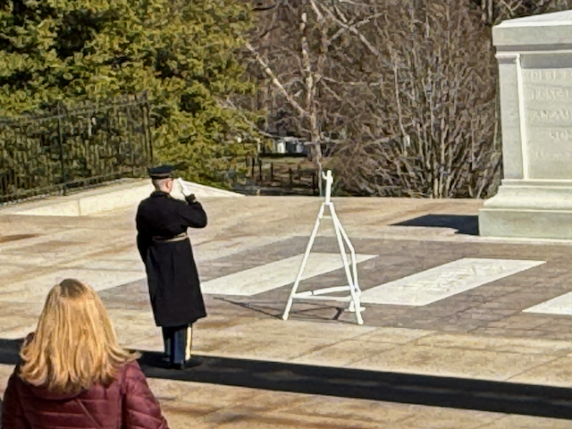

Everyone that walks past the tomb salutes.

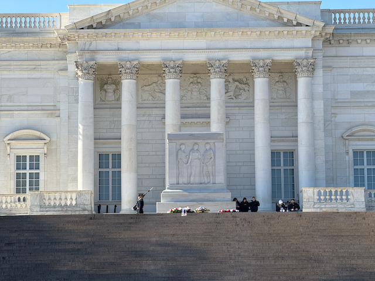

The tomb from below.

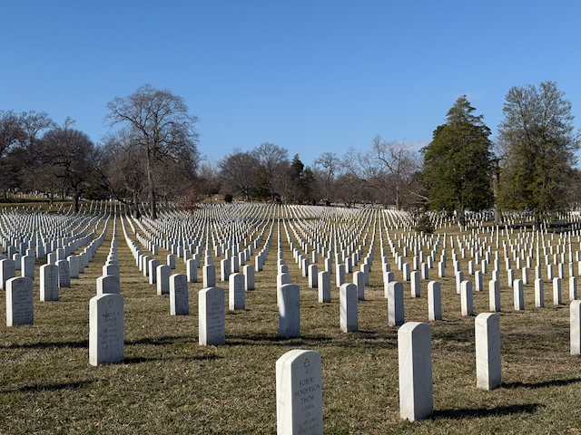

It's a big cemetary - so so so many gravestones.

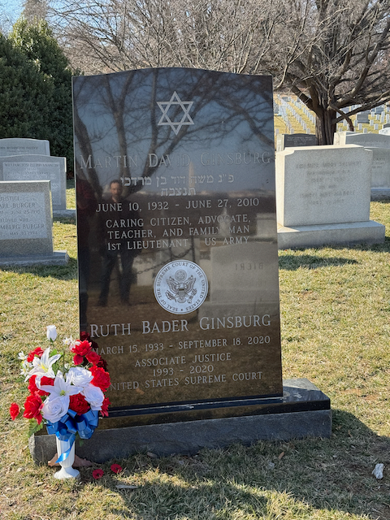

RBG

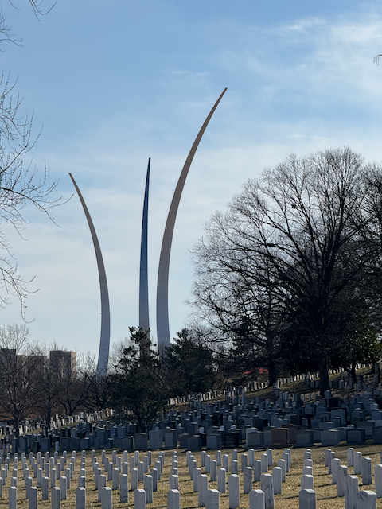

The Airforce memoria.

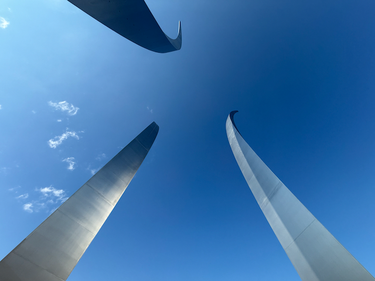

And more airforce memorial