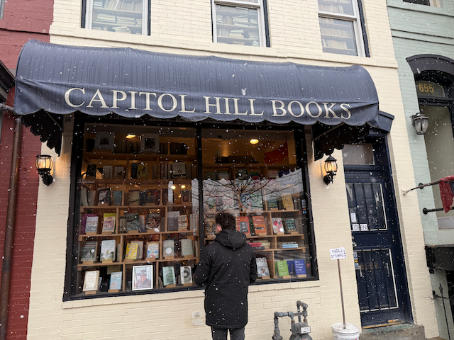
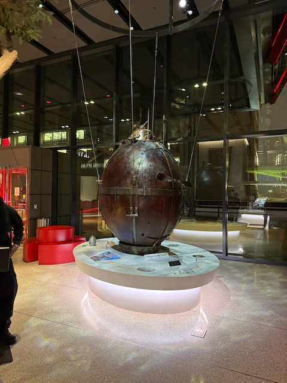
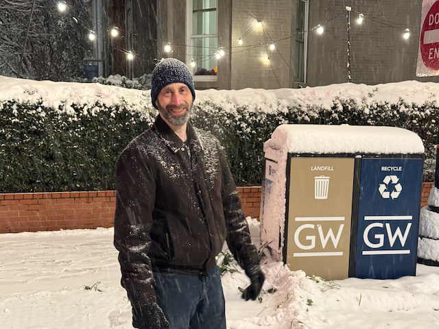

Howdy - just a quick entry - yesterday was spent at the Library of Congress (LOC) after starting the day with breakfast at the founding farmers.   

A winter storm was coming in, so the LOC (and the rest of the Federal government) was closing at 1pm, that allowed us plenty of time to visit the LOC, and then head over to meet up with Cindy and Andy,  friends of my Sister Sue that live in Washington DC.  We had coffee and a nice visit with them, and they gave us some ideas of things to do in DC.  Based on their recommendations, we went to the Spy Museum (which really exceeded my expectations) and then over to Kramer books for dinner and some shopping.  

While we were at the Spy Museum the predicted winter storm rolled through, and we came out to a winter wonderland.  :) 

Today we are heading to the Jefferson Memorial and we will see what else happens.

Dan W

We had a wonderful breakfast at Founding Farmers.

Preparing for our visit to the Library of congress

The library of congress is an impressive space.     We took one of the tours, which gave us some of the context of the space, and the meaning of the different pieces of art around the space.

In the artifacts Gallery - this installation opened only two months ago, and is quite impressive.

Overlooking the main lobby coming into the building.

There are lots and lots of these sayings.  And these light bulbs are original Edison Bulbs (I think that is what the Docent told us)

The British burned the Library of Congress on August 24, 1814, during the War of 1812. This occurred as part of the Burning of Washington when British forces, led by Major General Robert Ross and Rear Admiral George Cockburn, set fire to multiple government buildings in Washington, D.C.

The Library of Congress was housed in the U.S. Capitol building at the time. The British troops specifically targeted and burned the building, destroying the library's entire collection of about 3,000 volumes. This first collection had been carefully assembled under President Thomas Jefferson's direction.

After the destruction, Thomas Jefferson offered to sell his personal library as a replacement. In 1815, Congress approved the purchase of Jefferson's 6,487-volume collection for $23,950, which formed the foundation of the modern Library of Congress.

The burning of the Library of Congress represents one of the most significant losses of cultural and intellectual resources in early American history, though it ultimately led to the creation of an even larger and more comprehensive collection through Jefferson's contribution.

On December 24, 1851, another devastating fire broke out in the Library of Congress, which destroyed about two-thirds (approximately 4,000 volumes) of Jefferson's original collection of 6,487 books. This fire occurred in the library's chambers within the Capitol building.

The fire was particularly destructive because it started in the morning hours of Christmas Eve when few people were present in the building. The fire began due to a faulty chimney flue and spread rapidly through the library's wooden shelves.

Of Jefferson's original collection:

• About 2,400 volumes survived the 1851 fire

• Around 4,000 volumes were destroyed

In recent decades, the Library of Congress has worked to reassemble Jefferson's original collection through a project called "Thomas Jefferson's Library." They have acquired exact editions when possible, or similar editions when the exact versions cannot be found. The Library marks these books with different colors to indicate:

• Green ribbon: Original Jefferson books

• Yellow ribbon: Same edition, different copy

• Red ribbon: Different edition of the same title

(Note - the above was provided by ChatGPT)

The reading Room.

The original Librarians office.

"One of only three perfect vellum copies of the Gutenberg Bible in existence, this masterpiece of early printing rests in the Library of Congress. Completed by Johannes Gutenberg around 1455 in Mainz, Germany, this revolutionary work represents the first major book printed with movable metal type in Western history. Its pristine pages showcase the exquisite craftsmanship of medieval illuminators who hand-painted the decorative initials and flourishes after printing. This treasure of human innovation marks the beginning of the age of mass communication and stands as a testament to the dawn of the printed word in Europe."

_On display in the Thomas Jefferson Building's Great Hall_

(Description provided by chatGPT)

After the library - we got on the Metro to head towards 7th Hill Coffee, where we met my suster Sues friends Cindy and Andy - we had a wonderful time with them, and they gave us some great ideas for what to see.  

We walked through the Rather impressive east Market after our coffee with Cindy and Andy, as Brian and I headed for the spy museum via the metro

But before we got on the metro, we stopped in the absolutely wonderful [Capitol Hill Books](https://www.capitolhillbooks-dc.com/)  Note the books in the upper windows.

The place was just crammed with books

And a warning to please not burn the building down.

I succeeded in my secret spy mission at the [Spy Museum](https://www.spymuseum.org/)- this is me in disguise :) 

In the Lobby of the Spy Museum.

After the Spy Museum, we headed over to [Kramers books](https://www.kramers.com/) for dinner of Kal salad and Pizza

It was just Fabulous.

While we were at Coffee with Cindy and Andy the predictions of snow came true, and by the time we were out of Kramers - we were in the middle of a winter wonderland.

Brian trying to hit me with a snowball (he missed ;) )

We found a nice Rum Bar on the way back from Kramers to the Hotel

Walking in the snow.

Back at the Hotel.

[Track on Gai](https://www.gaiagps.com/public/My09fZ9yEyfto81bfL02s8Rb/)
