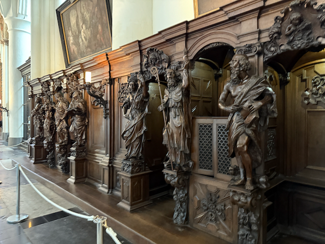

**Good morning from Bruges!**

Yesterday was an absolutely gorgeous day here. It started bright and early at the Oslo airport, where we’d spent the night at the airport hotel—super convenient to just roll out of the room and right into the terminal. From there, it was a smooth hop over to Brussels, and then a fairly chill Uber ride into Bruges.

Once we got checked into the hotel, I scouted out a lunch spot that turned out to be a winner—charming, cozy, and walkable. While we were there, Perrin popped in and surprised us, joining for the rest of the day. We swung back to the hotel so she could drop off her bag, and then the four of us hit the streets for an impromptu walking tour.

We didn’t have a set itinerary, just wandered and soaked it all in. The Church of Our Lady was breathtaking—between the soaring altar, the hush of the space, and Michelangelo’s _Madonna and Child_, it really struck a chord. From there, we hopped on a canal boat and floated through this fairy-tale city. Honestly, every turn looked like it belonged on a postcard.

Later in the afternoon, we met up with Judy and Balin, who had a bit of an adventure getting in from Paris (Judy managed to get separated from her phone _and_ her travel companion when she jumped back on the train to retrieve her Guitar, and it left with her still on it). We all grabbed dinner together at a touristy place that turned out better than expected—I went with the rabbit stew, which was surprisingly solid. I also got a flight of local beers because, well, when in Belgium…

After dinner, I walked Sue and Mom most of the way back to the hotel, made sure they were on the right track, and then peeled off for a long solo wander. The city was magical at dusk—light fading, canals glowing, everything hushed and beautiful. I strolled until about 10:30, soaking up every quiet corner I could find.

Today is the big Ascension Day procession, where they carry the vial that supposedly holds Christ’s blood through the streets. Should be fascinating to watch. Hoping to hit a couple more museums afterward and maybe finish walking the city’s perimeter.

Here are the photos from the day. Some captions are mine, some courtesy of ChatGPT—pretty sure you’ll be able to tell which is which.

Love you all—more tomorrow!

—Dan

Leaving Oslo for Brussels - it was nice being able to walk out of the Hotel and into the airport

We will be back to visit Oslo at the end of the trip.

Mom and Sue in the Brussels airport.

Perrin Showed rolled into town while we were eating Lunch and joined us for the rest of the day.

Mom and Perin in the cute little cafe that we were in for lunch

The outside of the cafe we had lunch at

A study of what some of the walls used to look like inside of the church of our Lady.

Inside of the Church of our Lady

The alter inside of the Church of our Lady

Confesionals

At the heart of Bruges’ Church of Our Lady stands Michelangelo’s ‘Madonna and Child’—a masterpiece of serene grace and the only one of his sculptures to leave Italy during his lifetime.

A close up of the Madonna and Child

In the heart of Bruges’ Church of Our Lady, this soaring altar seems to rise like a wooden wave — carved with care, crowned with light, and humming with centuries of quiet awe.

Suspended in stillness—this haunting crucifix floats above the choir in the Church of Our Lady in Bruges, a solemn reminder of faith carved in wood and shadowed by centuries of prayer.

A typical streat scene in Bruges

Me, Perrin, Sue and Mom waiting for out canal boat ride.

Perrin, Sue and Mom on the canal boat.

Drifting through Bruges, where every bend of the canal reveals a new postcard. Ancient brick, ivy-covered courtyards, and sunlit waters make this city feel like a story gently unfolding.

More canal boat shots

Under ancient arches and past painted facades, the boat glides on. Bruges reveals its story in rooftops and reflections—each gable a chapter, each ripple a whisper from centuries past.

More shots from the canal tour.

The heart of Bruges beats strongest at Rozenhoedkaai — where balconies brim with life and ancient stones remember the songs of salt traders and saints

Walking the sacred path- Bruges dresses up in medieval splendor for the Procession of the Holy Blood. The banners, flower-draped facades, and hushed cobblestones echo centuries of devotion and drama.

Stopped in the candy factory - This guy has owned this place for twenty years, and opened it because there were already too many chocolate houses.

That big roll of candy stretches down to look like this.

Belfry of Bruges- Towering over Markt Square since the 13th century, this medieval marvel once guarded the city’s treasures and still rings out melodies from its 47-bell carillon. A climb to the top rewards you with one of the best 

My flight of beer at dinner.

Balin - it took them a bit longer to get here then they expected, as Judy ran back on the train to fetch her guitar, and the train left with her still on it, but without her phone.

Sue in the walkway to the hospital

Through the arches of time — a quiet courtyard inside Bruges’ Sint-Janshospitaal, where centuries of care, devotion, and healing echo softly among the bricks.

Stumbled on this peaceful little stretch of canal—tucked away from the crowds, with ivy-covered walls and rooftops that look like they’ve been here forever. A perfect spot to slow down

Stumbled upon a surprise fair in Bruges tonight — lights flashing, rides spinning, and the smell of waffles in the air. Who knew a quiet evening walk would turn into a carnival adventure?

Another shot of a canal along the walk.

Evening light glowing through the arches of the Lover’s Bridge in Bruges—tranquility in every ripple.

Reflections of a fairy tale—Château Minnewater glowing golden at twilight.

Peace and stillness on the Lake of Love—Bruges at its dreamiest.

Golden hour peeking through the trees—Bruges’ Church of Our Lady watching over the city.

Poertoren standing guard over the canal—Bruges history shining through the twilight.

Dusk falling over Minnewater—soft light, still water, and quiet wonder.

Evening deepens on the Lake of Love—Bruges quietly catching its breath under the cathedral’s watchful eye.

Modern lines meet medieval woods—the red footbridge crossing into another quiet corner of Bruges.

Mirror still and framed in green—this quiet Bruges canal feels like a secret kept by the trees.

[Link to Track](https://www.gaiagps.com/public/afNJyll4FrIrgLHLshQjWhTM/)

