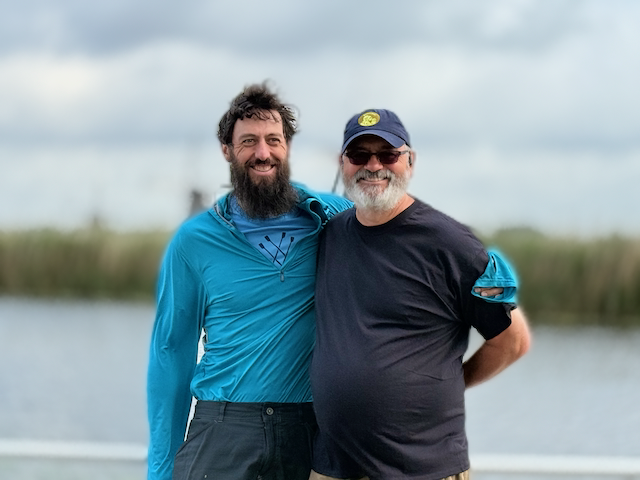
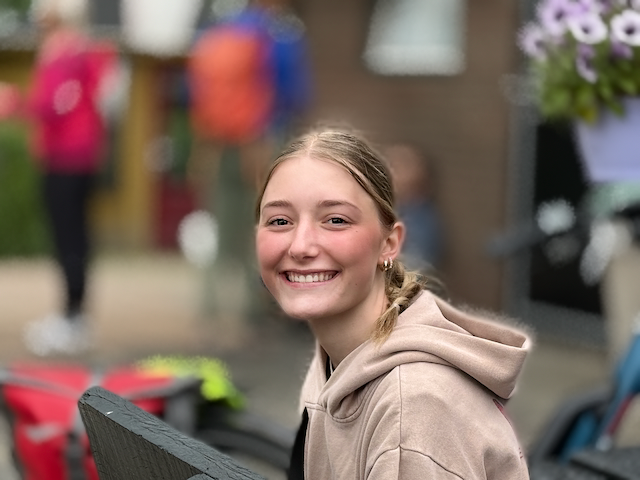

OK - I finally have found a moment to process a few pictures - things are going great on the tour.  This is mostly just a dump of pictures for the day with captions.

Enjoy!

I went for an early morning walk in Bruge before every on got up

The yacht harbor in Bruge

Some art in Bruge near the yacht harbor

This is a very cool lifting bridge for pedestrians and bikes.  The cables wrap around those tubes, which twist to raise the bridge

Houses along the canals of Bruge

More views of the canals of bruge

Another street scene in Bruge

Bruge has a windmill for milling grain.

The belfy in the distance.  Bruge is small, but still pretty big.

Treelined path in Bruge

A cool little garden in Bruge

Street scene in Bruge

More street pics on my morning walk in Bruge

One of the canals of Bruge

The Iris, our home for the next couple of days

Getting in a ten mile familiarization ride while the Iris moves on down the way.

A landscape view coming out of Bruge

The Iris heading to Ghent

Balin has been having a great time on this trip.

we went for a walk in Ghent

Ghent was a pretty city and was an important Medieval center.

THe warehouses of Ghent

Art along the walls in Ghent.

Reflectison in the Canal

A bridge in Ghent

Sunset on our boat tour in Ghent

The mighty Gravensteen—Ghent’s medieval stronghold, once home to the Counts of Flanders and now a dramatic reminder of the city’s feudal past, surrounded by a mirror-still moat at golden hour

Part of the Ghent street art walk scene

Kasteel van Laarne, just outside Ghent, is one of the best-preserved medieval castles in Belgium. Surrounded by a moat and connected by a stone bridge, it offers a glimpse into the architecture and lifestyle of past centuries.

All of us on the tour at the castle.

My Sister Sue taking a break

A tree lined path coming out of Ghent

A field along the path

Riding the ferry across a river

This ferry goes back and forth every half hour.

The city square in Dendermonde

The Cathederal in Dendermonde

A quiet lane inside the Sint-Alexiusbegijnhof in Dendermonde. These rows of modest brick homes once housed beguines—religious women who lived independently in community. Today, it’s a peaceful place to walk and reflect.

A small grotto in the beguinage garden with a statue of Mary. It’s a quiet, shady spot where people leave candles and take a moment to reflect.

Alex at teh  beguinage in Dendermonde

Dan at the beguinage in Dendermonde

Antoher view of the homes in the beguinage of Dendermonde

The chapel in the middle of the Bruges beguinage. The big open lawn and quiet trees make it feel really calm and tucked away from the city.

Alex at the gates of the beguinage in Dendermonde

The church in the beguinage of Dendermonde

The houses on the other side of the gardens in the beguinage of Dendermonde

Alex and Judy chatting on the Iris.

Me, Judy and Sue on the boat

The beers we had on our beer tasting night

Staging up to head out on our ride from Dendermonde

Myt bike had a tire start to fail. it made it to the end of the day after some hacks

Alex and Me

This is the tower that Mercator was imprisoned in for his heratetical maps

IMG_0638

We walked down to the water in Antwerp

The wooden escalator in Antwerp that took us to the tunnel under the river

Alex in the square outside of the tunnel in Antwerp.

Stuff for sale in the market

IMG_0683

IMG_0688

Throwing the hand of the giant that was slain

Inside of the Cathederal in Antwerp - it's huge, and way way down the list of biggest cathederals

Stained glass window in the Cathederal

A crown of glass thorns

Lewis' youngest son

great pizza place for dinner in Antwerp with Lewis and his Family

This is Lewis - he was an exchange student with my sister Sue when he was in his late teans.

IMG_0796

IMG_0804

Lewis and his family.

Sue in the Cathederal Square of Antwerp

Sunset in Antwerp

Guild Halls in Antwerp - these are recreations - the originals were destroyed in a fire

The clock and the statue

Some Streat art in Antwerp

A statue in Antwerp at sunset

Some cool art on the side of the building in Antwerp

Looking out at the harbor in Antwerp at sunset

IMG_0861

there are all sorts of cool drawbridges in Belgium.  Here we are leaving Antwerp, heading to the Netherlands.

A close up look at the drawbridge as we left Antwerp

Riding along the Canal - it started raining Big not long after I took this picture.

Stopped at Bergen Op Zoom for coffee

The canadian cemetary outside of Bergen Op Zoom

The Jesus bridge at Fort de Roovere

Brothers in law - Tim and Bryon

An example of a house in Tholen

A windmill in Tholen

Tholen is a beautiful community

Street scene in Tholen

IMG_1120

I went for an sunrise walk in Tholen

The iris at her moorings in Tholen

The Tholen Yacht Basin

They had some nice Yachts in Tholen

IMG_1129

Sun peeking up over the horizon in Tholen

IMG_1135

Early morning reflections in Tholen

They had some pretty boats in the Tholen yacht Basin

More reflections in Tholen

And another pretty boat in Tholen

Another view of Tholen's windmill on my morning walk

There is a moat around Tholen

The church in Tholen

These were pretty cool market rigs in Tholen.  They roll in these trailers into the square and just open up and away they go.

More street scenes in Tholen

The Church steeple in Tholen

Just so so pleasent in the morning in Tholen

Back to the Boat in Tholen

Riding away from Tholen

Our coffee stop was where the Roosevelt Clan came from - they are very proud of it here.

Dana taking in the sights

Me and SUe

Heading out for a nice walk in Willemstead - an old fort along the waterline

Mom and Sue

Me, Mom and Sue

The cemetary in Willemstead - these headstones were fresh

Tree lined street in Willemstead

The old fort barracks are now apartments

Looking at the moat that surrounded the fort

We spent the night in Dordrecht

One of the city gates in Dordrecht.  I have a much better sense of what a medieval city looked like and worked like now.

Details of the gate

Dordrecht is a wonderful little city the old canals are surrounded by wharehouses and are now boat basins

One of the canals in Dordrecht

Alex checking out the lift bridge

Walking down the old streets of Dordrecht

The warehouses in Dordrecht tend not to be plumb

More warehouses in Dordrecht

Reflection in the canal in Dordrecht

Alex checking out the canals in Dordrecht

I loved to imagine what the canals and wharehouses of Dordrecht were like when it was an active seaport

The wharehouses of Dordrecht reflected in the canals

Captain Dick in the wheelhouse of the Iris

Holland really does have windmills

This is part of the Unesco world Heritage site for the windmills of Holand

Ducks and geese in the canals

IMG_1408

Alex and Me with Windmills in the background

OPur biking group at teh windmills

IMG_1420

These four windmills were used to pump water half a meter from behind them into this canal.

IMG_1433

IMG_1435

Canals are everywhere and quite calm.

Brooklyn

Tim

IMG_1480.HEIC

Perrin at Lunch

Perrin, Alex and I  had Toasties for Lunch

Judy and Perrin

Alex in Schoonhoven

Riding through the streets of Vianen

